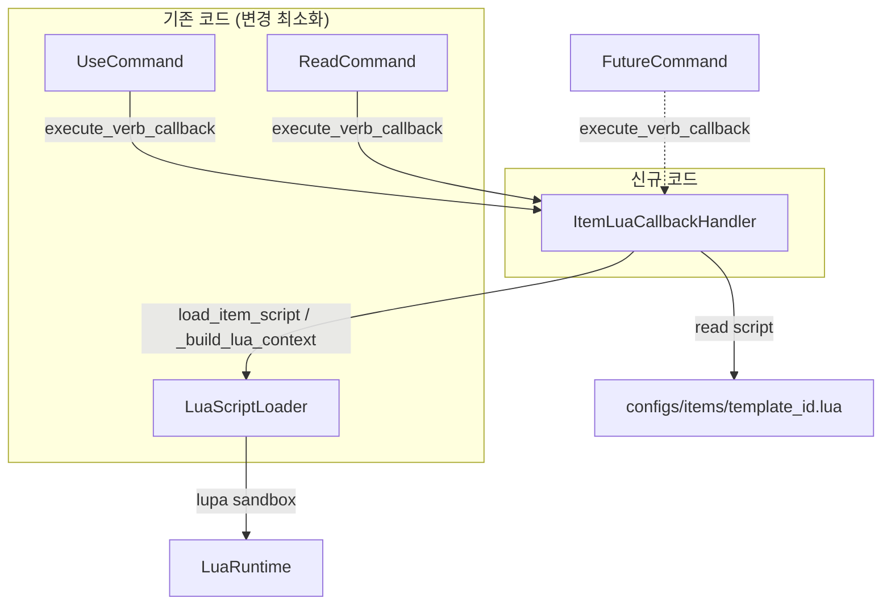
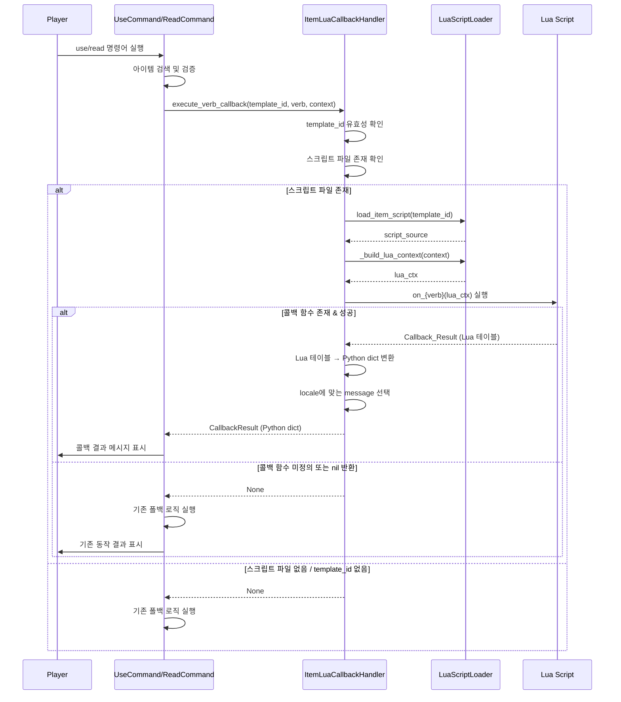

# 설계 문서: 아이템 Lua 콜백 시스템

## 개요

아이템 동사 명령어(use, read 등) 실행 시 `configs/items/{template_id}.lua` 스크립트의 콜백 함수(`on_use`, `on_read` 등)를 호출하여 아이템별 커스텀 동작을 구현하는 시스템이다.

핵심 설계 방향:
- 기존 `LuaScriptLoader` 인스턴스를 재사용하여 샌드박스 환경과 핫 리로드를 그대로 활용
- `ItemLuaCallbackHandler` 클래스를 신규 생성하여 아이템 Lua 콜백 전담 처리
- `execute_verb_callback(template_id, verb, context)` 범용 메서드로 동사 확장 용이
- UseCommand/ReadCommand에서 Lua 콜백 우선 시도 → 실패 시 기존 로직 폴백
- 기존 코드 최소 변경 원칙 준수

## 아키텍처

### 시스템 구성도



### 실행 흐름



## 컴포넌트 및 인터페이스

### 1. ItemLuaCallbackHandler (신규)

파일 경로: `src/mud_engine/game/item_lua_callback_handler.py`

```python
class ItemLuaCallbackHandler:
    """아이템 Lua 콜백 스크립트를 로드하고 실행하는 핸들러"""

    def __init__(self, lua_script_loader: LuaScriptLoader) -> None:
        """기존 LuaScriptLoader 인스턴스를 주입받아 재사용"""
        ...

    def execute_verb_callback(
        self,
        template_id: str,
        verb: str,
        context: dict[str, Any],
    ) -> dict[str, Any] | None:
        """범용 동사 콜백 실행 메서드

        Args:
            template_id: 아이템 템플릿 ID (예: "health_potion")
            verb: 동사 이름 (예: "use", "read")
            context: 콜백 컨텍스트 (player, item, session 정보)

        Returns:
            콜백 결과 dict 또는 None (폴백 필요 시)
            결과 dict 구조: {"message": str, "consume": bool, ...}
        """
        ...

    def load_item_script(self, template_id: str) -> str | None:
        """configs/items/{template_id}.lua 파일을 읽어 반환

        매 호출 시 디스크에서 읽어 핫 리로드 지원.
        """
        ...

    def _convert_callback_result(
        self,
        lua_result: Any,
        locale: str,
    ) -> dict[str, Any]:
        """Lua 콜백 반환값(테이블)을 Python dict로 변환

        message 필드가 다국어 dict인 경우 locale에 맞게 선택.
        """
        ...
```

설계 결정:
- `LuaScriptLoader` 인스턴스를 생성자 주입으로 공유한다. 별도 인스턴스를 만들지 않는 이유는 `LuaRuntime`이 프로세스 내 단일 인스턴스로 관리되는 것이 안전하고, 기존 `_attribute_filter` 샌드박스 설정을 그대로 재사용하기 위함이다.
- `load_item_script`는 `LuaScriptLoader.load_script`와 유사하지만 경로가 `configs/items/`로 다르므로 별도 메서드로 구현한다.
- `execute_verb_callback`은 동사 이름을 매개변수로 받아 `on_{verb}` 함수를 동적으로 호출하므로, 새로운 동사 추가 시 이 핸들러를 수정할 필요가 없다.

### 2. UseCommand 변경 (최소 수정)

기존 `execute` 메서드의 소모품 효과 처리 직전에 Lua 콜백 시도 로직을 삽입한다.

```python
# UseCommand.execute() 내부 변경 부분 (의사 코드)
async def execute(self, session, args):
    # ... 기존 아이템 검색 로직 ...

    # [신규] Lua 콜백 우선 시도
    callback_handler = self._get_callback_handler(session)
    if callback_handler:
        template_id = target_item.properties.get("template_id")
        ctx = self._build_item_context(session, target_item)
        result = callback_handler.execute_verb_callback(template_id, "use", ctx)
        if result is not None:
            message = result.get("message", "")
            if result.get("consume", False):
                # 기존 소모 로직 (after_use 변환 또는 삭제) 재사용
                await self._consume_item(session, game_engine, target_item)
            return self.create_success_result(message=message, data={...})

    # [기존] 하드코딩된 소모품 사용 로직 (폴백)
    # ... 기존 HP/스태미나 회복 코드 ...
```

### 3. ReadCommand 변경 (최소 수정)

기존 `execute` 메서드의 readable 텍스트 표시 직전에 Lua 콜백 시도 로직을 삽입한다.

```python
# ReadCommand.execute() 내부 변경 부분 (의사 코드)
async def execute(self, session, args):
    # ... 기존 아이템 검색 로직 ...

    # [신규] Lua 콜백 우선 시도
    callback_handler = self._get_callback_handler(session)
    if callback_handler:
        template_id = self._get_template_id(target_item)
        ctx = self._build_item_context(session, target_item)
        result = callback_handler.execute_verb_callback(template_id, "read", ctx)
        if result is not None:
            message = result.get("message", "")
            return self.create_success_result(message=message, data={...})

    # [기존] readable 속성 기반 텍스트 표시 (폴백)
    # ... 기존 _get_readable_text 코드 ...
```

### 4. LuaScriptLoader 변경 없음

기존 `LuaScriptLoader`는 변경하지 않는다. `ItemLuaCallbackHandler`가 다음 메서드를 직접 호출한다:
- `is_available()`: lupa 사용 가능 여부 확인
- `_build_lua_context(context)`: Python dict → Lua 테이블 변환
- `_lua.execute(script_source)`: 스크립트 실행
- `_lua.globals()`: 글로벌 함수 접근
- `_lua_table_to_dict(lua_table)`: Lua 테이블 → Python dict 변환

`_build_lua_context`와 `_lua_table_to_dict`는 현재 public이 아니지만(`_` 접두사), 같은 패키지 내에서 사용하므로 접근에 문제가 없다. 필요 시 public 래퍼를 추가할 수 있으나, 기존 코드 변경 최소화 원칙에 따라 현재 상태로 사용한다.


## 데이터 모델

### Callback_Context 구조

Lua 콜백 함수에 전달되는 컨텍스트 테이블의 Python dict 표현:

```python
context = {
    "player": {
        "id": "player-uuid-string",
        "display_name": "PlayerName",
        "locale": "ko",  # 또는 "en"
    },
    "item": {
        "id": "game-object-uuid-string",
        "template_id": "health_potion",
        "name": {
            "en": "Health Potion",
            "ko": "체력 물약",
        },
        "properties": {
            "hp_restore": 10,
            "base_value": 15,
            # ... 아이템 템플릿의 properties 전체
        },
    },
    "session": {
        "locale": "ko",
    },
}
```

이 dict는 `LuaScriptLoader._build_lua_context()`를 통해 Lua 테이블로 변환된다.

### Callback_Result 구조

Lua 콜백 함수가 반환하는 테이블의 Python dict 변환 결과:

```python
# on_use 콜백 반환 예시
result = {
    "message": {
        "en": "You drink the health potion. HP restored by 10.",
        "ko": "체력 물약을 마셨습니다. HP가 10 회복되었습니다.",
    },
    "consume": True,  # 아이템 소모 여부
}

# on_read 콜백 반환 예시
result = {
    "message": {
        "en": "The scroll reveals a hidden message...",
        "ko": "두루마리에서 숨겨진 메시지가 드러납니다...",
    },
}
```

`_convert_callback_result` 메서드가 이 dict를 처리하여:
1. `message` 필드가 dict(다국어)인 경우 → 플레이어 locale에 맞는 문자열 선택
2. `message` 필드가 string인 경우 → 그대로 사용
3. `consume` 필드 → boolean으로 변환 (기본값: `False`)

최종 반환 형태:
```python
processed_result = {
    "message": "체력 물약을 마셨습니다. HP가 10 회복되었습니다.",  # locale 적용된 단일 문자열
    "consume": True,
}
```

### Lua 스크립트 예시

`configs/items/health_potion.lua`:
```lua
function on_use(ctx)
    local player = ctx.player
    local item = ctx.item
    local locale = ctx.session.locale

    return {
        message = {
            en = player.display_name .. " drinks the " .. item.name.en .. ". A warm feeling spreads through your body.",
            ko = player.display_name .. "이(가) " .. item.name.ko .. "을(를) 마셨습니다. 따뜻한 기운이 온몸에 퍼집니다.",
        },
        consume = true,
    }
end
```

`configs/items/forgotten_scripture.lua`:
```lua
function on_read(ctx)
    local player = ctx.player

    return {
        message = {
            en = "As " .. player.display_name .. " reads the ancient scripture, a faint golden light emanates from the text...",
            ko = player.display_name .. "이(가) 고대 경전을 읽자, 희미한 금빛이 글자에서 흘러나옵니다...",
        },
    }
end
```

### 아이템 오브젝트에서 template_id 추출

게임 오브젝트의 `properties` 필드에서 `template_id`를 추출한다:

```python
# properties가 dict인 경우
template_id = target_item.properties.get("template_id")

# properties가 JSON 문자열인 경우 (방어적 처리)
properties = target_item.properties
if isinstance(properties, str):
    properties = json.loads(properties)
template_id = properties.get("template_id")
```


## 정확성 속성 (Correctness Properties)

속성(property)이란 시스템의 모든 유효한 실행에서 참이어야 하는 특성 또는 동작이다. 속성은 사람이 읽을 수 있는 명세와 기계가 검증할 수 있는 정확성 보장 사이의 다리 역할을 한다.

### Property 1: 폴백 안전성

임의의 template_id(None, 빈 문자열, 존재하지 않는 ID 포함)와 임의의 동사에 대해, 해당 Lua 스크립트 파일이 존재하지 않거나 template_id가 무효하거나 해당 `on_{verb}` 함수가 정의되지 않았거나 콜백이 nil을 반환하는 경우, `execute_verb_callback`은 항상 None을 반환해야 한다.

**Validates: Requirements 1.3, 1.4, 2.5, 3.3, 5.3**

### Property 2: 범용 동사 콜백 호출

임의의 동사 이름 문자열과 해당 `on_{verb}` 함수가 정의된 유효한 Lua 스크립트에 대해, `execute_verb_callback`은 해당 `on_{verb}(ctx)` 함수를 호출하고 non-None 결과를 반환해야 한다. 동사 목록은 하드코딩되지 않으며, 스크립트에 정의된 함수의 존재 여부로만 판단한다.

**Validates: Requirements 2.1, 3.1, 6.1, 6.3**

### Property 3: 컨텍스트 필수 필드 완전성

임의의 플레이어 정보(id, display_name, locale), 아이템 정보(id, template_id, name dict, properties dict), 세션 정보(locale)에 대해, 구성된 Callback_Context는 반드시 `player.id`, `player.display_name`, `player.locale`, `item.id`, `item.template_id`, `item.name.en`, `item.name.ko`, `item.properties`, `session.locale` 필드를 모두 포함해야 한다.

**Validates: Requirements 4.1, 4.2, 4.3, 4.5**

### Property 4: 콜백 결과 변환 정확성

임의의 Lua 콜백 반환값(message가 다국어 dict인 경우, 단일 문자열인 경우, consume이 true/false/nil인 경우)과 임의의 locale에 대해, `_convert_callback_result`는 message를 해당 locale에 맞는 단일 문자열로 변환하고, consume을 boolean으로 변환하여 Python dict를 반환해야 한다.

**Validates: Requirements 2.2, 2.4, 3.2, 5.1, 5.2, 5.4**

### Property 5: 오류 스크립트 안전 처리

임의의 구문 오류 또는 런타임 오류를 포함하는 Lua 스크립트에 대해, `execute_verb_callback`은 예외를 전파하지 않고 항상 None을 반환해야 한다.

**Validates: Requirements 2.6, 3.4, 7.1, 7.2, 7.3**


## 오류 처리

### 오류 유형별 처리 전략

| 오류 유형 | 처리 방식 | 로그 레벨 | 반환값 |
|-----------|-----------|-----------|--------|
| template_id 없음 | 스크립트 로딩 시도 안 함 | DEBUG | None |
| 스크립트 파일 없음 | 정상 흐름 (폴백) | DEBUG | None |
| 스크립트 파일 읽기 실패 | 오류 로깅 후 폴백 | ERROR | None |
| Lua 구문 오류 | template_id + 오류 내용 로깅 | ERROR | None |
| 콜백 함수 미정의 | 정상 흐름 (폴백) | DEBUG | None |
| 콜백 런타임 오류 | template_id + verb + 오류 내용 로깅 | ERROR | None |
| 콜백 nil 반환 | 정상 흐름 (폴백) | DEBUG | None |
| lupa 미설치 | 스크립트 실행 시도 안 함 | - | None |

### 오류 처리 원칙

1. Lua 콜백 관련 모든 오류는 `ItemLuaCallbackHandler` 내부에서 처리한다
2. 호출자(UseCommand, ReadCommand)에게는 예외가 전파되지 않는다
3. 오류 발생 시 항상 None을 반환하여 기존 폴백 로직이 실행되도록 한다
4. 오류 로그에는 디버깅에 필요한 컨텍스트(template_id, verb, 오류 메시지)를 포함한다

## 테스트 전략

### 단위 테스트 (Unit Tests)

테스트 프레임워크: pytest + pytest-mock

1. `ItemLuaCallbackHandler` 단위 테스트
   - `load_item_script`: 파일 존재/미존재 케이스
   - `_convert_callback_result`: 다양한 결과 구조 변환
   - `execute_verb_callback`: mock된 LuaScriptLoader로 각 분기 테스트

2. `UseCommand` 통합 테스트
   - Lua 콜백 성공 시 결과 메시지 반환 확인
   - Lua 콜백 None 반환 시 기존 폴백 실행 확인
   - consume=true 시 아이템 소모 확인
   - consume=false 시 아이템 유지 확인

3. `ReadCommand` 통합 테스트
   - Lua 콜백 성공 시 결과 메시지 반환 확인
   - Lua 콜백 None 반환 시 기존 readable 텍스트 표시 확인

### 속성 기반 테스트 (Property-Based Tests)

테스트 라이브러리: hypothesis (Python PBT 라이브러리)

각 속성 테스트는 최소 100회 반복 실행한다.

1. Property 1 테스트: 임의의 무효 template_id와 동사에 대해 None 반환 검증
   - Tag: Feature: item-lua-callback, Property 1: 폴백 안전성
2. Property 2 테스트: 임의의 동사와 유효한 스크립트에 대해 콜백 호출 검증
   - Tag: Feature: item-lua-callback, Property 2: 범용 동사 콜백 호출
3. Property 3 테스트: 임의의 입력 데이터에 대해 컨텍스트 필수 필드 완전성 검증
   - Tag: Feature: item-lua-callback, Property 3: 컨텍스트 필수 필드 완전성
4. Property 4 테스트: 임의의 콜백 결과와 locale에 대해 변환 정확성 검증
   - Tag: Feature: item-lua-callback, Property 4: 콜백 결과 변환 정확성
5. Property 5 테스트: 임의의 오류 스크립트에 대해 안전 처리 검증
   - Tag: Feature: item-lua-callback, Property 5: 오류 스크립트 안전 처리

### 수동 테스트

Telnet MCP를 통한 실제 게임 내 테스트:
1. `health_potion.lua`에 `on_use` 콜백 정의 후 `use health potion` 실행
2. `forgotten_scripture.lua`에 `on_read` 콜백 정의 후 `read scripture` 실행
3. Lua 스크립트 없는 아이템에 대해 기존 동작 유지 확인
4. Lua 스크립트 수정 후 핫 리로드 확인
