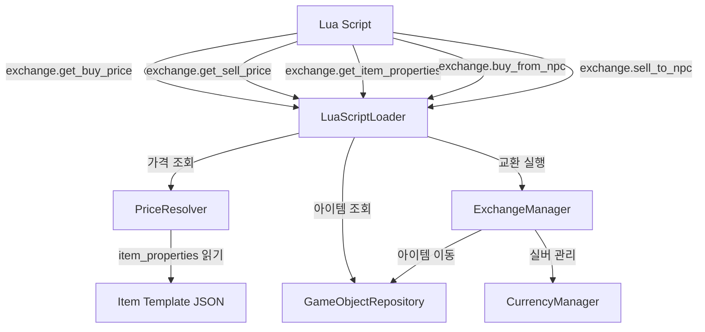

# 설계 문서: 아이템 가격 시스템 (Item Pricing System)

## 개요

아이템별 고정 매수/매도 가격 시스템과 Lua 스크립트 기반 동적 가격 조정 기능을 설계한다.

현재 시스템은 `properties.base_value`만 존재하며, Lua 스크립트에서 하드코딩된 마진을 곱해 가격을 산출한다. 이 설계는 아이템 템플릿에 `buy_price`/`sell_price` 필드를 추가하고, `PriceResolver` 모듈을 통해 일관된 가격 산출 로직을 제공하며, Lua 스크립트에서 동적 가격 조정이 가능한 구조를 구현한다.

설계 원칙:
- 기존 ExchangeManager API 시그니처 변경 없음
- 기존 Lua 스크립트 하위 호환성 유지
- 최소 변경 원칙 (PriceResolver 신규 생성, LuaScriptLoader에 함수 추가)
- 단일 책임 원칙 (가격 산출 로직은 PriceResolver에 집중)

## 아키텍처



데이터 흐름:
1. Lua 스크립트가 `exchange.get_buy_price(item_id)`를 호출
2. LuaScriptLoader가 GameObjectRepository에서 아이템 properties를 조회
3. PriceResolver가 `buy_price`를 반환
4. Lua 스크립트가 price_modifier를 계산하여 최종 가격 산출
5. Lua 스크립트가 `exchange.buy_from_npc(player_id, npc_id, item_id, final_price)`를 호출
6. ExchangeManager가 기존 로직대로 거래 처리

## 컴포넌트 및 인터페이스

### PriceResolver (신규)

파일: `src/mud_engine/game/managers/price_resolver.py`

순수 함수 기반의 가격 산출 모듈. 외부 의존성 없이 `item_properties` dict만으로 가격을 계산한다.

```python
class PriceResolver:
    """아이템 가격 산출 모듈.

    아이템 properties dict에서 buy_price/sell_price를 읽고,
    선택적 price_modifier를 적용하여 최종 가격을 반환한다.
    """

    def get_buy_price(
        self,
        item_properties: dict[str, Any],
        price_modifier: float | None = None,
    ) -> int:
        """아이템 구매 가격 산출.

        buy_price 필드 필수. 미정의 시 0 반환 (거래 불가).
        price_modifier 적용 후 반올림, 양수일 때 최소값 1 보장.
        """
        ...

    def get_sell_price(
        self,
        item_properties: dict[str, Any],
        price_modifier: float | None = None,
    ) -> int:
        """아이템 판매 가격 산출.

        sell_price 필드 필수. 미정의 시 0 반환 (거래 불가).
        price_modifier 적용 후 반올림, 양수일 때 최소값 1 보장.
        """
        ...
```

### LuaScriptLoader 확장 (기존 파일 수정)

`_register_exchange_globals()` 메서드에 3개 함수 추가:

| Lua 함수 | 설명 | 반환값 |
|----------|------|--------|
| `exchange.get_buy_price(item_id)` | 아이템 기준 구매 가격 조회 | int (가격) |
| `exchange.get_sell_price(item_id)` | 아이템 기준 판매 가격 조회 | int (가격) |
| `exchange.get_item_properties(item_id)` | 아이템 전체 속성 조회 | Lua table |

기존 함수 유지 (시그니처 변경 없음):
- `exchange.get_npc_inventory(npc_id)` — 반환 항목에 `buy_price` 필드 추가
- `exchange.get_player_inventory(player_id)` — 반환 항목에 `sell_price` 필드 추가
- `exchange.get_npc_silver(npc_id)`
- `exchange.get_player_silver(player_id)`
- `exchange.buy_from_npc(player_id, npc_id, game_object_id, price)`
- `exchange.sell_to_npc(player_id, npc_id, game_object_id, price)`

### ExchangeManager (변경 없음)

기존 `buy_from_npc`/`sell_to_npc` 시그니처를 그대로 유지한다. 가격 산출 책임은 Lua 스크립트 + PriceResolver에 위임되며, ExchangeManager는 전달받은 price로 거래만 실행한다.


## 데이터 모델

### 아이템 템플릿 properties 확장

기존 `properties` 필드에 `buy_price`와 `sell_price`를 선택적으로 추가한다.

```json
{
  "template_id": "health_potion",
  "name_en": "Health Potion",
  "name_ko": "체력 물약",
  "properties": {
    "hp_restore": 10,
    "buy_price": 20,
    "sell_price": 8,
    "verbs": { "use": {"en": "drinks", "ko": "마십니다"} }
  }
}
```

필드 정의:

| 필드 | 타입 | 필수 | 설명 |
|------|------|------|------|
| `buy_price` | int ≥ 0 | 필수 | NPC 구매가 (플레이어가 NPC에게서 살 때) |
| `sell_price` | int ≥ 0 | 필수 | NPC 판매가 (플레이어가 NPC에게 팔 때) |

### 가격 산출 규칙

```
get_buy_price(properties, modifier):
    base = properties.get("buy_price", 0)
    if modifier is not None:
        base = round(base * modifier)
    return max(1, base) if base > 0 else 0

get_sell_price(properties, modifier):
    base = properties.get("sell_price", 0)
    if modifier is not None:
        base = round(base * modifier)
    return max(1, base) if base > 0 else 0
```

### 인벤토리 조회 반환 구조 확장

`exchange.get_npc_inventory` 반환 항목에 `buy_price` 추가:
```lua
{
  id = "uuid-...",
  name = { en = "Health Potion", ko = "체력 물약" },
  category = "consumable",
  weight = 0.6,
  properties = { ... },
  buy_price = 20  -- PriceResolver 산출 기준 가격
}
```

`exchange.get_player_inventory` 반환 항목에 `sell_price` 추가:
```lua
{
  id = "uuid-...",
  name = { en = "Health Potion", ko = "체력 물약" },
  category = "consumable",
  weight = 0.6,
  properties = { ... },
  sell_price = 8  -- PriceResolver 산출 기준 가격
}
```


## 정확성 속성 (Correctness Properties)

*속성(property)은 시스템의 모든 유효한 실행에서 참이어야 하는 특성 또는 동작이다. 속성은 사람이 읽을 수 있는 명세와 기계가 검증할 수 있는 정확성 보장 사이의 다리 역할을 한다.*

### Property 1: 가격 필드 직접 사용

*For any* item_properties dict에 대해:
- `buy_price` 키가 존재하면 `get_buy_price(properties, None)`은 `buy_price` 값을 반환해야 한다.
- `buy_price` 키가 없으면 `get_buy_price(properties, None)`은 0을 반환해야 한다 (거래 불가).
- `sell_price` 키가 존재하면 `get_sell_price(properties, None)`은 `sell_price` 값을 반환해야 한다.
- `sell_price` 키가 없으면 `get_sell_price(properties, None)`은 0을 반환해야 한다 (거래 불가).

**Validates: Requirements 1.1, 1.2, 1.5, 2.1, 2.5**

### Property 2: price_modifier 적용

*For any* 유효한 item_properties dict와 양의 실수 price_modifier에 대해:
- `get_buy_price(properties, modifier)`는 `max(1, round(base_price * modifier))`를 반환해야 한다 (base_price는 Property 1의 규칙으로 결정).
- `get_sell_price(properties, modifier)`는 `max(1, round(base_price * modifier))`를 반환해야 한다 (base_price는 Property 1의 규칙으로 결정).
- 반환값은 항상 int 타입이어야 한다.

**Validates: Requirements 2.2, 2.3, 2.5**

### Property 3: 최소값 1 보장

*For any* item_properties dict와 *any* price_modifier (0에 가까운 값, 매우 작은 양수 포함)에 대해:
- `get_buy_price(properties, modifier)` >= 1
- `get_sell_price(properties, modifier)` >= 1

이 속성은 modifier가 0.001 같은 극단적으로 작은 값이어도 최종 가격이 절대 0 이하가 되지 않음을 보장한다.

**Validates: Requirements 2.4**


## 에러 처리

### PriceResolver 에러 처리

| 상황 | 처리 방식 |
|------|-----------|
| `item_properties`가 None | 0 반환 (거래 불가) |
| `buy_price`/`sell_price` 미정의 | 0 반환 (거래 불가) |
| `buy_price`/`sell_price`가 음수 | max(1, value)로 보정 |
| `price_modifier`가 음수 | 절대값 사용 또는 무시 (None 취급) |
| `price_modifier`가 0 | 최소값 1 반환 |

### Lua API 에러 처리

| 상황 | 처리 방식 |
|------|-----------|
| `item_id`가 문자열이 아님 | `_make_error("item_id must be a string")` 반환 |
| 아이템이 존재하지 않음 | `0` 반환 (가격 조회), `_make_error` 반환 (속성 조회) |
| DB 조회 실패 | 로그 기록 후 `0` 반환 (가격), `_make_error` 반환 (속성) |

### 방어적 프로그래밍 원칙

- PriceResolver는 어떤 입력에도 예외를 발생시키지 않는다
- 잘못된 입력은 안전한 기본값(최소값 1)으로 처리한다
- Lua API 래퍼는 모든 예외를 catch하여 Lua 스크립트 실행이 중단되지 않도록 한다

## 테스트 전략

### 단위 테스트 (Unit Tests)

PriceResolver 단위 테스트:
- `buy_price` 정의 시 해당 값 반환
- `sell_price` 정의 시 해당 값 반환
- `buy_price` 미정의 시 0 반환 (거래 불가)
- `sell_price` 미정의 시 0 반환 (거래 불가)
- `price_modifier` 적용 시 올바른 곱셈 및 반올림
- 에러 케이스 (None 입력, 빈 dict 등)

### 속성 기반 테스트 (Property-Based Tests)

테스트 라이브러리: `hypothesis` (Python PBT 표준 라이브러리)

각 property 테스트는 최소 100회 반복 실행한다.

```python
# 태그 형식 예시
# Feature: item-pricing-system, Property 1: 가격 우선순위 폴백
# Feature: item-pricing-system, Property 2: price_modifier 적용
# Feature: item-pricing-system, Property 3: 최소값 1 보장
```

생성기 전략:
- `item_properties`: `buy_price` (0~10000 정수, 필수), `sell_price` (0~10000 정수, 필수)의 조합. 미정의 케이스도 포함.
- `price_modifier`: 0.01~10.0 범위의 양의 실수 (극단값 포함)

### 통합 테스트 (Integration Tests)

- LuaScriptLoader에 exchange API 함수가 올바르게 등록되는지 확인
- Lua 스크립트에서 `exchange.get_buy_price`/`exchange.get_sell_price` 호출 시 올바른 값 반환
- 인벤토리 조회 시 가격 필드가 포함되는지 확인
- 기존 Lua 스크립트가 수정 없이 동작하는지 확인
