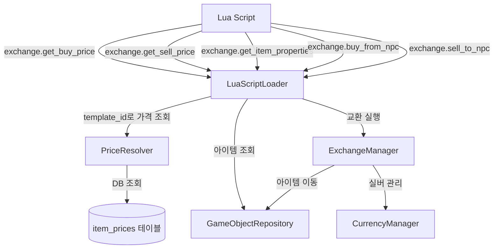

# 설계 문서: 아이템 가격 시스템 (Item Pricing System)

## 개요

아이템별 고정 매수/매도 가격 시스템과 Lua 스크립트 기반 동적 가격 조정 기능을 설계한다.

현재 시스템은 `properties.base_value`만 존재하며, Lua 스크립트에서 하드코딩된 마진을 곱해 가격을 산출한다. 이 설계는 아이템 가격을 DB `item_prices` 테이블로 분리하고, `PriceResolver`가 `template_id`로 DB를 조회하여 일관된 가격 산출 로직을 제공하며, Lua 스크립트에서 동적 가격 조정이 가능한 구조를 구현한다.

설계 원칙:
- 가격 데이터를 JSON properties에서 DB 테이블로 분리 (단일 진실 원천)
- PriceResolver가 `template_id` 기반 비동기 DB 조회 수행
- 기존 ExchangeManager API 시그니처 변경 없음
- 기존 Lua 스크립트 하위 호환성 유지
- `game_objects.properties`에 가격 필드 불필요 — `template_id`만으로 가격 조회

## 아키텍처



데이터 흐름:
1. Lua 스크립트가 `exchange.get_buy_price(item_id)`를 호출
2. LuaScriptLoader가 GameObjectRepository에서 아이템을 조회하여 `template_id`를 추출
3. PriceResolver가 `item_prices` 테이블에서 `template_id`로 가격 조회
4. 최종 가격 반환 (template_id가 item_prices에 없으면 0 반환)
5. Lua 스크립트가 price_modifier를 계산하여 최종 가격 산출
6. Lua 스크립트가 `exchange.buy_from_npc(player_id, npc_id, item_id, final_price)`를 호출
7. ExchangeManager가 기존 로직대로 거래 처리

## 컴포넌트 및 인터페이스

### PriceResolver (DB 기반으로 변경)

파일: `src/mud_engine/game/managers/price_resolver.py`

`DatabaseManager`를 주입받아 `item_prices` 테이블에서 `template_id` 기반으로 가격을 조회한다.

```python
class PriceResolver:
    """아이템 가격 산출 모듈.

    item_prices DB 테이블에서 template_id로 buy_price/sell_price를 조회하고,
    선택적 price_modifier를 적용하여 최종 가격을 반환한다.
    """

    def __init__(self, db_manager: DatabaseManager) -> None:
        """DatabaseManager를 주입받아 DB 조회에 사용한다."""
        ...

    async def get_buy_price(
        self,
        template_id: str,
        price_modifier: float | None = None,
    ) -> int:
        """아이템 구매 가격 산출.

        item_prices 테이블에서 template_id로 buy_price 조회.
        template_id가 테이블에 없으면 0 반환 (거래 불가).
        price_modifier 적용 후 반올림, 양수일 때 최소값 1 보장.
        """
        ...

    async def get_sell_price(
        self,
        template_id: str,
        price_modifier: float | None = None,
    ) -> int:
        """아이템 판매 가격 산출.

        item_prices 테이블에서 template_id로 sell_price 조회.
        template_id가 테이블에 없으면 0 반환 (거래 불가).
        price_modifier 적용 후 반올림, 양수일 때 최소값 1 보장.
        """
        ...
```

### DB 스키마: item_prices 테이블

```sql
CREATE TABLE IF NOT EXISTS item_prices (
    template_id TEXT PRIMARY KEY,
    buy_price INTEGER DEFAULT 0,
    sell_price INTEGER DEFAULT 0
);
```

### LuaScriptLoader 변경 (기존 파일 수정)

`_register_exchange_globals()` 내부의 가격 조회 함수에서:
- `item.properties`에서 가격을 읽는 대신, `item.properties.get("template_id")`로 `template_id`를 추출
- PriceResolver의 async 메서드를 `_run_async()` 래퍼로 호출
- `_inventory_to_lua()`에서도 동일하게 `template_id` 기반 PriceResolver 호출

변경되는 Lua API 함수 (시그니처 변경 없음, 내부 구현만 변경):

| Lua 함수 | 변경 내용 |
|----------|-----------|
| `exchange.get_buy_price(item_id)` | item.properties 대신 template_id로 PriceResolver.get_buy_price() 호출 |
| `exchange.get_sell_price(item_id)` | item.properties 대신 template_id로 PriceResolver.get_sell_price() 호출 |
| `exchange.get_npc_inventory(npc_id)` | 반환 항목의 buy_price를 template_id 기반으로 산출 |
| `exchange.get_player_inventory(player_id)` | 반환 항목의 sell_price를 template_id 기반으로 산출 |

기존 함수 유지 (변경 없음):
- `exchange.get_item_properties(item_id)`
- `exchange.get_npc_silver(npc_id)`
- `exchange.get_player_silver(player_id)`
- `exchange.buy_from_npc(player_id, npc_id, game_object_id, price)`
- `exchange.sell_to_npc(player_id, npc_id, game_object_id, price)`

### ExchangeManager (변경 없음)

기존 `buy_from_npc`/`sell_to_npc` 시그니처를 그대로 유지한다. 가격 산출 책임은 Lua 스크립트 + PriceResolver에 위임되며, ExchangeManager는 전달받은 price로 거래만 실행한다.


## 데이터 모델

### item_prices 테이블

아이템 가격 정보를 DB에서 중앙 관리한다. `game_objects.properties`의 `buy_price`/`sell_price` 필드는 더 이상 사용하지 않는다.

```sql
CREATE TABLE IF NOT EXISTS item_prices (
    template_id TEXT PRIMARY KEY,
    buy_price INTEGER DEFAULT 0,
    sell_price INTEGER DEFAULT 0
);
```

필드 정의:

| 필드 | 타입 | 설명 |
|------|------|------|
| `template_id` | TEXT PRIMARY KEY | 아이템 템플릿 고유 식별자 |
| `buy_price` | INTEGER DEFAULT 0 | NPC 구매가 (플레이어가 NPC에게서 살 때) |
| `sell_price` | INTEGER DEFAULT 0 | NPC 판매가 (플레이어가 NPC에게 팔 때) |

초기 데이터:

| template_id | buy_price | sell_price |
|-------------|-----------|------------|
| health_potion | 20 | 7 |
| stamina_potion | 16 | 5 |
| bread | 4 | 1 |
| club | 15 | 5 |
| guard_sword | 50 | 12 |
| guard_heavy_sword | 100 | 25 |
| guard_halberd | 80 | 20 |
| guard_spear | 60 | 15 |
| rusty_dagger | 8 | 2 |
| guide_walking_stick | 10 | 3 |
| rope | 10 | 3 |
| torch | 7 | 2 |
| backpack | 25 | 8 |
| saddle | 50 | 15 |
| leather_bridle | 30 | 10 |
| horse_brush | 12 | 4 |
| horseshoe | 8 | 3 |
| oats | 6 | 2 |
| hay_bale | 5 | 2 |
| oak_branch | 3 | 1 |
| forest_mushroom | 2 | 1 |
| wild_berries | 1 | 0 |
| smooth_stone | 1 | 0 |
| wildflower_crown | 3 | 1 |
| empty_bottle | 2 | 1 |
| merchant_journal | 20 | 8 |
| forgotten_scripture | 15 | 5 |

거래 불가 아이템(quest item 등)은 `item_prices`에 레코드를 포함하지 않는다. PriceResolver 조회 시 0을 반환하여 거래 불가를 나타낸다.

### 가격 산출 규칙

```
async get_buy_price(template_id, modifier):
    row = DB.query("SELECT buy_price FROM item_prices WHERE template_id = ?", template_id)
    if row is None:
        return 0  # 거래 불가
    base = row.buy_price
    if base <= 0:
        return 0
    if modifier is not None:
        base = round(base * modifier)
    return max(1, base)

async get_sell_price(template_id, modifier):
    row = DB.query("SELECT sell_price FROM item_prices WHERE template_id = ?", template_id)
    if row is None:
        return 0  # 거래 불가
    base = row.sell_price
    if base <= 0:
        return 0
    if modifier is not None:
        base = round(base * modifier)
    return max(1, base)
```

### 인벤토리 조회 반환 구조 확장

`exchange.get_npc_inventory` 반환 항목에 `buy_price` 추가:
```lua
{
  id = "uuid-...",
  name = { en = "Health Potion", ko = "체력 물약" },
  category = "consumable",
  weight = 0.6,
  properties = { ... },
  buy_price = 20  -- PriceResolver가 template_id로 DB 조회한 기준 가격
}
```

`exchange.get_player_inventory` 반환 항목에 `sell_price` 추가:
```lua
{
  id = "uuid-...",
  name = { en = "Health Potion", ko = "체력 물약" },
  category = "consumable",
  weight = 0.6,
  properties = { ... },
  sell_price = 7  -- PriceResolver가 template_id로 DB 조회한 기준 가격
}
```


## 정확성 속성 (Correctness Properties)

*속성(property)은 시스템의 모든 유효한 실행에서 참이어야 하는 특성 또는 동작이다. 속성은 사람이 읽을 수 있는 명세와 기계가 검증할 수 있는 정확성 보장 사이의 다리 역할을 한다.*

### Property 1: template_id 기반 DB 조회

*For any* template_id에 대해:
- `template_id`가 `item_prices` 테이블에 존재하면 `get_buy_price(template_id, None)`은 해당 `buy_price` 값을 반환해야 한다.
- `template_id`가 `item_prices` 테이블에 존재하지 않으면 `get_buy_price(template_id, None)`은 0을 반환해야 한다 (거래 불가).
- `template_id`가 `item_prices` 테이블에 존재하면 `get_sell_price(template_id, None)`은 해당 `sell_price` 값을 반환해야 한다.
- `template_id`가 `item_prices` 테이블에 존재하지 않으면 `get_sell_price(template_id, None)`은 0을 반환해야 한다 (거래 불가).

**Validates: Requirements 1.1, 1.5, 1.6, 2.1, 2.5**

### Property 2: price_modifier 적용

*For any* item_prices에 존재하는 template_id와 양의 실수 price_modifier에 대해:
- `get_buy_price(template_id, modifier)`는 `max(1, round(base_price * modifier))`를 반환해야 한다 (base_price는 DB에서 조회한 buy_price).
- `get_sell_price(template_id, modifier)`는 `max(1, round(base_price * modifier))`를 반환해야 한다 (base_price는 DB에서 조회한 sell_price).
- 반환값은 항상 int 타입이어야 한다.

**Validates: Requirements 2.2, 2.3, 2.5**

### Property 3: 최소값 1 보장

*For any* item_prices에 존재하는 template_id와 *any* price_modifier (0에 가까운 값, 매우 작은 양수 포함)에 대해:
- `get_buy_price(template_id, modifier)` >= 1 (buy_price > 0인 경우)
- `get_sell_price(template_id, modifier)` >= 1 (sell_price > 0인 경우)

이 속성은 modifier가 0.001 같은 극단적으로 작은 값이어도 최종 가격이 절대 0 이하가 되지 않음을 보장한다.

**Validates: Requirements 2.4**


## 에러 처리

### PriceResolver 에러 처리

| 상황 | 처리 방식 |
|------|-----------|
| `template_id`가 None 또는 빈 문자열 | 0 반환 (거래 불가) |
| `template_id`가 `item_prices`에 미존재 | 0 반환 (거래 불가) |
| DB 조회 실패 | 로그 기록 후 0 반환 |
| `buy_price`/`sell_price`가 0 이하 | 0 반환 (거래 불가) |
| `price_modifier`가 음수 | 절대값 사용 또는 무시 (None 취급) |
| `price_modifier`가 0 | 최소값 1 반환 |

### Lua API 에러 처리

| 상황 | 처리 방식 |
|------|-----------|
| `item_id`가 문자열이 아님 | `_make_error("item_id must be a string")` 반환 |
| 아이템이 존재하지 않음 | `0` 반환 (가격 조회), `_make_error` 반환 (속성 조회) |
| 아이템에 `template_id`가 없음 | `0` 반환 (가격 조회) |
| DB 조회 실패 | 로그 기록 후 `0` 반환 (가격), `_make_error` 반환 (속성) |

### 방어적 프로그래밍 원칙

- PriceResolver는 어떤 입력에도 예외를 발생시키지 않는다
- DB 조회 실패 시 안전한 기본값(0)으로 처리한다
- Lua API 래퍼는 모든 예외를 catch하여 Lua 스크립트 실행이 중단되지 않도록 한다

## 테스트 전략

### 단위 테스트 (Unit Tests)

PriceResolver 단위 테스트:
- `template_id`가 `item_prices`에 존재할 때 해당 가격 반환
- `template_id`가 `item_prices`에 미존재 시 0 반환 (거래 불가)
- `price_modifier` 적용 시 올바른 곱셈 및 반올림
- 에러 케이스 (None 입력, 빈 문자열, DB 조회 실패 등)

### 속성 기반 테스트 (Property-Based Tests)

테스트 라이브러리: `hypothesis` (Python PBT 표준 라이브러리)

각 property 테스트는 최소 100회 반복 실행한다.

```python
# 태그 형식 예시
# Feature: item-pricing-system, Property 1: template_id 기반 DB 조회
# Feature: item-pricing-system, Property 2: price_modifier 적용
# Feature: item-pricing-system, Property 3: 최소값 1 보장
```

생성기 전략:
- `template_id`: 랜덤 문자열 (존재/미존재 케이스 포함)
- `buy_price`/`sell_price`: 0~10000 정수
- `price_modifier`: 0.01~10.0 범위의 양의 실수 (극단값 포함)

### 통합 테스트 (Integration Tests)

- LuaScriptLoader에 exchange API 함수가 올바르게 등록되는지 확인
- Lua 스크립트에서 `exchange.get_buy_price`/`exchange.get_sell_price` 호출 시 DB에서 올바른 값 반환
- 인벤토리 조회 시 가격 필드가 포함되는지 확인
- 기존 Lua 스크립트가 수정 없이 동작하는지 확인
