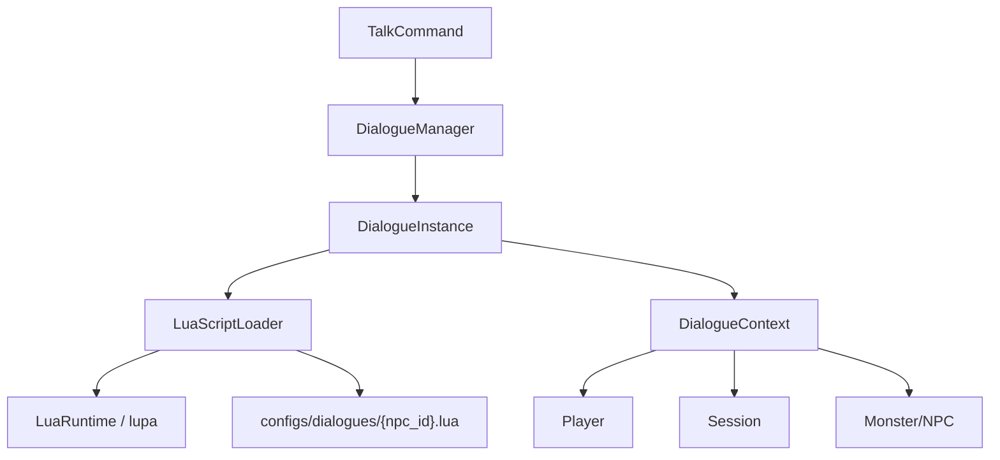
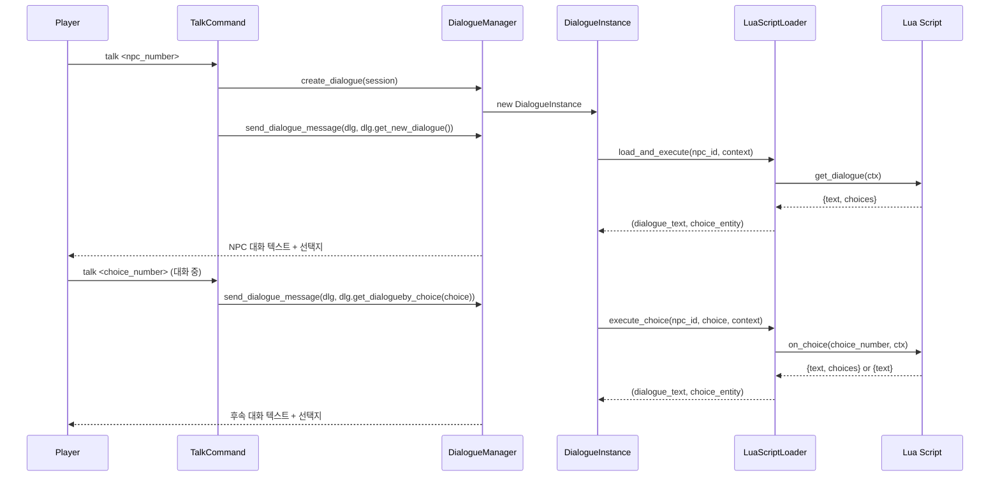

# 설계 문서: Lua 스크립트 기반 NPC 대화 시스템

## Overview

기존 DialogueInstance/DialogueManager 기반 NPC 대화 시스템을 lupa 라이브러리를 통해 Lua 스크립트로 확장한다. NPC별 대화 로직을 `configs/dialogues/{npc_id}.lua` 파일로 외부화하여, 서버 재시작 없이 대화 내용을 수정할 수 있게 한다.

핵심 설계 결정:
- lupa의 `LuaRuntime`을 사용하여 Python 내에서 Lua 스크립트를 실행
- `attribute_filter`를 통해 Lua에서 Python 내부 객체 직접 접근을 차단 (샌드박스)
- Lua 스크립트에 전달되는 컨텍스트는 순수 Lua 테이블로 변환하여 읽기 전용 제공
- Lua 테이블의 다국어 dict `{en = "...", ko = "..."}` → Python dict `{"en": "...", "ko": "..."}` 변환은 DialogueManager에서 locale 기반으로 처리
- Lua 스크립트 미존재 또는 실행 오류 시 기존 동작(silent_stare + [1] Bye)으로 폴백

## Architecture

### 컴포넌트 다이어그램



### 데이터 흐름



## Components and Interfaces

### 1. LuaScriptLoader

Lua 스크립트 파일을 로드하고 실행하는 모듈. `LuaRuntime` 인스턴스를 관리한다.

파일 위치: `src/mud_engine/game/lua_script_loader.py`

```python
class LuaScriptLoader:
    """Lua 스크립트 로더 - NPC 대화 스크립트를 로드하고 실행"""

    def __init__(self) -> None:
        self._lua: LuaRuntime | None  # lupa LuaRuntime 인스턴스
        self._available: bool          # lupa 사용 가능 여부

    def is_available(self) -> bool:
        """lupa 라이브러리 사용 가능 여부 반환"""

    def load_script(self, npc_id: str) -> str | None:
        """configs/dialogues/{npc_id}.lua 파일을 읽어 문자열로 반환.
        파일 미존재 시 None 반환."""

    def execute_get_dialogue(
        self, npc_id: str, context: dict
    ) -> tuple[list[dict], dict[int, dict]] | None:
        """Lua 스크립트의 get_dialogue(ctx) 함수를 실행.
        반환: (dialogue_texts, choice_entity) 또는 None (실패 시)
        - dialogue_texts: [{"en": "...", "ko": "..."}, ...]
        - choice_entity: OrderedDict {1: {"en": "...", "ko": "..."}, ...}
        """

    def execute_on_choice(
        self, npc_id: str, choice: int, context: dict
    ) -> tuple[list[dict], dict[int, dict]] | None:
        """Lua 스크립트의 on_choice(choice_number, ctx) 함수를 실행.
        반환: (dialogue_texts, choice_entity) 또는 None (실패 시)
        """

    def _build_lua_context(self, context: dict) -> LuaTable:
        """Python dict를 Lua 테이블로 변환하여 샌드박스 컨텍스트 생성"""

    def _convert_lua_result(
        self, lua_result: LuaTable
    ) -> tuple[list[dict], dict[int, dict]]:
        """Lua 반환값(테이블)을 Python 자료구조로 변환
        Lua 테이블 {en = "...", ko = "..."} → Python dict {"en": "...", "ko": "..."}
        """
```

설계 결정:
- `LuaRuntime`은 `register_eval=False`로 초기화하여 Lua에서 `python.eval()` 호출을 차단
- `attribute_filter`를 설정하여 `_` 접두사 속성 접근을 차단
- 스크립트 파일은 매 호출 시 디스크에서 읽어 핫 리로드 지원 (캐싱 없음, 개발 편의성 우선)

### 2. DialogueContext

Lua 스크립트에 전달할 컨텍스트 데이터를 구성하는 헬퍼. Python 객체를 순수 dict로 변환한다.

파일 위치: `src/mud_engine/game/dialogue_context.py`

```python
class DialogueContext:
    """Lua 스크립트에 전달할 읽기 전용 컨텍스트 빌더"""

    @staticmethod
    def build(
        player: Player,
        session: TelnetSession,
        npc: Monster,
        dialogue: DialogueInstance
    ) -> dict:
        """Player, Session, Monster, DialogueInstance 정보를 순수 dict로 변환.
        반환 구조:
        {
            "player": {
                "username": str,
                "display_name": str,
                "preferred_locale": str,
                "completed_quests": list[str],
                "quest_progress": dict
            },
            "session": {
                "session_id": str,
                "locale": str,
                "current_room_id": str,
                "stamina": float
            },
            "npc": {
                "id": str,
                "name": {"en": str, "ko": str},
                "properties": dict
            },
            "dialogue": {
                "id": str,
                "is_active": bool,
                "choice_entity": dict,
                "started_at": str
            }
        }
        """
```

설계 결정:
- Python 객체 참조를 전달하지 않고 순수 dict로 변환하여 Lua 측에서 Python 내부 상태를 변경할 수 없게 함
- `lua.table_from()`으로 Lua 테이블로 변환 후 전달

### 3. Lua 스크립트 인터페이스

각 NPC의 Lua 스크립트가 구현해야 하는 함수 인터페이스:

```lua
-- configs/dialogues/{npc_id}.lua

-- 초기 대화 함수
-- ctx: 컨텍스트 테이블 (player, session, npc 정보)
-- 반환: { text = {...}, choices = { [1] = {...}, ... } }
-- 주의: Bye 선택지는 자동 추가되므로 스크립트에서 명시하지 않음
function get_dialogue(ctx)
    return {
        text = {
            {en = "Hello!", ko = "안녕하세요!"}
        },
        choices = {
            [1] = {en = "Who are you?", ko = "누구신가요?"}
        }
    }
end

-- 선택지 처리 함수
-- choice_number: 플레이어가 선택한 번호 (int)
-- ctx: 컨텍스트 테이블
-- 반환: { text = {...}, choices = { ... } } 또는 { text = {...} } (선택지 없음)
function on_choice(choice_number, ctx)
    if choice_number == 1 then
        return {
            text = {
                {en = "I am a guard.", ko = "나는 경비병이다."}
            }
            -- choices 없음 → 자동으로 [1] Bye 추가
        }
    end
    return nil  -- nil 반환 시 대화 종료
end
```

반환값 규약:
- `text`: 대화 텍스트 배열. 각 요소는 `{en = "...", ko = "..."}` 다국어 테이블
- `choices`: 선택지 테이블 (선택사항). 키는 정수, 값은 `{en = "...", ko = "..."}` 다국어 테이블
- 모든 선택지의 마지막에는 자동으로 Bye 선택지가 추가됨 (Lua 스크립트에서 Bye를 명시할 필요 없음)
- `choices` 미포함 시에도 자동으로 `[1] Bye` 선택지 추가
- `nil` 반환 시 대화 종료 처리

### 4. 기존 컴포넌트 수정 사항

#### DialogueInstance (dialogue.py) 수정

- `get_new_dialogue()`: LuaScriptLoader를 사용하여 Lua 스크립트 실행. 실패 시 기존 폴백 유지
- `get_dialogueby_choice()`: LuaScriptLoader의 `execute_on_choice()` 호출. 선택지 없는 응답 시 자동 Bye 추가
- 새 필드: `lua_loader: LuaScriptLoader` (외부에서 주입)

#### DialogueManager (dialogue_manager.py) 수정

- `__init__()`: `LuaScriptLoader` 인스턴스 생성 및 보유
- `create_dialogue()`: DialogueInstance에 `lua_loader` 참조 전달
- `send_dialogue_message()`: 다국어 dict에서 locale 기반 텍스트 선택 로직 추가
  - `choice_entity` 값이 dict(`{"en": "...", "ko": "..."}`)인 경우 locale에 맞는 문자열 추출
  - 기존 문자열 값("Bye.")도 하위 호환성 유지

#### TalkCommand (dialogue/talk_command.py) 수정

- 변경 없음. 기존 흐름 그대로 유지 (DialogueInstance/DialogueManager 내부에서 처리)


## Data Models

### Lua 스크립트 반환값 구조

```
LuaDialogueResult:
  text: list[dict[str, str]]     # [{en: "...", ko: "..."}, ...]
  choices: dict[int, dict[str, str]]  # {1: {en: "...", ko: "..."}, ...} (선택사항)
```

### DialogueContext 데이터 구조

```
DialogueContextData:
  player:
    username: str
    display_name: str
    preferred_locale: str
    completed_quests: list[str]
    quest_progress: dict[str, Any]
  session:
    session_id: str
    locale: str
    current_room_id: str
    stamina: float
  npc:
    id: str
    name: dict[str, str]          # {en: "...", ko: "..."}
    properties: dict[str, Any]
  dialogue:
    id: str
    is_active: bool
    choice_entity: dict[int, str | dict[str, str]]
    started_at: str               # ISO format
```

### choice_entity 확장

기존: `OrderedDict[int, str]` (예: `{1: "Bye."}`)
확장: `OrderedDict[int, str | dict[str, str]]` (예: `{1: {"en": "Bye.", "ko": "안녕히."}}`)

DialogueManager의 `send_dialogue_message()`에서 locale 기반으로 최종 문자열을 추출한다:
- `choice_entity[n]`이 `dict`이면 → `choice_entity[n][locale]` 또는 `choice_entity[n]["en"]` (폴백)
- `choice_entity[n]`이 `str`이면 → 그대로 사용 (하위 호환성)

### 샘플 Lua 스크립트 (Veteran Guard)

파일: `configs/dialogues/3914fbe8-c8a9-493a-b451-1084ee4d6d2a.lua`

```lua
-- Veteran Guard 대화 스크립트
-- NPC ID: 3914fbe8-c8a9-493a-b451-1084ee4d6d2a

function get_dialogue(ctx)
    local player_name = ctx.player.display_name
    return {
        text = {
            {
                en = "Halt! I haven't seen your face before, " .. player_name .. ". State your business.",
                ko = "멈춰라! " .. player_name .. ", 처음 보는 얼굴이군. 용건을 말하라."
            }
        },
        choices = {
            [1] = {en = "Who are you?", ko = "누구신가요?"}
        }
    }
end

function on_choice(choice_number, ctx)
    if choice_number == 1 then
        return {
            text = {
                {
                    en = "I am a veteran guard of this town. I've been protecting these walls for over twenty years. If you need anything, speak to the merchants in the square.",
                    ko = "나는 이 마을의 베테랑 경비병이다. 20년 넘게 이 성벽을 지켜왔지. 필요한 게 있으면 광장의 상인들에게 말하라."
                }
            }
            -- choices 없음 → 자동으로 [1] Bye 추가
        }
    end
    -- choice 2 (Bye) 또는 알 수 없는 선택 → nil 반환 → 대화 종료
    return nil
end
```


## Correctness Properties

*A property is a characteristic or behavior that should hold true across all valid executions of a system — essentially, a formal statement about what the system should do. Properties serve as the bridge between human-readable specifications and machine-verifiable correctness guarantees.*

### Property 1: Lua 결과 변환 보존 (Round-trip)

*For any* valid Lua dialogue result (text 배열 + choices 테이블)를 `_convert_lua_result()`로 Python 자료구조로 변환했을 때, 원본 Lua 테이블의 모든 텍스트 데이터(en/ko 값)와 선택지 번호가 변환 결과에 보존되어야 한다.

**Validates: Requirements 1.2, 4.1, 4.2**

### Property 2: 컨텍스트 빌드 완전성

*For any* 유효한 Player, Session, Monster, DialogueInstance 조합에 대해 `DialogueContext.build()`를 호출하면, 반환된 dict에는 반드시 다음 키가 모두 존재해야 한다:
- `player.username`, `player.display_name`, `player.preferred_locale`, `player.completed_quests`, `player.quest_progress`
- `session.session_id`, `session.locale`, `session.current_room_id`, `session.stamina`
- `npc.id`, `npc.name`, `npc.properties`
- `dialogue.id`, `dialogue.is_active`, `dialogue.choice_entity`, `dialogue.started_at`

**Validates: Requirements 3.1, 3.2, 3.3**

### Property 3: 모든 선택지 마지막에 자동 Bye 추가

*For any* Lua 스크립트 반환값에 대해, DialogueInstance는 choices의 마지막 번호 다음에 자동으로 `{"en": "Bye.", "ko": "안녕히."}` 선택지를 추가해야 한다. choices가 없거나 빈 테이블인 경우에도 `{1: {"en": "Bye.", "ko": "안녕히."}}` 선택지를 추가해야 한다.

**Validates: Requirements 4.3**

### Property 4: 컨텍스트 변수의 대화 텍스트 반영

*For any* 유효한 display_name 문자열을 가진 Player로 Veteran Guard 스크립트의 `get_dialogue(ctx)`를 실행하면, 반환된 텍스트 중 하나 이상에 해당 display_name이 포함되어야 한다.

**Validates: Requirements 5.4**

## Error Handling

### 1. lupa 라이브러리 미설치

- `LuaScriptLoader.__init__()`에서 `import lupa` 실패 시 `_available = False` 설정
- 이후 모든 `execute_*` 호출은 `None` 반환 → 폴백 동작
- 에러 로그: `logger.error("lupa 라이브러리를 찾을 수 없습니다. Lua 대화 스크립트가 비활성화됩니다.")`

### 2. Lua 스크립트 파일 미존재

- `load_script()`가 `None` 반환
- DialogueInstance는 기존 폴백 동작 유지 (silent_stare + [1] Bye)
- 로그: `logger.info(f"Lua 스크립트 파일 없음: {file_path}")`

### 3. Lua 스크립트 구문/런타임 오류

- `lupa.LuaError` 또는 `lupa.LuaSyntaxError` 캐치
- `None` 반환 → 폴백 동작
- 로그: `logger.error(f"Lua 스크립트 실행 오류 [{npc_id}]: {e}")`

### 4. Lua 스크립트 반환값 형식 오류

- `_convert_lua_result()`에서 예상 구조가 아닌 경우 `None` 반환
- 예: `text` 키 없음, `choices` 값이 테이블이 아님 등
- 로그: `logger.warning(f"Lua 스크립트 반환값 형식 오류 [{npc_id}]")`

### 5. 대화 중 선택지 범위 초과

- `get_dialogueby_choice()`에서 유효하지 않은 choice 번호 → 기존 에러 처리 유지
- Lua `on_choice()`가 `nil` 반환 시 → 대화 종료 처리

## Testing Strategy

### 단위 테스트 (Unit Tests)

1. `LuaScriptLoader` 초기화 및 `is_available()` 확인
2. `load_script()` - 파일 존재/미존재 케이스
3. `DialogueContext.build()` - 올바른 필드 추출 확인
4. lupa 미설치 시 폴백 동작 (모킹)
5. Lua 스크립트 오류 시 폴백 동작
6. 샌드박스 - Lua에서 Python 내부 접근 차단 확인
7. 샘플 Veteran Guard 스크립트 실행 및 결과 검증
8. `send_dialogue_message()` - 다국어 dict에서 locale 기반 텍스트 선택

### 속성 기반 테스트 (Property-Based Tests)

라이브러리: `hypothesis` (Python PBT 라이브러리)
최소 반복: 100회

각 속성 테스트는 설계 문서의 Correctness Property를 참조한다:
- **Feature: lua-dialogue-scripting, Property 1**: Lua 결과 변환 보존
- **Feature: lua-dialogue-scripting, Property 2**: 컨텍스트 빌드 완전성
- **Feature: lua-dialogue-scripting, Property 3**: 선택지 없는 응답 시 자동 Bye 추가
- **Feature: lua-dialogue-scripting, Property 4**: 컨텍스트 변수의 대화 텍스트 반영

### 통합 테스트 (Integration Tests)

1. TalkCommand → DialogueManager → DialogueInstance → LuaScriptLoader 전체 흐름
2. Veteran Guard 샘플 스크립트를 사용한 E2E 대화 시나리오
3. 대화 시작 → 선택지 선택 → 후속 대화 → Bye → 대화 종료 전체 흐름
