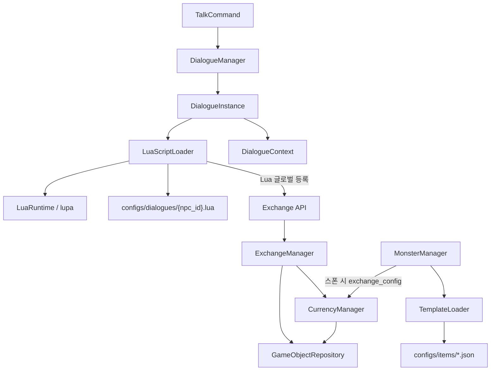
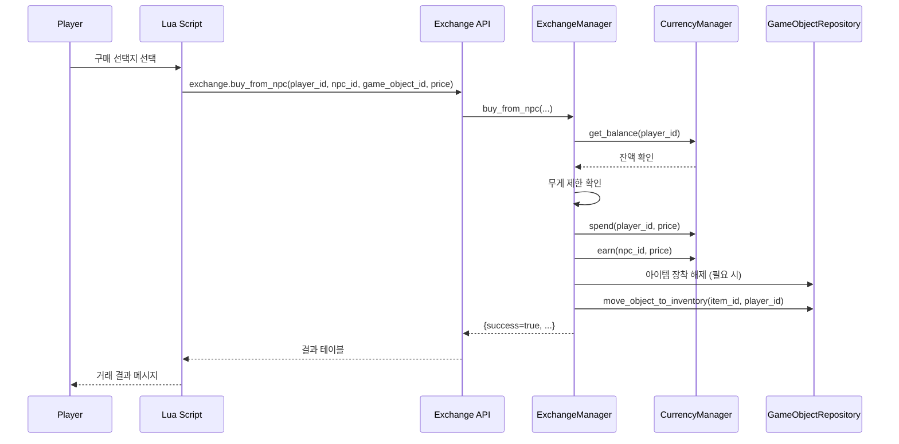
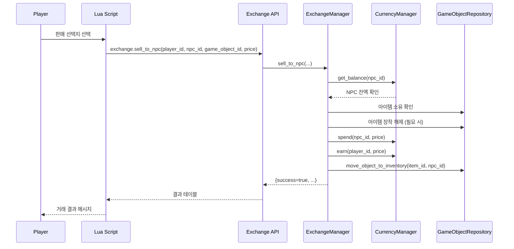

# 설계 문서: Lua 대화 기반 교환(Exchange) 시스템

## Overview

기존 Lua 대화 시스템(LuaScriptLoader, DialogueContext, DialogueInstance, DialogueManager)을 확장하여 NPC와의 양방향 아이템 교환 시스템을 구현한다. 핵심은 Lua 스크립트에서 호출 가능한 Exchange API를 Python 측에 구현하고, LuaScriptLoader를 통해 Lua 글로벌에 등록하는 것이다.

설계 결정:
- CurrencyManager: silver_coin 스택 관리 전담 (획득/소비/잔액 조회). game_objects 테이블의 기존 스택 시스템(max_stack=9999) 활용. weight=0.003kg(3g)
- ExchangeManager: buy_from_npc/sell_to_npc 원자적 거래 처리. CurrencyManager와 GameObjectRepository를 조합
- Exchange API: Python 함수를 LuaScriptLoader._build_lua_context() 시점에 Lua 글로벌에 등록. Lua에서 `exchange.buy_from_npc(...)` 형태로 호출
- DialogueContext 확장: 양쪽 실버 잔액, 인벤토리 목록, 무게 정보를 ctx에 포함
- NPC 스폰 시 exchange_config 기반으로 silver_coin + 판매 아이템 생성 (MonsterManager._create_monster_equipment 확장)
- 장착 아이템 거래: 거래 전 is_equipped=false, equipment_slot 초기화 후 location 변경
- 레거시 shop_command.py deprecated 처리

## Architecture

### 컴포넌트 다이어그램



### 교환 시퀀스 다이어그램 (구매)




### 교환 시퀀스 다이어그램 (판매)



## Components and Interfaces

### 1. CurrencyManager

silver_coin 스택 관리 전담 모듈. GameObjectRepository를 통해 game_objects 테이블의 silver_coin 아이템을 조작한다.

파일 위치: `src/mud_engine/game/managers/currency_manager.py`

```python
class CurrencyManager:
    """실버 코인 스택 관리"""

    def __init__(self, object_repo: GameObjectRepository) -> None:
        self._object_repo = object_repo

    async def get_balance(self, owner_id: str) -> int:
        """소유자의 실버 잔액 조회.
        game_objects에서 template_id='silver_coin', location_type='inventory',
        location_id=owner_id인 아이템의 properties.quantity 합산.
        없으면 0 반환.
        """

    async def earn(self, owner_id: str, amount: int) -> bool:
        """소유자에게 실버 지급.
        기존 스택이 있으면 quantity 증가, 없으면 새 silver_coin 아이템 생성.
        max_stack(9999) 초과 시 추가 스택 생성.
        """

    async def spend(self, owner_id: str, amount: int) -> bool:
        """소유자의 실버 차감.
        잔액 부족 시 False 반환.
        quantity가 0이 되면 해당 game_object 삭제.
        """

    async def _find_silver_stacks(self, owner_id: str) -> list[GameObject]:
        """소유자의 silver_coin game_objects 목록 조회"""

    async def _create_silver_stack(self, owner_id: str, quantity: int) -> GameObject:
        """새 silver_coin game_object 생성"""
```

설계 결정:
- silver_coin의 수량은 `properties.quantity` 필드에 저장 (기존 game_objects 스택 패턴 준수)
- template_id는 `properties.template_id = 'silver_coin'`으로 식별
- max_stack=9999이므로 대부분의 경우 단일 스택으로 충분

### 2. ExchangeManager

양방향 아이템 교환의 원자적 처리를 담당한다.

파일 위치: `src/mud_engine/game/managers/exchange_manager.py`

```python
class ExchangeResult(TypedDict):
    success: bool
    error: str  # 실패 시 사유 (빈 문자열이면 성공)
    error_code: str  # 'insufficient_silver', 'weight_exceeded', 'npc_insufficient_silver', 'item_not_found'

class ExchangeManager:
    """양방향 아이템 교환 처리"""

    def __init__(
        self,
        currency_manager: CurrencyManager,
        object_repo: GameObjectRepository,
    ) -> None:
        self._currency = currency_manager
        self._object_repo = object_repo

    async def buy_from_npc(
        self, player_id: str, npc_id: str, game_object_id: str, price: int
    ) -> ExchangeResult:
        """플레이어가 NPC로부터 아이템 구매.
        1. 플레이어 실버 잔액 확인
        2. 플레이어 무게 제한 확인
        3. 플레이어 실버 차감
        4. NPC 실버 증가
        5. 아이템 장착 해제 (NPC 장착 중이면)
        6. 아이템 location을 NPC → 플레이어로 변경
        실패 시 롤백.
        """

    async def sell_to_npc(
        self, player_id: str, npc_id: str, game_object_id: str, price: int
    ) -> ExchangeResult:
        """플레이어가 NPC에게 아이템 판매.
        1. NPC 실버 잔액 확인
        2. 아이템 소유 확인 (player_id)
        3. 아이템 장착 해제 (플레이어 장착 중이면)
        4. NPC 실버 차감
        5. 플레이어 실버 증가
        6. 아이템 location을 플레이어 → NPC로 변경
        실패 시 롤백.
        """

    async def _unequip_item(self, game_object: GameObject) -> None:
        """아이템 장착 해제 (is_equipped=false, equipment_slot 유지)"""

    async def _get_player_carry_weight(self, player_id: str) -> float:
        """플레이어 현재 소지 무게 계산"""

    async def _get_player_weight_limit(self, player_id: str) -> float:
        """플레이어 무게 제한 조회 (stats 기반)"""
```

설계 결정:
- 원자성: 실버 차감 후 아이템 이동 실패 시 실버를 복원하는 보상 트랜잭션 패턴 사용
- 장착 해제: equipment_slot은 유지하되 is_equipped만 false로 변경 (재장착 가능)
- 무게 제한: 플레이어 stats의 strength 기반 계산 (base 20 + strength * 2 kg)

### 3. Exchange API (Lua 등록)

LuaScriptLoader를 확장하여 Exchange API 함수들을 Lua 글로벌에 등록한다.

파일 위치: `src/mud_engine/game/lua_script_loader.py` (기존 파일 확장)

```python
# LuaScriptLoader에 추가되는 메서드

def register_exchange_api(self, exchange_manager: ExchangeManager) -> None:
    """ExchangeManager 참조를 저장하여 Lua에서 호출 가능하게 함"""
    self._exchange_manager = exchange_manager

def _register_exchange_globals(self) -> None:
    """Lua 글로벌에 exchange 테이블 등록.
    Lua에서 다음과 같이 호출:
      local result = exchange.get_npc_inventory(npc_id)
      local result = exchange.buy_from_npc(player_id, npc_id, item_id, price)
    """
```

Lua에서 사용 가능한 Exchange API 함수:

```lua
-- 조회 함수
exchange.get_npc_inventory(npc_id)      -- NPC 인벤토리 목록 (Lua 테이블)
exchange.get_player_inventory(player_id) -- 플레이어 인벤토리 목록 (Lua 테이블)
exchange.get_npc_silver(npc_id)          -- NPC 실버 잔액 (정수)
exchange.get_player_silver(player_id)    -- 플레이어 실버 잔액 (정수)

-- 교환 함수
exchange.buy_from_npc(player_id, npc_id, game_object_id, price)
-- 반환: {success = true/false, error = "사유", error_code = "코드"}

exchange.sell_to_npc(player_id, npc_id, game_object_id, price)
-- 반환: {success = true/false, error = "사유", error_code = "코드"}
```

설계 결정:
- Exchange API는 동기 함수로 노출 (lupa의 Python 함수 호출은 동기적이므로, 내부에서 asyncio.run_coroutine_threadsafe 또는 이벤트 루프 직접 실행)
- 실제로는 LuaRuntime이 메인 스레드에서 실행되므로, `asyncio.get_event_loop().run_until_complete()` 대신 별도의 동기 래퍼를 사용하거나, 대화 시작 시 필요한 데이터를 미리 로드하여 ctx에 포함하는 방식 검토
- 최종 결정: Exchange API 함수는 내부적으로 `asyncio.get_event_loop().run_until_complete()`를 사용하여 비동기 함수를 동기적으로 호출. Lua 스크립트 실행은 이미 await 컨텍스트 내에서 이루어지므로, 중첩 이벤트 루프 문제를 피하기 위해 `nest_asyncio` 패턴 또는 별도 스레드 풀 사용

### 4. DialogueContext 확장

기존 DialogueContext에 교환 관련 정보를 추가한다.

파일 위치: `src/mud_engine/game/dialogue_context.py` (기존 파일 확장)

```python
# DialogueContext.build()에 추가되는 필드

ctx = {
    "player": {
        # ... 기존 필드 ...
        "silver": 150,                    # 실버 잔액
        "carry_weight": 12.5,             # 현재 소지 무게
        "weight_limit": 40.0,             # 무게 제한
        "inventory": [                    # 인벤토리 아이템 목록
            {
                "id": "uuid-...",
                "name": {"en": "Guard's Sword", "ko": "경비병의 검"},
                "category": "weapon",
                "weight": 1.5,
                "is_equipped": True,
                "equipment_slot": "right_hand",
                "properties": {"base_value": 25, "dice": "1d6", ...}
            },
            ...
        ]
    },
    "npc": {
        # ... 기존 필드 ...
        "silver": 500,                    # NPC 실버 잔액
        "inventory": [                    # NPC 인벤토리 아이템 목록
            {
                "id": "uuid-...",
                "name": {"en": "Health Potion", "ko": "체력 물약"},
                "category": "consumable",
                "weight": 0.3,
                "is_equipped": False,
                "equipment_slot": None,
                "properties": {"base_value": 10, "heal": 50, ...}
            },
            ...
        ]
    },
    # ... session, dialogue 기존 필드 ...
}
```

설계 결정:
- 인벤토리 목록에서 silver_coin은 제외 (별도 silver 필드로 제공)
- properties에 base_value가 포함되어 Lua에서 가격 계산 가능
- exchange_config는 npc.properties에 이미 포함되어 있으므로 별도 필드 불필요

### 5. NPC 스폰 시 교환 아이템 생성

MonsterManager._create_monster_equipment()를 확장하여 exchange_config가 있는 NPC 스폰 시 silver_coin과 판매 아이템을 생성한다.

파일 위치: `src/mud_engine/game/managers/monster_manager.py` (기존 파일 확장)

```python
async def _create_monster_equipment(self, monster_id: str, template_id: str) -> None:
    """몬스터 스폰 시 equipment + exchange 아이템 생성"""
    # ... 기존 equipment 생성 로직 ...

    # exchange_config가 있으면 silver_coin + 판매 아이템 생성
    exchange_config = template.get('exchange_config')
    if exchange_config:
        initial_silver = exchange_config.get('initial_silver', 0)
        if initial_silver > 0:
            await self._currency_manager.earn(monster_id, initial_silver)

        # 판매 아이템은 equipment 배열에 이미 포함되어 있으므로 별도 처리 불필요
        # NPC 인벤토리에 실제 존재하는 아이템이 곧 판매 목록
```

### 6. 샘플 교환 NPC Lua 스크립트 구조

```lua
-- configs/dialogues/{merchant_npc_id}.lua

function get_dialogue(ctx)
    return {
        text = {
            {en = "Welcome! What can I do for you?", ko = "어서 오세요! 무엇을 도와드릴까요?"}
        },
        choices = {
            [1] = {en = "Buy", ko = "구매"},
            [2] = {en = "Sell", ko = "판매"}
        }
    }
end

function on_choice(choice_number, ctx)
    if choice_number == 1 then
        return show_buy_menu(ctx)
    elseif choice_number == 2 then
        return show_sell_menu(ctx)
    end
    return nil
end

function show_buy_menu(ctx)
    local npc_items = ctx.npc.inventory
    local choices = {}
    local text_lines = {}

    -- NPC 인벤토리에서 판매 가능 아이템 목록 생성
    local idx = 1
    for i = 1, #npc_items do
        local item = npc_items[i]
        local price = item.properties.base_value or 0
        if price > 0 then
            local locale = ctx.session.locale
            local item_name = item.name[locale] or item.name.en
            choices[idx] = {
                en = item_name .. " (" .. price .. " silver, " .. item.weight .. "kg)",
                ko = item_name .. " (" .. price .. " 실버, " .. item.weight .. "kg)"
            }
            -- 선택지 번호와 아이템 ID 매핑은 스크립트 내부 상태로 관리
            idx = idx + 1
        end
    end

    choices[idx] = {en = "Back", ko = "돌아가기"}

    return {
        text = {{
            en = "Here's what I have. You have " .. ctx.player.silver .. " silver.",
            ko = "제가 가진 물건입니다. " .. ctx.player.silver .. " 실버를 가지고 계시네요."
        }},
        choices = choices
    }
end
```

## Data Models

### silver_coin 아이템 템플릿

파일: `configs/items/silver_coin.json`

```json
{
  "template_id": "silver_coin",
  "name_en": "Silver Coin",
  "name_ko": "은화",
  "description_en": "A standard silver coin used for trade.",
  "description_ko": "거래에 사용되는 표준 은화입니다.",
  "weight": 0.003,
  "max_stack": 9999,
  "properties": {
    "category": "currency",
    "base_value": 1
  }
}
```

### exchange_config (몬스터 템플릿 properties 내)

```json
{
  "template_id": "template_merchant_npc",
  "name": {"en": "Merchant", "ko": "상인"},
  "properties": {
    "exchange_config": {
      "initial_silver": 500,
      "buy_margin": 0.5
    }
  },
  "equipment": [
    {"template_id": "health_potion", "slot": null},
    {"template_id": "guard_sword", "slot": "right_hand"}
  ]
}
```

- `initial_silver`: NPC 스폰 시 생성되는 초기 실버 수량
- `buy_margin`: NPC가 플레이어로부터 매입할 때 적용하는 비율 (0.5 = base_value의 50%)
- 판매 아이템 목록은 별도 정의하지 않음. NPC 인벤토리에 실제 존재하는 아이템(silver_coin 제외)이 곧 판매 목록
- 각 아이템의 판매 가격은 `item.properties.base_value`에서 읽음

### Exchange API 반환값 구조

```lua
-- buy_from_npc / sell_to_npc 반환값
{
    success = true,   -- boolean: 거래 성공 여부
    error = "",       -- string: 실패 시 사유 (성공 시 빈 문자열)
    error_code = ""   -- string: 프로그래밍용 에러 코드
}

-- error_code 값:
-- "insufficient_silver"     : 플레이어 실버 부족
-- "npc_insufficient_silver" : NPC 실버 부족
-- "weight_exceeded"         : 플레이어 무게 초과
-- "item_not_found"          : 아이템을 찾을 수 없음
-- "item_not_owned"          : 아이템 소유자 불일치
-- ""                        : 성공
```

### get_npc_inventory / get_player_inventory 반환값 구조

```lua
-- 인벤토리 조회 반환값 (Lua 테이블 배열)
{
    [1] = {
        id = "uuid-...",
        name = {en = "Guard's Sword", ko = "경비병의 검"},
        category = "weapon",
        weight = 1.5,
        is_equipped = true,
        equipment_slot = "right_hand",
        properties = {base_value = 25, dice = "1d6"}
    },
    [2] = { ... }
}
```

### DialogueContext 확장 데이터 구조

기존 DialogueContext에 추가되는 필드:

```
player:
  silver: int                    # 실버 잔액
  carry_weight: float            # 현재 소지 무게 (kg)
  weight_limit: float            # 무게 제한 (kg)
  inventory: list                # 인벤토리 아이템 목록 (silver_coin 제외)
    - id: str
    - name: dict[str, str]
    - category: str
    - weight: float
    - is_equipped: bool
    - equipment_slot: str | None
    - properties: dict

npc:
  silver: int                    # NPC 실버 잔액
  inventory: list                # NPC 인벤토리 아이템 목록 (silver_coin 제외)
    - (player.inventory와 동일 구조)
```


## Correctness Properties

*A property is a characteristic or behavior that should hold true across all valid executions of a system — essentially, a formal statement about what the system should do. Properties serve as the bridge between human-readable specifications and machine-verifiable correctness guarantees.*

### Property 1: 실버 earn/spend 잔액 보존

*For any* 소유자 ID와 임의의 초기 잔액(0 이상), 임의의 금액(1 이상)에 대해:
- earn(owner_id, amount) 호출 후 get_balance(owner_id)는 정확히 초기잔액 + amount를 반환해야 한다
- 초기잔액 >= amount일 때 spend(owner_id, amount) 호출 후 get_balance(owner_id)는 정확히 초기잔액 - amount를 반환해야 한다
- 초기잔액 < amount일 때 spend(owner_id, amount)는 False를 반환하고 get_balance(owner_id)는 초기잔액과 동일해야 한다

**Validates: Requirements 1.3, 1.4, 1.5**

### Property 2: buy_from_npc 원자성 및 잔액/인벤토리 정합성

*For any* 유효한 플레이어 ID, NPC ID, 아이템(NPC 인벤토리에 존재), 가격(1 이상)에 대해:
- 플레이어 잔액 >= 가격이고 무게 제한 내이면: buy_from_npc 성공 후 플레이어 잔액 = 초기 - 가격, NPC 잔액 = 초기 + 가격, 아이템이 플레이어 인벤토리에 존재하고 is_equipped=false
- 플레이어 잔액 < 가격이면: buy_from_npc 실패하고 양쪽 잔액과 아이템 위치가 호출 전과 동일
- 무게 초과이면: buy_from_npc 실패하고 양쪽 잔액과 아이템 위치가 호출 전과 동일

**Validates: Requirements 3.3, 5.2**

### Property 3: sell_to_npc 원자성 및 잔액/인벤토리 정합성

*For any* 유효한 플레이어 ID, NPC ID, 아이템(플레이어 인벤토리에 존재, 장착 여부 무관), 가격(1 이상)에 대해:
- NPC 잔액 >= 가격이면: sell_to_npc 성공 후 NPC 잔액 = 초기 - 가격, 플레이어 잔액 = 초기 + 가격, 아이템이 NPC 인벤토리에 존재하고 is_equipped=false
- NPC 잔액 < 가격이면: sell_to_npc 실패하고 양쪽 잔액과 아이템 위치가 호출 전과 동일

**Validates: Requirements 3.4, 3.5, 5.1**

### Property 4: DialogueContext 교환 수치 정보 완전성

*For any* 유효한 Player, Session, Monster(exchange_config 포함), DialogueInstance 조합에 대해 DialogueContext.build()를 호출하면:
- ctx.player.silver는 플레이어의 실제 실버 잔액과 일치해야 한다
- ctx.player.carry_weight는 플레이어 인벤토리 아이템 무게 합산과 일치해야 한다
- ctx.player.weight_limit는 플레이어 stats 기반 계산값과 일치해야 한다
- ctx.npc.silver는 NPC의 실제 실버 잔액과 일치해야 한다

**Validates: Requirements 6.1, 6.2, 6.4**

### Property 5: DialogueContext 인벤토리 목록 완전성

*For any* 유효한 Player와 Monster에 대해, 각각의 인벤토리에 임의의 아이템(silver_coin 제외)이 존재할 때 DialogueContext.build()를 호출하면:
- ctx.player.inventory의 각 아이템은 id, name, category, weight, is_equipped, equipment_slot, properties 필드를 모두 포함해야 한다
- ctx.npc.inventory의 각 아이템도 동일한 필드를 모두 포함해야 한다
- silver_coin 아이템은 inventory 목록에 포함되지 않아야 한다

**Validates: Requirements 6.3, 6.5**

## Error Handling

### 1. CurrencyManager 에러

- `earn()` 실패 (DB 오류): 로깅 후 False 반환. 호출자(ExchangeManager)가 롤백 처리
- `spend()` 잔액 부족: False 반환, 잔액 변경 없음
- `spend()` DB 오류: 로깅 후 False 반환

### 2. ExchangeManager 에러

- `buy_from_npc()` 실패: 보상 트랜잭션 패턴으로 롤백
  - 실버 차감 후 아이템 이동 실패 → 실버 복원 (earn으로 되돌림)
  - 반환: `{success: false, error: "사유", error_code: "코드"}`
- `sell_to_npc()` 실패: 동일한 보상 트랜잭션 패턴
- 아이템 미존재: `{success: false, error_code: "item_not_found"}`
- 아이템 소유자 불일치: `{success: false, error_code: "item_not_owned"}`

### 3. Exchange API (Lua 측) 에러

- Python 함수 호출 중 예외 발생: try/except로 캐치, `{success: false, error: "Internal error"}` 반환
- 잘못된 인자 타입: 타입 검증 후 `{success: false, error: "Invalid arguments"}` 반환
- 비동기 호출 실패: 로깅 후 실패 결과 반환

### 4. Lua 스크립트 에러

- exchange API 호출 결과가 nil: Lua 스크립트에서 nil 체크 후 에러 메시지 표시
- 기존 폴백 동작 유지: Exchange API 등록 실패 시에도 일반 대화는 정상 동작

### 5. NPC 스폰 시 에러

- exchange_config 파싱 실패: 로깅 후 무시 (NPC는 교환 기능 없이 스폰)
- silver_coin 생성 실패: 로깅 후 무시 (NPC는 실버 없이 스폰)
- 아이템 템플릿 미존재: 로깅 후 해당 아이템 건너뜀

## Testing Strategy

### 단위 테스트 (Unit Tests)

1. CurrencyManager
   - earn(): 빈 인벤토리에서 새 스택 생성, 기존 스택에 수량 추가
   - spend(): 정상 차감, 잔액 부족 시 거부, 수량 0 시 삭제
   - get_balance(): 스택 없을 때 0, 단일 스택, 복수 스택 합산

2. ExchangeManager
   - buy_from_npc(): 정상 구매, 잔액 부족, 무게 초과, 아이템 미존재
   - sell_to_npc(): 정상 판매, NPC 잔액 부족, 아이템 미소유
   - 장착 아이템 거래: 장착 해제 후 이동 확인
   - 롤백: 중간 실패 시 상태 복원 확인

3. DialogueContext 확장
   - build(): silver, carry_weight, weight_limit, inventory 필드 존재 확인
   - silver_coin 제외 확인
   - 빈 인벤토리 처리

4. Exchange API 등록
   - Lua 글로벌에 exchange 테이블 등록 확인
   - 각 함수 호출 가능 여부 확인

### 속성 기반 테스트 (Property-Based Tests)

라이브러리: `hypothesis` (Python PBT 라이브러리)
최소 반복: 100회

각 속성 테스트는 설계 문서의 Correctness Property를 참조한다:
- **Feature: lua-dialogue-shop, Property 1: 실버 earn/spend 잔액 보존**
- **Feature: lua-dialogue-shop, Property 2: buy_from_npc 원자성 및 잔액/인벤토리 정합성**
- **Feature: lua-dialogue-shop, Property 3: sell_to_npc 원자성 및 잔액/인벤토리 정합성**
- **Feature: lua-dialogue-shop, Property 4: DialogueContext 교환 수치 정보 완전성**
- **Feature: lua-dialogue-shop, Property 5: DialogueContext 인벤토리 목록 완전성**

### 통합 테스트 (Integration Tests)

1. NPC 스폰 → exchange_config 기반 silver_coin + 아이템 생성 확인
2. TalkCommand → Lua 스크립트 → Exchange API → ExchangeManager 전체 흐름
3. 구매 시나리오: 대화 시작 → 구매 선택 → 아이템 선택 → 거래 완료 → 메인 메뉴 복귀
4. 판매 시나리오: 대화 시작 → 판매 선택 → 아이템 선택 → 거래 완료 → 메인 메뉴 복귀
5. 실패 시나리오: 잔액 부족, NPC 잔액 부족, 무게 초과
6. 장착 아이템 거래: 장착 중인 아이템 판매 → 장착 해제 확인
7. NPC 사망 후 인벤토리 → corpse 이동 (기존 동작 회귀 테스트)
8. 다국어 메시지: en/ko 모두 올바르게 표시되는지 확인
