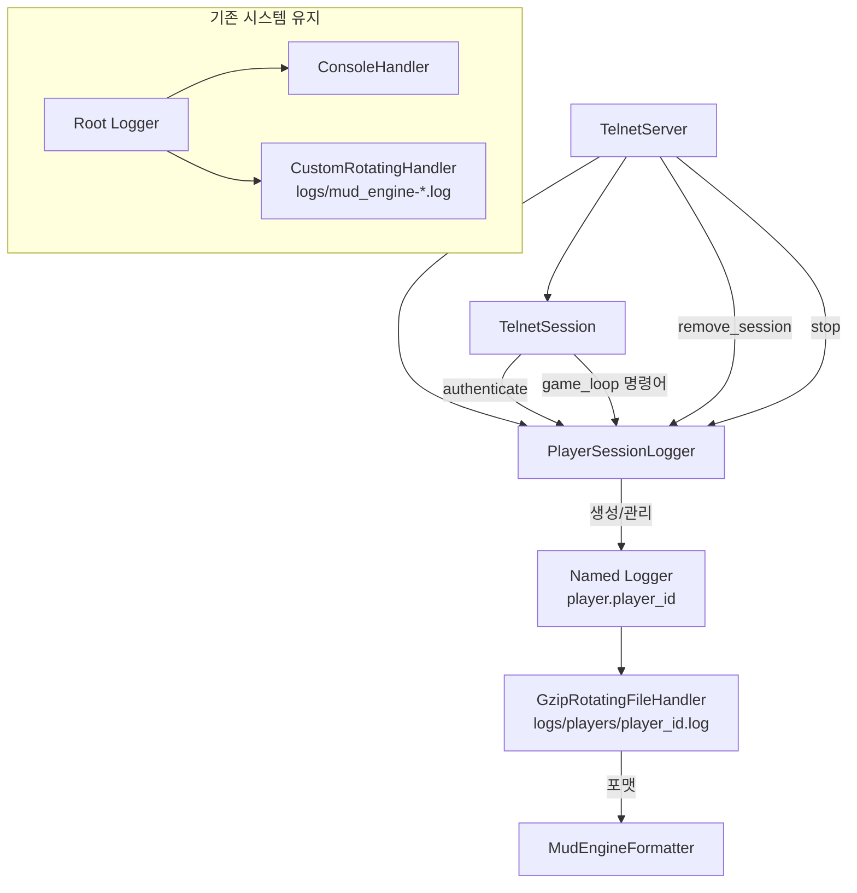

# 설계 문서: 플레이어별 세션 로그

## 개요

기존 MUD 엔진의 통합 로그 시스템(`logs/mud_engine-*.log`)을 유지하면서, 인증된 각 플레이어의 세션 활동을 `logs/players/{player_id}.log`에 개별 기록하는 기능을 추가한다.

핵심 설계 결정:
- Python 표준 `logging` 모듈의 named logger 방식을 사용한다. 플레이어별로 `player.{player_id}` 이름의 로거를 생성하고, 해당 로거에 `RotatingFileHandler`를 부착한다.
- 플레이어별 로거는 `propagate=False`로 설정하여 루트 로거(Global_Logger)로 이벤트가 전파되지 않도록 한다. 이를 통해 기존 통합 로그에 영향을 주지 않는다.
- 세션 로거의 생명주기 관리를 전담하는 `PlayerSessionLogger` 클래스를 `src/mud_engine/server/player_session_logger.py`에 신규 생성한다.

## 아키텍처

### 컴포넌트 관계도



### 데이터 흐름

1. 플레이어 인증 성공 → `TelnetServer.handle_login()` / `handle_register()` → `PlayerSessionLogger.setup_player_logger()` 호출
2. 게임 명령어 입력 → `TelnetServer.handle_game_command()` → `PlayerSessionLogger.log_command()` 호출
3. 세션 종료 → `TelnetServer.remove_session()` → `PlayerSessionLogger.cleanup_player_logger()` 호출
4. 서버 종료 → `TelnetServer.stop()` → `PlayerSessionLogger.cleanup_all()` 호출

### 설계 결정 근거

named logger 방식 vs 핸들러 동적 추가 방식 비교:

| 기준 | Named Logger (채택) | 핸들러 동적 추가 |
|------|---------------------|------------------|
| 격리성 | `propagate=False`로 완전 격리 | 루트 로거에 핸들러 추가 시 간섭 위험 |
| 관리 용이성 | 로거 이름으로 조회/정리 간편 | 핸들러 참조를 별도 관리해야 함 |
| 기존 코드 영향 | 없음 (별도 로거 네임스페이스) | 루트 로거 수정 필요 가능 |
| 복잡도 | 낮음 | 중간 |

## 컴포넌트 및 인터페이스

### PlayerSessionLogger 클래스

```python
# src/mud_engine/server/player_session_logger.py

class GzipRotatingFileHandler(logging.handlers.RotatingFileHandler):
    """로테이션 시 이전 파일을 gzip 압축하는 RotatingFileHandler.
    기존 통합 로그의 CustomRotatingHandler와 동일한 압축 방식."""

    def doRollover(self) -> None:
        """로테이션 수행. 백업 파일을 .gz로 압축."""


class PlayerSessionLogger:
    """플레이어별 세션 로그 관리자"""

    def __init__(self) -> None:
        """초기화. logs/players/ 디렉토리 생성."""

    def setup_player_logger(
        self,
        player_id: str,
        player_username: str,
        session_id: str,
        ip_address: str
    ) -> None:
        """플레이어별 로거 설정 및 세션 시작 로그 기록.
        이미 핸들러가 존재하면 기존 것을 정리 후 재설정."""

    def log_command(self, player_id: str, command: str) -> None:
        """플레이어 명령어를 해당 플레이어 로그에 기록."""

    def log_session_end(self, player_id: str, reason: str) -> None:
        """세션 종료 로그 기록."""

    def cleanup_player_logger(self, player_id: str) -> None:
        """플레이어 로거의 핸들러를 제거하고 닫음."""

    def cleanup_all(self) -> None:
        """모든 활성 플레이어 로거의 핸들러를 정리."""
```

### 기존 코드 수정 지점

1. `TelnetServer.__init__()`: `PlayerSessionLogger` 인스턴스 생성
2. `TelnetServer.handle_login()`: 인증 성공 후 `setup_player_logger()` 호출
3. `TelnetServer.handle_register()`: 회원가입+자동 로그인 후 `setup_player_logger()` 호출
4. `TelnetServer.handle_game_command()`: 명령어 처리 전 `log_command()` 호출
5. `TelnetServer.remove_session()`: 세션 제거 시 `log_session_end()` + `cleanup_player_logger()` 호출
6. `TelnetServer.stop()`: 서버 종료 시 `cleanup_all()` 호출

### MudEngineFormatter 재사용

현재 `MudEngineFormatter`는 `main.py`의 `setup_logging()` 내부 클래스로 정의되어 있어 외부에서 import할 수 없다. 두 가지 접근 방식이 있다:

- 방식 A: `MudEngineFormatter`를 별도 모듈로 추출
- 방식 B: `PlayerSessionLogger` 내부에서 동일한 포맷 로직을 재구현

기존 코드 최소 변경 원칙에 따라 방식 B를 채택한다. `PlayerSessionLogger` 내부에 동일한 포맷 문자열을 사용하는 `Formatter`를 정의한다. 포맷: `{시분초.ms} {LEVEL} [{module:line}] {message}`

## 데이터 모델

### 로그 파일 구조

```
logs/
├── mud_engine-20260115-01.log      # 기존 통합 로그 (변경 없음)
├── mud_engine-20260115-01.log.gz   # 기존 압축 로그 (변경 없음)
└── players/                         # 신규 디렉토리
    ├── abc123.log                   # 플레이어별 로그 (player_id 기반)
    ├── abc123.log.1.gz              # 로테이션 백업 1 (gzip 압축)
    ├── abc123.log.2.gz              # 로테이션 백업 2 (gzip 압축)
    ├── def456.log
    └── ...
```

### 로그 메시지 형식

세션 시작:
```
14:23:45.123 INFO [player_session_logger:42] 세션 시작 - session_id=abc-def, player_id=abc123, username=player1, ip=192.168.1.1
```

명령어 기록:
```
14:23:50.456 INFO [player_session_logger:55] 명령어: look
14:23:52.789 INFO [player_session_logger:55] 명령어: go north
```

세션 종료:
```
14:30:00.123 INFO [player_session_logger:68] 세션 종료 - 사유: 플레이어 요청으로 종료
```

### GzipRotatingFileHandler 설정

| 설정 항목 | 값 |
|-----------|-----|
| maxBytes | 10MB (10 * 1024 * 1024) |
| backupCount | 5 |
| encoding | utf-8 |
| mode | append (a) |
| 압축 | gzip (로테이션 시 백업 파일을 .gz로 압축) |

### 로거 네이밍 규칙

- 로거 이름: `player.{player_id}`
- `propagate`: `False` (루트 로거로 전파 차단)
- 로그 레벨: `INFO`


## 정확성 속성 (Correctness Properties)

*속성(property)이란 시스템의 모든 유효한 실행에서 참이어야 하는 특성 또는 동작이다. 속성은 사람이 읽을 수 있는 명세와 기계가 검증할 수 있는 정확성 보장 사이의 다리 역할을 한다.*

### Property 1: 세션 시작 로그에 필수 필드 포함

*For any* 유효한 player_id, player_username, session_id, ip_address 조합으로 `setup_player_logger`를 호출하면, 생성된 로그 파일에는 session_id, player_id, player_username, ip_address가 모두 포함된 세션 시작 로그 라인이 존재해야 한다.

**Validates: Requirements 1.1, 2.1**

### Property 2: 로그 포맷 패턴 일치

*For any* 로그 레코드(임의의 레벨, 메시지, 모듈명)에 대해 PlayerSessionLogger의 포맷터를 적용하면, 출력 문자열은 `{HH:MM:SS.mmm} {LEVEL} [{module:line}] {message}` 패턴과 일치해야 한다.

**Validates: Requirements 1.4**

### Property 3: 명령어 로그 기록

*For any* 유효한 player_id와 임의의 명령어 문자열에 대해 `log_command`를 호출하면, 해당 플레이어의 로그 파일에 원본 명령어 문자열이 포함된 로그 라인이 존재해야 한다.

**Validates: Requirements 3.1, 3.2**

### Property 4: 세션 종료 로그에 사유 포함

*For any* 유효한 player_id와 임의의 종료 사유 문자열에 대해 `log_session_end`를 호출하면, 해당 플레이어의 로그 파일에 종료 사유가 포함된 로그 라인이 존재해야 한다.

**Validates: Requirements 2.2**

### Property 5: 핸들러 정리 후 리소스 해제

*For any* 유효한 player_id에 대해 `setup_player_logger` 후 `cleanup_player_logger`를 호출하면, 해당 로거의 핸들러 리스트는 비어있어야 한다.

**Validates: Requirements 2.3, 6.1**

### Property 6: cleanup_all이 모든 로거 정리

*For any* 1~10개의 임의의 player_id 집합에 대해 각각 `setup_player_logger`를 호출한 후 `cleanup_all`을 호출하면, 모든 플레이어 로거의 핸들러 리스트가 비어있어야 한다.

**Validates: Requirements 6.2**

### Property 7: 플레이어 로거 격리성

*For any* 유효한 player_id에 대해 플레이어 로거에 메시지를 기록하면, 해당 메시지는 루트 로거의 핸들러로 전파되지 않아야 한다 (propagate=False 보장).

**Validates: Requirements 4.1, 4.2**

## 에러 처리

### 로그 파일 생성 실패

- `logs/players/` 디렉토리 생성 실패 시: `Global_Logger`에 ERROR 레벨로 기록하고, 플레이어 세션은 정상 진행
- 로그 파일 열기 실패 시 (디스크 풀, 권한 문제): `Global_Logger`에 ERROR 레벨로 기록하고, 해당 플레이어의 세션 로깅만 비활성화

### 로그 기록 실패

- `log_command`, `log_session_end` 호출 시 예외 발생: try/except로 감싸서 `Global_Logger`에 WARNING 기록, 게임 로직에 영향 없음
- 로거가 설정되지 않은 player_id로 호출 시: 조용히 무시 (미인증 세션 등)

### 핸들러 정리 실패

- `cleanup_player_logger` 중 예외 발생: `Global_Logger`에 WARNING 기록, 다른 플레이어 로거 정리에 영향 없음
- `cleanup_all` 중 개별 로거 정리 실패: 해당 로거만 건너뛰고 나머지 계속 정리

## 테스트 전략

### 단위 테스트 (Unit Tests)

- `PlayerSessionLogger` 초기화 시 `logs/players/` 디렉토리 생성 확인
- 핸들러 설정 값 확인: encoding=utf-8, maxBytes=10MB, backupCount=5, gzip 압축
- 로그 파일 생성/기록 실패 시 예외가 전파되지 않는 것 확인
- 미설정 player_id로 `log_command` 호출 시 에러 없이 무시되는 것 확인

### 속성 기반 테스트 (Property-Based Tests)

- 라이브러리: `hypothesis` (Python PBT 표준 라이브러리)
- 최소 100회 반복 실행
- 각 테스트에 설계 문서 속성 번호 태그 부착
- 태그 형식: `Feature: player-session-logging, Property {number}: {property_text}`

테스트 대상 속성:
1. Property 1: 세션 시작 로그 필수 필드 포함
2. Property 2: 로그 포맷 패턴 일치
3. Property 3: 명령어 로그 기록
4. Property 4: 세션 종료 로그 사유 포함
5. Property 5: 핸들러 정리 후 리소스 해제
6. Property 6: cleanup_all 전체 정리
7. Property 7: 플레이어 로거 격리성

### 통합 테스트 (Integration Tests)

- 실제 TelnetServer 흐름에서 로그인 → 명령어 입력 → 로그아웃 시나리오 검증
- 서버 종료 시 모든 핸들러 정리 확인
- 기존 통합 로그(`logs/mud_engine-*.log`)가 영향받지 않는 것 확인
