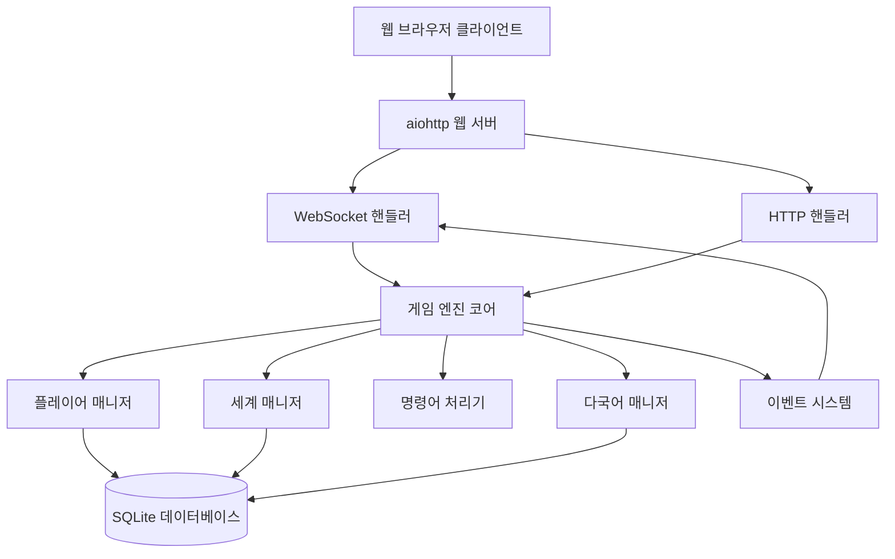

# 설계 문서

## 개요

Python MUD 엔진은 aiohttp를 기반으로 한 비동기 웹 서버로, WebSocket을 통해 실시간 다중 사용자 텍스트 게임을 제공합니다. 전통적인 MUD의 텍스트 명령어 시스템과 현대적인 웹 UI를 결합한 하이브리드 인터페이스를 제공하며, SQLite를 사용한 데이터 지속성과 영어/한국어 다국어 지원을 포함합니다.

## 아키텍처

### 전체 시스템 구조



### 레이어 구조

1. **프레젠테이션 레이어**: 웹 클라이언트 (HTML/CSS/JavaScript)
2. **네트워크 레이어**: aiohttp 서버 (HTTP/WebSocket)
3. **애플리케이션 레이어**: 게임 엔진 코어
4. **비즈니스 로직 레이어**: 게임 매니저들
5. **데이터 레이어**: SQLite 데이터베이스

## 구성 요소 및 인터페이스

### 1. 웹 서버 (aiohttp)

**역할**: HTTP 요청 및 WebSocket 연결 처리

**주요 컴포넌트**:

- `MudServer`: 메인 서버 클래스
- `WebSocketHandler`: WebSocket 연결 관리
- `StaticHandler`: 정적 파일 서빙 (HTML, CSS, JS)

**인터페이스**:

```python
class MudServer:
    async def start_server(self, host: str, port: int) -> None
    async def stop_server(self) -> None
    async def handle_websocket(self, request: web.Request) -> web.WebSocketResponse
    async def handle_static(self, request: web.Request) -> web.Response
```

### 2. 게임 엔진 코어

**역할**: 게임 로직의 중앙 조정자

**주요 컴포넌트**:

- `GameEngine`: 메인 게임 엔진
- `Session`: 플레이어 세션 관리
- `EventBus`: 이벤트 발행/구독 시스템

**인터페이스**:

```python
class GameEngine:
    async def process_command(self, session: Session, command: str) -> None
    async def broadcast_to_room(self, room_id: str, message: dict) -> None
    async def add_player_session(self, session: Session) -> None
    async def remove_player_session(self, session_id: str) -> None
```

### 3. 플레이어 매니저

**역할**: 플레이어 인증, 세션 관리, 캐릭터 데이터

**주요 컴포넌트**:

- `PlayerManager`: 플레이어 관리
- `AuthService`: 인증 서비스
- `Character`: 캐릭터 모델

**인터페이스**:

```python
class PlayerManager:
    async def authenticate(self, username: str, password: str) -> Optional[Player]
    async def create_account(self, username: str, password: str) -> Player
    async def get_player(self, player_id: str) -> Optional[Player]
    async def save_player(self, player: Player) -> None
```

### 4. 세계 매니저

**역할**: 게임 세계, 방, 객체 관리

**주요 컴포넌트**:

- `WorldManager`: 세계 관리
- `Room`: 방 모델
- `GameObject`: 게임 객체 모델

**인터페이스**:

```python
class WorldManager:
    async def get_room(self, room_id: str) -> Optional[Room]
    async def create_room(self, room_data: dict) -> Room
    async def update_room(self, room_id: str, updates: dict) -> None
    async def get_room_objects(self, room_id: str) -> List[GameObject]
```

### 5. 명령어 처리기

**역할**: 텍스트 명령어 파싱 및 실행

**주요 컴포넌트**:

- `CommandProcessor`: 명령어 처리
- `CommandRegistry`: 명령어 등록 관리
- `Command`: 개별 명령어 클래스들

**인터페이스**:

```python
class CommandProcessor:
    async def parse_command(self, input_text: str) -> Tuple[str, List[str]]
    async def execute_command(self, session: Session, command: str, args: List[str]) -> None
    def register_command(self, command_name: str, handler: Command) -> None
```

### 6. 다국어 매니저

**역할**: 영어/한국어 지원

**주요 컴포넌트**:

- `I18nManager`: 다국어 관리
- `LocaleService`: 로케일 서비스

**인터페이스**:

```python
class I18nManager:
    def get_text(self, key: str, locale: str, **kwargs) -> str
    async def load_translations(self) -> None
    def get_supported_locales(self) -> List[str]
```

## 데이터 모델

### 데이터베이스 스키마 (SQLite)

```sql
-- 플레이어 테이블
CREATE TABLE players (
    id TEXT PRIMARY KEY,
    username TEXT UNIQUE NOT NULL,
    password_hash TEXT NOT NULL,
    email TEXT,
    preferred_locale TEXT DEFAULT 'en',
    created_at TIMESTAMP DEFAULT CURRENT_TIMESTAMP,
    last_login TIMESTAMP
);

-- 캐릭터 테이블
CREATE TABLE characters (
    id TEXT PRIMARY KEY,
    player_id TEXT NOT NULL,
    name TEXT NOT NULL,
    current_room_id TEXT,
    inventory TEXT, -- JSON 형태로 저장
    stats TEXT, -- JSON 형태로 저장
    created_at TIMESTAMP DEFAULT CURRENT_TIMESTAMP,
    FOREIGN KEY (player_id) REFERENCES players(id)
);

-- 방 테이블
CREATE TABLE rooms (
    id TEXT PRIMARY KEY,
    name_en TEXT NOT NULL,
    name_ko TEXT NOT NULL,
    description_en TEXT,
    description_ko TEXT,
    exits TEXT, -- JSON 형태로 저장 (방향: 목적지_방_ID)
    created_at TIMESTAMP DEFAULT CURRENT_TIMESTAMP,
    updated_at TIMESTAMP DEFAULT CURRENT_TIMESTAMP
);

-- 게임 객체 테이블
CREATE TABLE game_objects (
    id TEXT PRIMARY KEY,
    name_en TEXT NOT NULL,
    name_ko TEXT NOT NULL,
    description_en TEXT,
    description_ko TEXT,
    object_type TEXT NOT NULL, -- 'item', 'npc', 'furniture' 등
    location_type TEXT NOT NULL, -- 'room', 'inventory'
    location_id TEXT, -- room_id 또는 character_id
    properties TEXT, -- JSON 형태로 저장
    created_at TIMESTAMP DEFAULT CURRENT_TIMESTAMP
);

-- 다국어 텍스트 테이블
CREATE TABLE translations (
    key TEXT NOT NULL,
    locale TEXT NOT NULL,
    value TEXT NOT NULL,
    PRIMARY KEY (key, locale)
);
```

### 핵심 데이터 모델

```python
@dataclass
class Player:
    id: str
    username: str
    password_hash: str
    email: Optional[str]
    preferred_locale: str = 'en'
    created_at: datetime
    last_login: Optional[datetime] = None

@dataclass
class Character:
    id: str
    player_id: str
    name: str
    current_room_id: Optional[str]
    inventory: List[str]  # 객체 ID 목록
    stats: Dict[str, Any]
    created_at: datetime

@dataclass
class Room:
    id: str
    name: Dict[str, str]  # {'en': 'name', 'ko': '이름'}
    description: Dict[str, str]
    exits: Dict[str, str]  # {'north': 'room_id', 'south': 'room_id'}
    created_at: datetime
    updated_at: datetime

@dataclass
class GameObject:
    id: str
    name: Dict[str, str]
    description: Dict[str, str]
    object_type: str
    location_type: str
    location_id: Optional[str]
    properties: Dict[str, Any]
    created_at: datetime

@dataclass
class Session:
    id: str
    player_id: str
    character_id: str
    websocket: web.WebSocketResponse
    current_room_id: str
    locale: str
    connected_at: datetime
```

## 오류 처리

### 오류 계층 구조

```python
class MudEngineError(Exception):
    """기본 MUD 엔진 오류"""
    pass

class AuthenticationError(MudEngineError):
    """인증 관련 오류"""
    pass

class CommandError(MudEngineError):
    """명령어 처리 오류"""
    pass

class WorldError(MudEngineError):
    """게임 세계 관련 오류"""
    pass

class DatabaseError(MudEngineError):
    """데이터베이스 관련 오류"""
    pass
```

### 오류 처리 전략

1. **WebSocket 연결 오류**: 자동 재연결 시도, 세션 정리
2. **데이터베이스 오류**: 트랜잭션 롤백, 로깅, 사용자 알림
3. **명령어 오류**: 사용자에게 친화적인 오류 메시지 표시
4. **세계 데이터 오류**: 기본값으로 복구, 관리자 알림

## 테스트 전략

### 테스트 레벨

1. **단위 테스트**: 개별 컴포넌트 테스트

   - 명령어 처리기
   - 데이터 모델
   - 다국어 매니저

2. **통합 테스트**: 컴포넌트 간 상호작용 테스트

   - 데이터베이스 연동
   - WebSocket 통신
   - 게임 엔진 워크플로우

3. **시스템 테스트**: 전체 시스템 테스트
   - 다중 사용자 시나리오
   - 실시간 세계 편집
   - 성능 테스트

### 테스트 도구

- **pytest**: 단위 및 통합 테스트
- **pytest-asyncio**: 비동기 코드 테스트
- **aiohttp.test_utils**: WebSocket 테스트
- **sqlite3**: 인메모리 데이터베이스 테스트

### 테스트 데이터

```python
# 테스트용 샘플 데이터
TEST_ROOMS = {
    'room_001': {
        'name': {'en': 'Town Square', 'ko': '마을 광장'},
        'description': {
            'en': 'A bustling town square with a fountain in the center.',
            'ko': '중앙에 분수가 있는 번화한 마을 광장입니다.'
        },
        'exits': {'north': 'room_002', 'east': 'room_003'}
    }
}

TEST_PLAYERS = {
    'player_001': {
        'username': 'testuser',
        'password_hash': 'hashed_password',
        'preferred_locale': 'ko'
    }
}
```

## 성능 고려사항

### 확장성 설계

1. **비동기 처리**: asyncio를 통한 동시성
2. **연결 풀링**: SQLite 연결 관리
3. **메모리 관리**: WeakSet을 사용한 WebSocket 연결 추적
4. **캐싱**: 자주 접근하는 방 데이터 캐싱

### 성능 최적화

1. **데이터베이스 인덱싱**: 자주 조회되는 컬럼에 인덱스 생성
2. **배치 처리**: 여러 플레이어에게 동시 메시지 전송 최적화
3. **지연 로딩**: 필요시에만 데이터 로드
4. **압축**: WebSocket 메시지 압축 활용 (aiohttp 내장 기능 사용, 메시지 타입별 압축 레벨 조정)

### 모니터링

```python
# 성능 메트릭 수집
class PerformanceMonitor:
    def __init__(self):
        self.active_connections = 0
        self.commands_per_second = 0
        self.database_query_time = []

    async def log_command_execution(self, duration: float):
        # 명령어 실행 시간 로깅
        pass

    async def log_database_query(self, query: str, duration: float):
        # 데이터베이스 쿼리 성능 로깅
        pass
```

이 설계는 요구사항에서 정의한 모든 기능을 지원하면서도 확장 가능하고 유지보수가 용이한 구조를 제공합니다. aiohttp의 비동기 특성을 활용하여 다중 사용자 환경에서 효율적으로 동작하며, SQLite를 통한 안정적인 데이터 저장과 실시간 세계 편집 기능을 지원합
