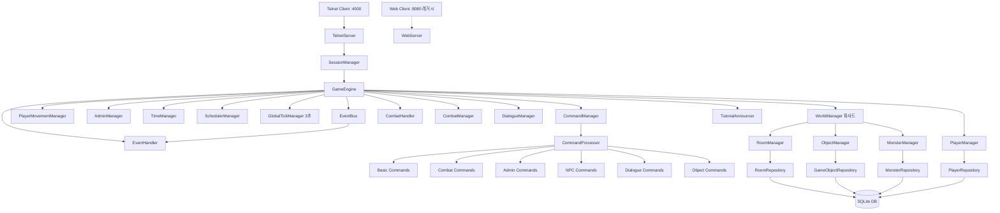
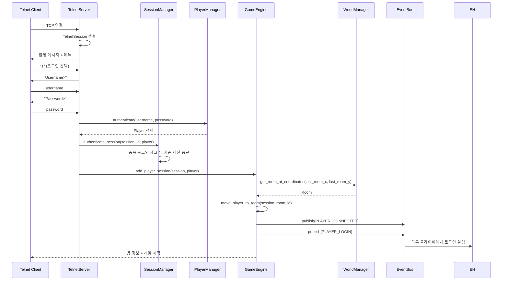
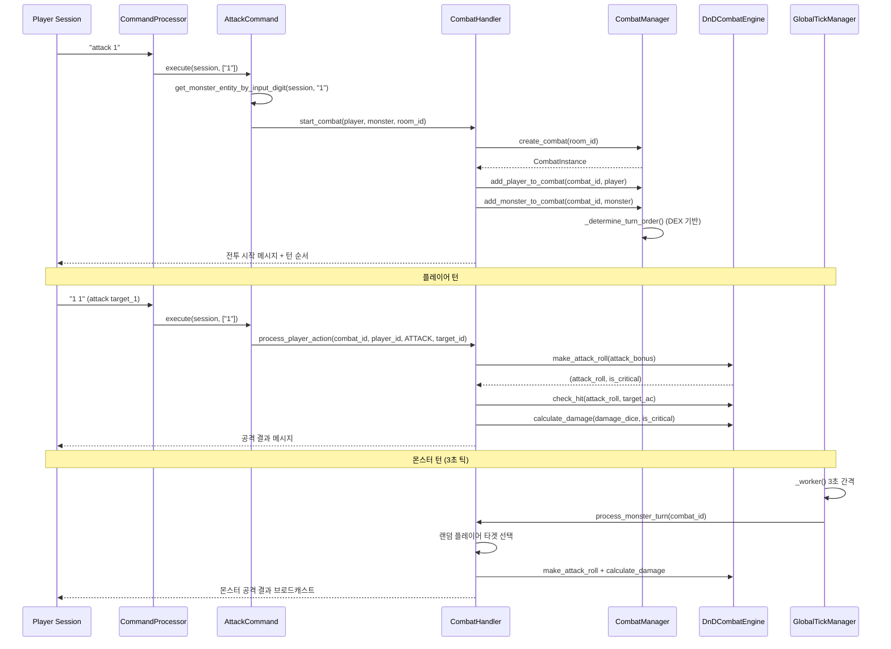
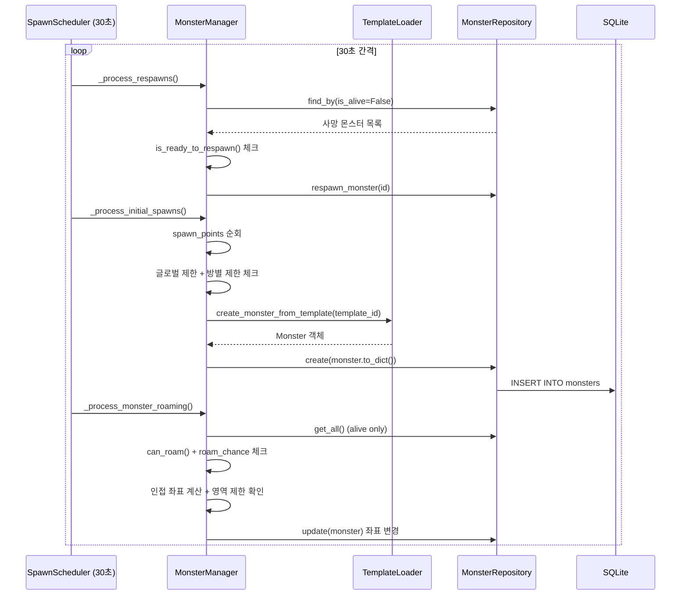

# 설계 문서: Python MUD Engine (카르나스 연대기: 분할된 지배권)

## 개요

Python MUD Engine은 asyncio 기반의 비동기 텍스트 MUD 게임 서버입니다. Telnet(포트 4000)을 주 클라이언트로 사용하며, SQLite 데이터 지속성, 영어/한국어 다국어 지원, D&D 5e 기반 전투 시스템, 좌표 기반 월드 시스템을 포함합니다.

세계관은 "분할된 지배권, 카르나스(Karnas)"로, 황금 제국이 무너진 뒤 폐허와 괴물의 소굴로 변한 세상에서 플레이어가 탐험하는 판타지 배경입니다. 세력(잿빛 기사단, 고블린, 동물) 간 관계 시스템이 NPC/몬스터 상호작용에 영향을 줍니다.

## 아키텍처


```mermaid
graph TD
    TC[Telnet Client :4000] --> TS[TelnetServer]
    WC[Web Client :8080 레거시] -.-> WS[WebServer]

    TS --> SM[SessionManager]
    SM --> GE[GameEngine]

    GE --> CM[CommandManager]
    GE --> EH[EventHandler]
    GE --> MM[PlayerMovementManager]
    GE --> AM[AdminManager]
    GE --> TM[TimeManager]
    GE --> SCM[SchedulerManager]
    GE --> GTM[GlobalTickManager 3초]

    GE --> WM[WorldManager 파사드]
    GE --> PM[PlayerManager]
    GE --> CH[CombatHandler]
    GE --> CMgr[CombatManager]
    GE --> DM[DialogueManager]

    WM --> RMgr[RoomManager]
    WM --> OMgr[ObjectManager]
    WM --> MonMgr[MonsterManager]

    CM --> CP[CommandProcessor]
    CP --> BC[Basic Commands]
    CP --> CC[Combat Commands]
    CP --> AC[Admin Commands]
    CP --> NC[NPC Commands]
    CP --> DC[Dialogue Commands]
    CP --> OC[Object Commands]

    GE --> EB[EventBus]
    EB --> EH

    GE --> TA[TutorialAnnouncer]

    RMgr --> RRepo[RoomRepository]
    OMgr --> ORepo[GameObjectRepository]
    MonMgr --> MRepo[MonsterRepository]
    PM --> PRepo[PlayerRepository]

    RRepo --> DB[(SQLite DB)]
    ORepo --> DB
    MRepo --> DB
    PRepo --> DB
```

## 시퀀스 다이어그램

### 플레이어 로그인 흐름


```mermaid
sequenceDiagram
    participant C as Telnet Client
    participant TS as TelnetServer
    participant SM as SessionManager
    participant PM as PlayerManager
    participant GE as GameEngine
    participant WM as WorldManager
    participant EB as EventBus

    C->>TS: TCP 연결
    TS->>TS: TelnetSession 생성
    TS->>C: 환영 메시지 + 메뉴
    C->>TS: "1" (로그인 선택)
    TS->>C: "Username>"
    C->>TS: username
    TS->>C: "Password>"
    C->>TS: password
    TS->>PM: authenticate(username, password)
    PM-->>TS: Player 객체
    TS->>SM: authenticate_session(session_id, player)
    SM->>SM: 중복 로그인 체크 및 기존 세션 종료
    TS->>GE: add_player_session(session, player)
    GE->>WM: get_room_at_coordinates(last_room_x, last_room_y)
    WM-->>GE: Room
    GE->>GE: move_player_to_room(session, room_id)
    GE->>EB: publish(PLAYER_CONNECTED)
    GE->>EB: publish(PLAYER_LOGIN)
    EB->>EH: 다른 플레이어에게 로그인 알림
    GE-->>C: 방 정보 + 게임 시작
```

### 전투 흐름


```mermaid
sequenceDiagram
    participant P as Player Session
    participant CP as CommandProcessor
    participant AC as AttackCommand
    participant CH as CombatHandler
    participant CM as CombatManager
    participant DnD as DnDCombatEngine
    participant GTM as GlobalTickManager

    P->>CP: "attack 1"
    CP->>AC: execute(session, ["1"])
    AC->>AC: get_monster_entity_by_input_digit(session, "1")
    AC->>CH: start_combat(player, monster, room_id)
    CH->>CM: create_combat(room_id)
    CM-->>CH: CombatInstance
    CH->>CM: add_player_to_combat(combat_id, player)
    CH->>CM: add_monster_to_combat(combat_id, monster)
    CM->>CM: _determine_turn_order() (DEX 기반)
    CH-->>P: 전투 시작 메시지 + 턴 순서

    Note over P,GTM: 플레이어 턴
    P->>CP: "1 1" (attack target_1)
    CP->>AC: execute(session, ["1"])
    AC->>CH: process_player_action(combat_id, player_id, ATTACK, target_id)
    CH->>DnD: make_attack_roll(attack_bonus)
    DnD-->>CH: (attack_roll, is_critical)
    CH->>DnD: check_hit(attack_roll, target_ac)
    CH->>DnD: calculate_damage(damage_dice, is_critical)
    CH-->>P: 공격 결과 메시지

    Note over P,GTM: 몬스터 턴 (3초 틱)
    GTM->>GTM: _worker() 3초 간격
    GTM->>CH: process_monster_turn(combat_id)
    CH->>CH: 랜덤 플레이어 타겟 선택
    CH->>DnD: make_attack_roll + calculate_damage
    CH-->>P: 몬스터 공격 결과 브로드캐스트
```


### 몬스터 스폰/로밍 흐름


```mermaid
sequenceDiagram
    participant SS as SpawnScheduler (30초)
    participant MM as MonsterManager
    participant TL as TemplateLoader
    participant MR as MonsterRepository
    participant DB as SQLite

    loop 30초 간격
        SS->>MM: _process_respawns()
        MM->>MR: find_by(is_alive=False)
        MR-->>MM: 사망 몬스터 목록
        MM->>MM: is_ready_to_respawn() 체크
        MM->>MR: respawn_monster(id)

        SS->>MM: _process_initial_spawns()
        MM->>MM: spawn_points 순회
        MM->>MM: 글로벌 제한 + 방별 제한 체크
        MM->>TL: create_monster_from_template(template_id)
        TL-->>MM: Monster 객체
        MM->>MR: create(monster.to_dict())
        MR->>DB: INSERT INTO monsters

        SS->>MM: _process_monster_roaming()
        MM->>MR: get_all() (alive only)
        MM->>MM: can_roam() + roam_chance 체크
        MM->>MM: 인접 좌표 계산 + 영역 제한 확인
        MM->>MR: update(monster) 좌표 변경
    end
```

## 컴포넌트 및 인터페이스

### 1. TelnetServer

목적: asyncio 기반 Telnet 서버. 클라이언트 연결, 인증, 게임 루프 관리.

```python
class TelnetServer:
    host: str           # "0.0.0.0"
    port: int           # 4000
    game_engine: GameEngine
    sessions: Dict[str, TelnetSession]
    player_sessions: Dict[str, str]  # player_id -> session_id

    async def start() -> None
    async def stop() -> None
    async def handle_client(reader, writer) -> None
    async def handle_authentication(session) -> bool
    async def game_loop(session) -> None
```

책임:
- TCP 연결 수락 및 TelnetSession 생성
- 로그인/회원가입 인증 흐름 처리
- 게임 루프에서 명령어 입력 대기 및 GameEngine 위임
- 비활성 세션 정리 (60초 간격)
- 중복 로그인 감지 및 기존 세션 종료

### 2. TelnetSession

목적: 개별 Telnet 클라이언트 세션 관리. Telnet 프로토콜 처리 및 메시지 포맷팅.

```python
class TelnetSession:
    session_id: str
    reader: asyncio.StreamReader
    writer: asyncio.StreamWriter
    player: Optional[Player]
    is_authenticated: bool
    current_room_id: Optional[str]
    locale: str                      # "en" | "ko"
    game_engine: Optional[GameEngine]
    in_combat: bool
    original_room_id: Optional[str]
    combat_id: Optional[str]
    following_player: Optional[str]
    use_ansi_colors: bool

    async def send_message(message: Dict) -> bool
    async def send_text(text: str) -> bool
    async def read_line(timeout: float) -> Optional[str]
    async def disable_echo() -> None   # 패스워드 입력용
    async def enable_echo() -> None
```

책임:
- Telnet 프로토콜 협상 (IAC, WILL/WONT, ECHO)
- 메시지 딕셔너리를 ANSI 색상 텍스트로 포맷팅
- 방 정보 렌더링 (엔티티 번호 매핑, 세력 기반 몬스터 분류)
- 바이트 단위 입력 처리 (백스페이스, Telnet 명령어 필터링)

### 3. GameEngine

목적: 게임 로직 중앙 조정자. 모든 매니저를 초기화하고 통합.

```python
class GameEngine:
    session_manager: SessionManager
    player_manager: PlayerManager
    world_manager: WorldManager
    combat_manager: CombatManager
    combat_handler: CombatHandler
    command_manager: CommandManager
    event_handler: EventHandler
    movement_manager: PlayerMovementManager
    admin_manager: AdminManager
    time_manager: TimeManager
    scheduler_manager: SchedulerManager
    global_tick_manager: GlobalTickManager
    event_bus: EventBus
    tutorial_announcer: TutorialAnnouncer

    async def start() -> None
    async def stop() -> None
    async def add_player_session(session, player) -> None
    async def remove_player_session(session, reason) -> None
    async def handle_player_command(session, command) -> CommandResult
    async def broadcast_to_room(room_id, message, exclude_session) -> int
    async def try_rejoin_combat(session) -> bool
    async def get_room_info(room_id, locale) -> Optional[Dict]
```

책임:
- 모든 하위 매니저 초기화 및 생명주기 관리
- 플레이어 세션 추가/제거 및 위치 복원
- 명령어 처리 위임 (CommandManager)
- 방/전체 브로드캐스트
- 전투 복귀 처리 (재접속 시)
- 스폰 시스템, 시간 시스템, 스케줄러 시작/중지

### 4. WorldManager (파사드)

목적: RoomManager, ObjectManager, MonsterManager를 통합하는 파사드 인터페이스.

```python
class WorldManager:
    _room_manager: RoomManager
    _object_manager: ObjectManager
    _monster_manager: MonsterManager

    # 방 관리
    async def get_room(room_id) -> Optional[Room]
    async def get_room_at_coordinates(x, y) -> Optional[Room]
    async def get_adjacent_room(x, y, direction) -> Optional[Room]
    async def create_room(room_data) -> Room

    # 객체 관리
    async def get_room_objects(room_id) -> List[GameObject]
    async def get_inventory_objects(character_id) -> List[GameObject]
    async def get_equipped_objects(character_id) -> List[GameObject]

    # 몬스터 관리
    async def get_monsters_in_room(room_id) -> List[Monster]
    async def get_monsters_at_coordinates(x, y) -> List[Monster]

    # 스폰 시스템
    async def start_spawn_scheduler() -> None
    async def setup_default_spawn_points() -> None
    def set_global_spawn_limit(template_id, max_count) -> None

    # 컨테이너 시스템
    async def get_container_items(container_id) -> List[GameObject]
    async def put_item_in_container(player_id, item_num, container_num, entity_map) -> Dict

    # 위치 요약
    async def get_location_summary(room_id, locale) -> Dict
    async def validate_world_integrity() -> Dict[str, List[str]]
```

### 5. CommandProcessor

목적: 명령어 파싱, 라우팅, 실행.

```python
class CommandProcessor:
    commands: Dict[str, BaseCommand]
    event_bus: Optional[EventBus]

    def register_command(command: BaseCommand) -> None
    def parse_command(command_line: str) -> tuple[str, List[str]]
    async def process_command(session, command_line) -> CommandResult
```

책임:
- 명령어 이름 + 별칭 등록 및 조회
- shlex 기반 명령어 파싱
- 전투 중 숫자 입력 → 명령어 변환 (1→attack, 2→defend, 3→flee, 9→endturn)
- "." 입력 시 이전 명령어 반복
- 관리자 전용 명령어 권한 확인
- 전투 전용 명령어 동적 생성 (defend, flee, item, endturn)

### 6. CombatHandler / CombatManager

목적: D&D 5e 기반 인스턴스 턴제 전투 시스템.

```python
class CombatManager:
    combat_instances: Dict[str, CombatInstance]
    room_combats: Dict[str, str]      # room_id -> combat_id
    player_combats: Dict[str, str]    # player_id -> combat_id

    def create_combat(room_id) -> CombatInstance
    def add_player_to_combat(combat_id, player, player_id) -> bool
    def add_monster_to_combat(combat_id, monster) -> bool
    def mark_player_disconnected(player_id) -> bool
    def try_rejoin_combat(player_id, player) -> Optional[CombatInstance]
    async def process_combat_tick() -> Dict  # 15초 간격 타임아웃 체크

class CombatHandler:
    combat_manager: CombatManager
    dnd_engine: DnDCombatEngine

    async def start_combat(player, monster, room_id, aggresive=False) -> CombatInstance
    async def process_player_action(combat_id, player_id, action, target_id) -> Dict
    async def process_monster_turn(combat_id) -> Dict
```

### 7. EventBus

목적: 비동기 이벤트 발행/구독 시스템.

```python
class EventBus:
    async def start() -> None
    async def stop() -> None
    def subscribe(event_type: EventType, callback) -> None
    async def publish(event: Event) -> None
```

이벤트 타입: PLAYER_CONNECTED, PLAYER_DISCONNECTED, PLAYER_LOGIN, PLAYER_LOGOUT, PLAYER_COMMAND, ROOM_ENTERED, ROOM_LEFT, ROOM_MESSAGE, ROOM_BROADCAST, PLAYER_ACTION, PLAYER_EMOTE, PLAYER_GIVE, PLAYER_FOLLOW, OBJECT_PICKED_UP, OBJECT_DROPPED, SERVER_STARTED, SERVER_STOPPING

### 8. TutorialAnnouncer

목적: 마을 광장의 신입 플레이어에게 튜토리얼 안내를 주기적으로 전송.

```python
class TutorialAnnouncer:
    game_engine: GameEngine
    last_announcement: Dict[str, datetime]  # 플레이어별 마지막 안내 시간
    announcement_interval: int = 300        # 5분 간격
    running: bool = False

    async def start() -> None
    async def stop() -> None
```

책임:
- 1분 간격으로 마을 광장의 신입 플레이어(튜토리얼 퀘스트 미완료) 감지
- 5분 간격으로 교회 방문 안내 메시지를 locale별로 전송
- 플레이어별 마지막 안내 시간 추적으로 중복 안내 방지


## 데이터 모델

### Player

```python
@dataclass
class Player(BaseModel):
    id: str                          # UUID
    username: str                    # 3-20자, 영문/숫자/언더스코어
    password_hash: str               # bcrypt 해시
    preferred_locale: str = "en"     # "en" | "ko"
    is_admin: bool = False
    display_name: Optional[str]      # 게임 내 표시 이름 (한글/영문/숫자, 3-20자)
    last_name_change: Optional[datetime]  # 24시간 제한
    last_room_x: int = 0            # 좌표 기반 마지막 위치
    last_room_y: int = 0
    stats: PlayerStats               # D&D 기반 능력치
    completed_quests: List[str]      # 완료된 퀘스트 ID
    quest_progress: Dict[str, Any]   # 진행 중 퀘스트
```

검증 규칙:
- username: 3-20자, `^[a-zA-Z0-9_]+$`
- preferred_locale: "en" 또는 "ko"만 허용
- display_name: 한글/영문/숫자만, 공백 불가, 3-20자
- 이름 변경: 24시간에 1회 (관리자 제한 없음)

### PlayerStats

```python
@dataclass
class PlayerStats:
    # 1차 능력치 (1-100 범위)
    strength: int = 1       # 물리 공격력, 소지 무게
    dexterity: int = 1      # 회피율, 명중률, 속도
    intelligence: int = 1   # 마법 공격력, MP
    wisdom: int = 1         # 마법 방어력, MP 회복
    constitution: int = 1   # HP, 스태미나
    charisma: int = 1       # NPC 상호작용, 거래

    current_hp: int = 0     # 0이면 max_hp로 초기화
    current_values: Dict[str, int]              # DB 영속화 대상 (hp, mp 등)

    equipment_bonuses: Dict[str, int]           # 장비 보너스
    temporary_effects: Dict[str, Dict[str, Any]]  # 버프/디버프
```

파생 스탯 계산 (레벨 없음):
- HP = 10 + (CON × 5)
- MP = 50 + (INT × 3) + (WIS × 2)
- STA = 100 + (CON × 3) + (DEX × 2)
- ATK = 10 + (STR × 2) + 장비보너스
- DEF = 2 + (CON × 0.3) + 장비보너스
- SPD = 10 + (DEX × 1.5)
- RES = 5 + (WIS × 1.5)
- LCK = 10 + (전체 능력치 평균 / 10)
- INF = 5 + (CHA × 2)
- max_carry_weight = 5 + (STR × 5)

### Room

```python
@dataclass
class Room(BaseModel):
    id: str                          # UUID
    description: Dict[str, str]      # {"en": "...", "ko": "..."}
    x: Optional[int]                 # X 좌표
    y: Optional[int]                 # Y 좌표
```

좌표 시스템:
- 이동은 좌표 기반 (north: y+1, south: y-1, east: x+1, west: x-1)
- 인접 좌표에 방이 존재하면 이동 가능
- room_connections 테이블로 특별 연결 (enter 명령어)

### Monster

```python
@dataclass
class Monster(BaseModel):
    id: str
    name: Dict[str, str]             # {"en": "Small Rat", "ko": "작은 쥐"}
    description: Dict[str, str]
    monster_type: MonsterType         # AGGRESSIVE | PASSIVE | NEUTRAL
    behavior: MonsterBehavior         # STATIONARY | ROAMING | TERRITORIAL | AGGRESSIVE
    stats: MonsterStats               # D&D 기반 능력치
    drop_items: List[DropItem]
    x: Optional[int]                 # 좌표
    y: Optional[int]
    respawn_time: int = 300          # 초
    is_alive: bool = True
    aggro_range: int = 1
    roaming_range: int = 2
    faction_id: Optional[str]        # 세력 ID
    properties: Dict[str, Any]       # template_id, roaming_config 등
```

MonsterStats 파생값 (레벨 없음):
- max_hp = 10 + (CON × 2)
- attack_power = 1 + (STR / 2)
- defense = CON / 3
- armor_class = 10 + (DEX - 10) / 2
- attack_bonus = (STR - 10) / 2

### GameObject

```python
@dataclass
class GameObject(BaseModel):
    id: str
    name: Dict[str, str]             # {"en": "...", "ko": "..."}
    description: Dict[str, str]
    location_type: str               # "ROOM" | "INVENTORY" | "EQUIPPED" | "CONTAINER"
    location_id: Optional[str]       # room_id 또는 player_id 또는 container_id
    properties: Dict[str, Any]       # is_container, dice, template_id 등
    weight: float = 1.0
    max_stack: int = 1               # 1이면 스택 불가
    equipment_slot: Optional[str]    # HEAD, BODY, WEAPON, right_hand 등
    is_equipped: bool = False
```

### CombatInstance

```python
@dataclass
class CombatInstance:
    id: str                          # UUID
    room_id: str
    combatants: List[Combatant]
    turn_order: List[str]            # combatant_id 순서 (DEX 기반)
    current_turn_index: int = 0
    turn_number: int = 1
    is_active: bool = True
    disconnected_players: Dict[str, datetime]
    timeout_ticks: int = 0           # 8회 = 2분 타임아웃
    _entity_map: Dict[str, Any]      # 방 엔티티 번호 매핑

@dataclass
class Combatant:
    id: str
    name: str
    combatant_type: CombatantType    # PLAYER | MONSTER
    agility: int                     # 턴 순서 결정
    max_hp: int
    current_hp: int
    attack_power: int
    defense: int
    is_defending: bool = False
    data: Optional[Dict[str, Any]]   # player/monster 객체, armor_class, attack_bonus
```

## 데이터베이스 스키마 (SQLite)

```sql
-- 플레이어 (좌표 기반 위치, D&D 6스탯, 퀘스트)
CREATE TABLE players (
    id TEXT PRIMARY KEY,
    username TEXT UNIQUE NOT NULL,
    password_hash TEXT NOT NULL,
    email TEXT,
    preferred_locale TEXT DEFAULT 'en',
    is_admin BOOLEAN DEFAULT FALSE,
    stat_strength INTEGER DEFAULT 1,
    stat_dexterity INTEGER DEFAULT 1,
    stat_intelligence INTEGER DEFAULT 1,
    stat_wisdom INTEGER DEFAULT 1,
    stat_constitution INTEGER DEFAULT 1,
    stat_charisma INTEGER DEFAULT 1,
    stat_equipment_bonuses TEXT DEFAULT '{}',
    stat_temporary_effects TEXT DEFAULT '{}',
    stat_current TEXT DEFAULT '{}',
    last_room_x INTEGER DEFAULT 0,
    last_room_y INTEGER DEFAULT 0,
    display_name TEXT,
    last_name_change TIMESTAMP,
    completed_quests TEXT DEFAULT '[]',
    quest_progress TEXT DEFAULT '{}'
);

-- 방 (좌표 기반)
CREATE TABLE rooms (
    id TEXT PRIMARY KEY,
    description_en TEXT,
    description_ko TEXT,
    x INTEGER,
    y INTEGER,
    blocked_exits TEXT DEFAULT '[]'
);

-- 몬스터 (좌표 기반, D&D 스탯)
CREATE TABLE monsters (
    id TEXT PRIMARY KEY,
    name_en TEXT NOT NULL,
    name_ko TEXT NOT NULL,
    description_en TEXT,
    description_ko TEXT,
    monster_type TEXT DEFAULT 'passive',
    behavior TEXT DEFAULT 'stationary',
    stats TEXT DEFAULT '{}',
    drop_items TEXT DEFAULT '[]',
    x INTEGER,
    y INTEGER,
    respawn_time INTEGER DEFAULT 300,
    last_death_time TIMESTAMP,
    is_alive BOOLEAN DEFAULT TRUE,
    aggro_range INTEGER DEFAULT 1,
    roaming_range INTEGER DEFAULT 2,
    properties TEXT DEFAULT '{}'
);

-- 게임 오브젝트 (다국어, 장비 슬롯, 스택, 무게)
CREATE TABLE game_objects (
    id TEXT PRIMARY KEY,
    name_en TEXT NOT NULL,
    name_ko TEXT NOT NULL,
    description_en TEXT,
    description_ko TEXT,
    object_type TEXT NOT NULL,
    location_type TEXT NOT NULL,
    location_id TEXT,
    properties TEXT DEFAULT '{}',
    weight REAL DEFAULT 1.0,
    max_stack INTEGER DEFAULT 1,
    category TEXT DEFAULT 'misc',
    equipment_slot TEXT,
    is_equipped BOOLEAN DEFAULT FALSE
);

-- 특별 방 연결 (enter 명령어용)
CREATE TABLE room_connections (
    id TEXT PRIMARY KEY,
    from_x INTEGER NOT NULL,
    from_y INTEGER NOT NULL,
    to_x INTEGER NOT NULL,
    to_y INTEGER NOT NULL
);

-- 세력
CREATE TABLE factions (
    id TEXT PRIMARY KEY,
    name_en TEXT NOT NULL,
    name_ko TEXT NOT NULL,
    default_stance TEXT DEFAULT 'NEUTRAL'
);

-- 세력 간 관계 (-100 ~ 100)
CREATE TABLE faction_relations (
    faction_a_id TEXT NOT NULL,
    faction_b_id TEXT NOT NULL,
    relation_value INTEGER DEFAULT 0,
    relation_status TEXT DEFAULT 'NEUTRAL'
);
```


## 핵심 함수 형식 명세

### DnDCombatEngine

```python
class DnDCombatEngine:
    def roll_d20() -> int
    def roll_dice(dice_notation: str) -> int        # "2d6+3" 형식
    def make_attack_roll(attack_bonus: int) -> Tuple[int, bool]  # (total, is_critical)
    def check_hit(attack_roll: int, target_ac: int) -> bool
    def calculate_damage(damage_dice: str, is_critical: bool) -> int
    def calculate_ability_modifier(ability_score: int) -> int  # (score - 10) // 2
```

사전조건:
- dice_notation: "NdM" 또는 "NdM+B" 형식 (N: 주사위 수, M: 면 수, B: 보너스)
- attack_bonus >= 0
- target_ac >= 0

사후조건:
- roll_d20: 1 <= result <= 20
- make_attack_roll: d20 == 1이면 (0, False) 반환 (자동 실패), d20 == 20이면 is_critical = True
- calculate_damage: 크리티컬 시 주사위 2회 굴림, 최소 1 데미지 보장
- check_hit: attack_roll >= target_ac이면 True

### CombatHandler._execute_attack

```python
async def _execute_attack(combat, actor, target_id) -> Dict[str, Any]
```

사전조건:
- combat.is_active == True
- actor가 현재 턴의 combatant
- target이 combat에 존재하고 is_alive()

사후조건:
- 공격 굴림 → AC 비교 → 명중/빗나감 판정
- 명중 시: damage_dice 기반 데미지 계산 (무기 장착 시 무기 dice, 미장착 시 맨손 1d1)
- 방어 중 대상: 데미지 50% 감소
- 실제 데미지 = max(1, damage - target.defense)
- target.current_hp = max(0, current_hp - actual_damage)
- 사망 시: _handle_death() 호출 → corpse 컨테이너 생성, 몬스터 DB 사망 처리

### MonsterManager 스폰 시스템

```python
async def _spawn_scheduler_loop() -> None  # 30초 간격
```

루프 불변식:
- 각 반복에서 _process_respawns(), _process_initial_spawns(), _process_monster_roaming() 순서 실행
- 글로벌 스폰 제한: template_id별 전체 서버 최대 수 (예: small_rat 20마리)
- 방별 스폰 제한: spawn_point의 max_count
- 스폰 확률: spawn_chance (0.0 ~ 1.0)

```python
async def _roam_monster(monster, roaming_config, room_manager, game_engine) -> None
```

사전조건:
- monster.is_alive == True
- monster.can_roam() == True (behavior가 ROAMING 또는 TERRITORIAL)
- roaming_config에 roaming_area 정의

사후조건:
- 4방향 중 roaming_area 범위 내 인접 방이 있는 곳으로 랜덤 이동
- 이동 시 이전 방/새 방 플레이어에게 메시지 브로드캐스트

### GlobalTickManager (3초 간격)

```python
async def _worker() -> None
```

사전조건:
- _running == True

사후조건:
- 전투 중인 세션: 현재 턴이 몬스터이면 process_monster_turn() 호출
- 비전투 세션: 현재 방에 선공형(AGGRESSIVE) 몬스터가 있으면 자동 전투 시작

## 명령어 시스템

### 등록된 명령어 목록

기본:
- look (별칭: l) - 현재 방 정보 표시
- say - 같은 방 플레이어에게 메시지
- whisper - 특정 플레이어에게 귓속말
- who - 온라인 플레이어 목록
- help - 도움말
- stats - 능력치 확인
- quit (별칭: exit, logout) - 게임 종료

이동:
- north/south/east/west (별칭: n/s/e/w) - 좌표 기반 이동
- enter - room_connections 기반 특별 이동

객체:
- get - 방에서 아이템 획득
- drop - 아이템 버리기
- inventory (별칭: inv, i) - 인벤토리 확인
- use - 아이템 사용
- equip - 장비 장착
- unequip - 장비 해제
- unequipall - 모든 장비 해제

컨테이너:
- open - 컨테이너 열기 (내용물 확인)
- put - 아이템을 컨테이너에 넣기

전투:
- attack (별칭: att, kill, fight) - 공격/전투 시작
- defend (별칭: def, guard, block) - 방어 (전투 중만)
- flee (별칭: run, escape, retreat) - 도주 (전투 중만, 50% 확률)
- endturn - 턴 넘기기 (전투 중만)
- item - 전투 중 아이템 사용 (전투 중만)
- combat (별칭: battle, cs) - 전투 상태 확인

NPC/대화:
- talk <번호> - NPC 대화 시작 (DialogueManager → DialogueInstance 생성, 세션 대화 모드 전환)
- talk <선택지번호> - 대화 중 선택지 입력 (DialogueInstance.get_dialogueby_choice)
- trade - NPC 거래
- shop - 상점

상호작용:
- give - 다른 플레이어에게 아이템 주기
- follow - 다른 플레이어 따라가기
- players - 같은 방 플레이어 목록

관리자:
- createroom, editroom, createexit, createobject - 월드 편집
- goto - 좌표 이동
- spawn - 몬스터 스폰
- spawnitem - 아이템 스폰
- listtemplates, listitemtemplates - 템플릿 목록
- roominfo - 방 상세 정보
- terminate - 서버 종료
- scheduler - 스케줄러 관리
- kick - 플레이어 강제 퇴장
- adminlist - 관리자 목록/관리

기타:
- changename - 표시 이름 변경
- adminchangename - 관리자 이름 변경
- language - 언어 설정 변경
- examine - 아이템/엔티티 상세 조사
- emote - 감정 표현

## 에러 처리

### 연결 끊김 시 전투 처리
- 조건: 전투 중 플레이어 연결 끊김
- 응답: CombatManager.mark_player_disconnected()로 연결 해제 상태 표시, 전투 인스턴스 유지
- 복구: 재접속 시 try_rejoin_combat()으로 기존 전투 복귀, Combatant 데이터 갱신
- 타임아웃: 연결된 플레이어가 없는 전투는 15초 간격 tick으로 체크, 8회(2분) 후 자동 종료

### 중복 로그인
- 조건: 동일 계정으로 다른 세션에서 로그인
- 응답: 기존 세션에 "다른 곳에서 로그인" 메시지 전송 후 연결 종료
- 복구: 새 세션으로 정상 로그인 진행

### 몬스터 사망 처리
- 조건: 전투에서 몬스터 HP가 0 이하
- 응답: corpse 컨테이너 오브젝트를 원래 방에 생성, 몬스터 DB is_alive=False 처리
- 복구: respawn_time 경과 후 SpawnScheduler가 자동 리스폰

## 테스트 전략

### 단위 테스트
- PlayerStats 파생 스탯 계산 정확성
- DnDCombatEngine 주사위 굴림 범위 검증
- Monster/Player 모델 직렬화/역직렬화 (to_dict/from_dict)
- CommandProcessor 명령어 파싱 및 라우팅

### 속성 기반 테스트
- 라이브러리: hypothesis
- PlayerStats: 모든 1차 능력치 조합에서 파생 스탯이 양수
- DnDCombatEngine: roll_d20 결과가 항상 1-20 범위
- CombatInstance: 턴 순서가 항상 DEX 내림차순
- Monster.from_dict(monster.to_dict()) == monster (라운드트립)

### 통합 테스트
- Telnet 연결 → 로그인 → 이동 → 전투 → 로그아웃 전체 흐름
- 다중 플레이어 동시 접속 및 같은 방 상호작용
- 몬스터 스폰/로밍/리스폰 사이클

## 성능 고려사항

- asyncio 기반 비동기 I/O로 동시 연결 처리
- SQLite WAL 모드로 읽기/쓰기 동시성 향상
- EventBus 비동기 큐 기반 이벤트 처리 (백프레셔 방지)
- GlobalTickManager 3초 간격으로 전투 턴 처리 (폴링 방식)
- SpawnScheduler 30초 간격으로 몬스터 관리 (서버 부하 분산)
- 비활성 세션 60초 간격 정리
- 종료된 전투 인스턴스 자동 정리

## 보안 고려사항

- bcrypt 기반 패스워드 해싱
- Telnet 패스워드 입력 시 에코 비활성화 (IAC WILL ECHO)
- 관리자 명령어 권한 검증 (is_admin 플래그)
- 사용자명 정규식 검증 (인젝션 방지)
- 세션 타임아웃 (300초 비활성)
- 로그인 시도 횟수 제한 (3회)

## 향후 아키텍처 방향

### GUI 클라이언트 및 i18n 전환 계획

장기적으로 GUI 클라이언트를 개발할 예정이며, i18n(다국어 처리)은 클라이언트 측에서 담당하게 됩니다.

- 현재: 서버에서 LocalizationManager를 통해 locale별 메시지를 생성하여 Telnet 클라이언트에 전송
- 향후: 서버는 언어 중립적인 메시지 키 + 파라미터를 전송하고, GUI 클라이언트가 로컬에서 번역 처리
- 전환 시: 서버의 `I18N.get_message()` 호출을 메시지 키 + 데이터 구조 전송으로 교체
- Telnet 클라이언트는 레거시로 유지하되, 서버 측 i18n은 Telnet 호환 레이어로 분리

이 전환이 이루어지기 전까지는 서버 측 LocalizationManager 기반 i18n을 유지합니다.

## 의존성

- Python 3.13
- asyncio (표준 라이브러리) - 비동기 서버
- aiosqlite - 비동기 SQLite 접근
- bcrypt - 패스워드 해싱
- logging (표준 라이브러리) - 구조화된 로깅
- dataclasses (표준 라이브러리) - 데이터 모델
- uuid (표준 라이브러리) - 고유 ID 생성
