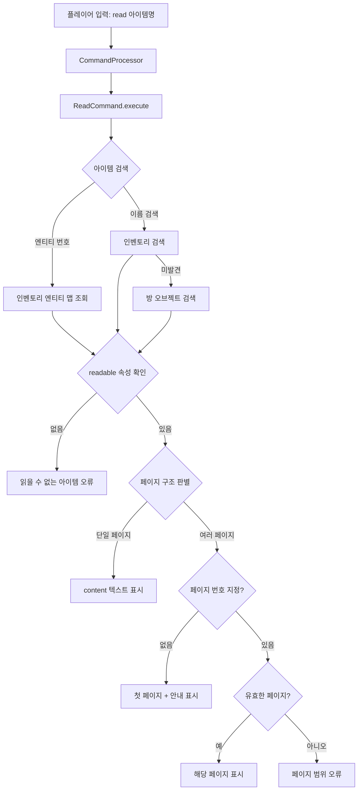
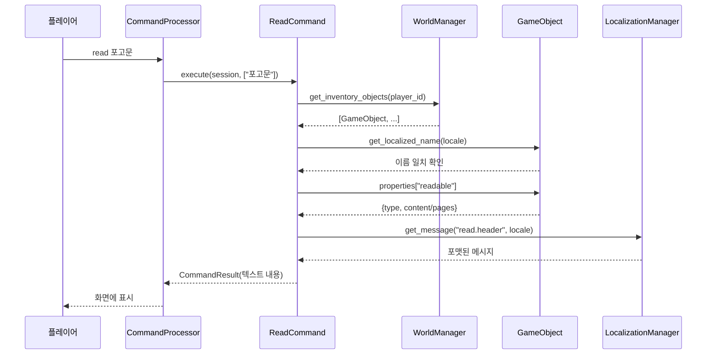

# 설계 문서: 읽을 수 있는 아이템 시스템

## 개요

플레이어가 게임 세계에서 책, 노트, 두루마리, 편지 등의 읽을 수 있는 아이템을 `read` 명령어로 열람할 수 있는 시스템을 설계한다. 기존 `use_command.py`의 명령어 구현 패턴(BaseCommand 상속, 아이템 검색 로직)을 따르며, `properties.readable` 객체를 통해 텍스트 내용을 정의한다.

핵심 설계 원칙:
- 기존 명령어 시스템(BaseCommand)과 아이템 검색 패턴을 그대로 재사용
- `game_objects` 테이블의 `properties` JSON 필드에 `readable` 데이터를 저장하여 DB 스키마 변경 없음
- 단일 페이지(`content`)와 여러 페이지(`pages`) 두 가지 형식 지원
- I18N 시스템을 통한 다국어 메시지 및 콘텐츠 지원

## 아키텍처

### 시스템 구성도



### 데이터 흐름



## 컴포넌트 및 인터페이스

### 1. ReadCommand 클래스

파일 위치: `src/mud_engine/commands/read_command.py`

```python
class ReadCommand(BaseCommand):
    """읽을 수 있는 아이템의 텍스트 내용을 표시하는 명령어"""

    def __init__(self):
        super().__init__(
            name="read",
            aliases=[],
            description="읽을 수 있는 아이템의 내용을 확인합니다",
            usage="read <아이템명> [페이지번호]"
        )

    async def execute(self, session: SessionType, args: List[str]) -> CommandResult:
        """명령어 실행 진입점"""
        ...

    def _find_item_by_entity_number(self, session, entity_num: int) -> Optional[GameObject]:
        """인벤토리 엔티티 번호로 아이템 검색"""
        ...

    async def _find_item_by_name(self, session, game_engine, item_name: str) -> Optional[GameObject]:
        """이름으로 아이템 검색 (인벤토리 → 방 순서)"""
        ...

    def _is_readable(self, item: GameObject) -> bool:
        """아이템이 readable 속성을 가지고 있는지 확인"""
        ...

    def _get_readable_text(self, item: GameObject, locale: str, page: Optional[int] = None) -> tuple[str, Optional[str]]:
        """readable 텍스트와 페이지 안내 메시지 반환"""
        ...

    def _get_localized_content(self, content: dict, locale: str) -> str:
        """로케일에 맞는 텍스트 반환 (폴백 로직 포함)"""
        ...
```

### 2. 명령어 등록

`CommandProcessor`에 ReadCommand를 등록한다. 기존 명령어 등록 패턴을 따라 게임 엔진 초기화 시 등록한다.

### 3. I18N 메시지

`data/translations/item.json`에 read 관련 메시지를 추가한다:

| 키 | 용도 |
|---|---|
| `read.usage` | 사용법 안내 |
| `read.not_found` | 아이템을 찾을 수 없음 |
| `read.not_readable` | 읽을 수 없는 아이템 |
| `read.header` | 아이템 이름 헤더 |
| `read.page_info` | 페이지 정보 (X/Y) |
| `read.page_hint` | 다음 페이지 안내 |
| `read.invalid_page` | 유효하지 않은 페이지 번호 |
| `read.error` | 일반 오류 |


## 데이터 모델

### Readable 속성 구조

`game_objects.properties` JSON 필드 내에 `readable` 객체를 추가한다. DB 스키마 변경은 필요 없다.

#### 단일 페이지 아이템

```json
{
  "readable": {
    "type": "note",
    "content": {
      "en": "By order of the Ash Knights...",
      "ko": "잿빛 기사단의 명에 따라..."
    }
  }
}
```

#### 여러 페이지 아이템

```json
{
  "readable": {
    "type": "book",
    "pages": [
      {
        "en": "Page 1 content in English...",
        "ko": "1페이지 한국어 내용..."
      },
      {
        "en": "Page 2 content in English...",
        "ko": "2페이지 한국어 내용..."
      }
    ]
  }
}
```

### 아이템 유형 (type)

| 유형 | 설명 | 아이콘 |
|---|---|---|
| `note` | 노트, 쪽지 | 📜 |
| `book` | 책 (여러 페이지) | 📖 |
| `scroll` | 두루마리 | 📜 |
| `letter` | 편지 | ✉️ |

### 아이템 템플릿 구조 (configs/items/)

기존 아이템 템플릿 구조를 확장한다. `category`를 `"readable"`로 설정하고 `properties.readable`에 텍스트 데이터를 포함한다.

```json
{
  "template_id": "ash_knights_proclamation",
  "name_en": "Ash Knights' Proclamation",
  "name_ko": "잿빛 기사단 포고문",
  "description_en": "An official proclamation bearing the seal of the Ash Knights.",
  "description_ko": "잿빛 기사단의 인장이 찍힌 공식 포고문입니다.",
  "object_type": "item",
  "category": "readable",
  "weight": 0.1,
  "max_stack": 1,
  "properties": {
    "readable": {
      "type": "note",
      "content": {
        "en": "...",
        "ko": "..."
      }
    }
  }
}
```

### 로케일 폴백 규칙

텍스트 조회 시 다음 순서로 폴백한다:
1. 플레이어의 `preferred_locale` (예: `ko`)
2. 영어 (`en`)
3. 한국어 (`ko`) — 영어도 없는 경우

### 샘플 아이템 4종

| 템플릿 ID | 유형 | 이름 (en) | 이름 (ko) | 페이지 수 |
|---|---|---|---|---|
| `ash_knights_proclamation` | note | Ash Knights' Proclamation | 잿빛 기사단 포고문 | 1 |
| `merchant_journal` | book | Merchant's Journal | 상인의 일지 | 2 |
| `forgotten_scripture` | scroll | Scripture of the Forgotten God | 잊혀진 신의 경전 | 1 |
| `personal_letter` | letter | A Weathered Letter | 낡은 편지 | 1 |

모든 영어 텍스트는 영국 영어(British English)로 작성하며, 카르나스 세계관(몰락한 제국, 대마법사, 잿빛 항구, 잊혀진 신의 교회)과 일관성을 유지한다.


## 정확성 속성 (Correctness Properties)

속성(property)이란 시스템의 모든 유효한 실행에서 참이어야 하는 특성 또는 동작을 의미한다. 속성은 사람이 읽을 수 있는 명세와 기계가 검증할 수 있는 정확성 보장 사이의 다리 역할을 한다.

### Property 1: 이름 검색은 대소문자 무시 부분 일치를 지원한다

임의의 readable 아이템과 해당 아이템의 영어 또는 한국어 이름의 부분 문자열(대소문자 변환 포함)에 대해, 검색 함수는 항상 해당 아이템을 찾아야 한다.

**Validates: Requirements 1.2, 2.5**

### Property 2: 아이템 검색은 인벤토리를 방보다 우선한다

임의의 readable 아이템 이름에 대해, 인벤토리와 방 모두에 동일한 이름의 readable 아이템이 존재할 때, 검색 결과는 항상 인벤토리의 아이템이어야 한다. 인벤토리에 없을 때만 방의 아이템이 반환되어야 한다.

**Validates: Requirements 2.1, 2.2**

### Property 3: 존재하지 않는 아이템 검색은 오류를 반환한다

임의의 문자열에 대해, 인벤토리와 방 모두에 해당 이름의 아이템이 없으면, ReadCommand는 항상 오류 결과를 반환해야 한다.

**Validates: Requirements 2.3**

### Property 4: non-readable 아이템은 읽기 오류를 반환한다

임의의 non-readable 아이템(properties에 readable 키가 없는 아이템)에 대해, ReadCommand는 항상 "읽을 수 없는 아이템" 오류를 반환해야 한다.

**Validates: Requirements 2.4**

### Property 5: 로케일 폴백 체인이 올바르게 동작한다

임의의 readable 아이템과 임의의 로케일에 대해, 텍스트 조회 결과는 다음 우선순위를 따라야 한다: (1) 요청된 로케일의 텍스트, (2) 영어(en) 텍스트, (3) 한국어(ko) 텍스트. 세 가지 중 하나라도 존재하면 빈 문자열이 아닌 텍스트가 반환되어야 한다.

**Validates: Requirements 3.1, 3.3, 3.4**

### Property 6: 유효한 페이지 번호는 올바른 페이지 내용을 반환한다

임의의 여러 페이지 readable 아이템과 1 이상 전체 페이지 수 이하의 페이지 번호에 대해, 해당 페이지의 텍스트 내용이 반환되어야 하며, 출력에는 현재 페이지 번호와 전체 페이지 수가 포함되어야 한다. 페이지 번호 없이 호출하면 첫 번째 페이지가 반환되어야 한다.

**Validates: Requirements 4.1, 4.2, 4.4**

### Property 7: 범위 밖 페이지 번호는 오류를 반환한다

임의의 여러 페이지 readable 아이템과 유효 범위(1~전체 페이지 수) 밖의 페이지 번호에 대해, ReadCommand는 항상 유효한 페이지 범위를 안내하는 오류를 반환해야 한다.

**Validates: Requirements 4.3**

### Property 8: Readable 템플릿 JSON 라운드트립

임의의 유효한 readable 아이템 템플릿 딕셔너리에 대해, `json.dumps` 후 `json.loads`를 수행하면 원본과 동일한 구조가 생성되어야 한다.

**Validates: Requirements 5.6**

### Property 9: 출력에는 항상 아이템 이름이 헤더로 포함된다

임의의 readable 아이템에 대해, read 명령어의 성공 출력에는 항상 해당 아이템의 로케일별 이름이 포함되어야 한다.

**Validates: Requirements 3.2**


## 오류 처리

### 오류 시나리오 및 대응

| 시나리오 | 오류 메시지 키 | 대응 |
|---|---|---|
| 인자 없이 `read` 입력 | `read.usage` | 사용법 안내 반환 |
| 미인증 세션 | `obj.unauthenticated` | 기존 I18N 메시지 재사용 |
| 게임 엔진 접근 불가 | `obj.no_engine` | 기존 I18N 메시지 재사용 |
| 아이템 미발견 | `read.not_found` | 아이템명 포함 오류 메시지 |
| readable 속성 없음 | `read.not_readable` | 아이템명 포함 오류 메시지 |
| 유효하지 않은 페이지 번호 | `read.invalid_page` | 유효 범위(1~N) 안내 |
| 예외 발생 | `read.error` | 일반 오류 메시지 + 로깅 |

### 방어적 프로그래밍

- `properties`가 문자열인 경우 `json.loads`로 변환 (기존 패턴 준수)
- `readable` 객체 내 `content`/`pages` 키 부재 시 graceful 처리
- 페이지 번호가 숫자가 아닌 경우 사용법 안내로 폴백

## 테스트 전략

### 단위 테스트 (Unit Tests)

example 기반 테스트로 다음을 검증한다:

1. ReadCommand 등록 확인 (SMOKE)
2. 빈 인자 시 사용법 반환 (1.3)
3. 미인증 세션 오류 (1.4)
4. 샘플 템플릿 4종의 구조 검증 (5.1~5.5)
5. 번역 파일에 read 관련 키 존재 확인 (7.2, 7.3)
6. 세계관 샘플 아이템 콘텐츠 검증 (6.1~6.6)

### 속성 기반 테스트 (Property-Based Tests)

Python의 `hypothesis` 라이브러리를 사용한다. 각 테스트는 최소 100회 반복 실행한다.

| Property | 테스트 대상 | 생성 전략 |
|---|---|---|
| Property 1 | 이름 검색 | 임의의 아이템명 + 부분 문자열 + 대소문자 변환 |
| Property 2 | 검색 순서 | 인벤토리/방에 동일 이름 아이템 배치 |
| Property 3 | 미발견 오류 | 존재하지 않는 임의 문자열 |
| Property 4 | non-readable 오류 | readable 속성 없는 임의 아이템 |
| Property 5 | 로케일 폴백 | 다양한 로케일 조합의 content 딕셔너리 |
| Property 6 | 페이지 접근 | 임의 페이지 수 + 유효 페이지 번호 |
| Property 7 | 범위 밖 페이지 | 임의 페이지 수 + 범위 밖 번호 |
| Property 8 | JSON 라운드트립 | 임의의 유효한 readable 템플릿 구조 |
| Property 9 | 출력 헤더 | 임의의 readable 아이템 |

각 property 테스트에는 다음 형식의 태그를 주석으로 포함한다:
```python
# Feature: readable-items, Property N: <property 설명>
```

### 통합 테스트

Telnet MCP를 통한 end-to-end 테스트:
1. 로그인 → 아이템 스폰 → `read` 명령어 실행 → 텍스트 출력 확인
2. 여러 페이지 아이템의 페이지 탐색 확인
3. 오류 시나리오 (존재하지 않는 아이템, non-readable 아이템) 확인

