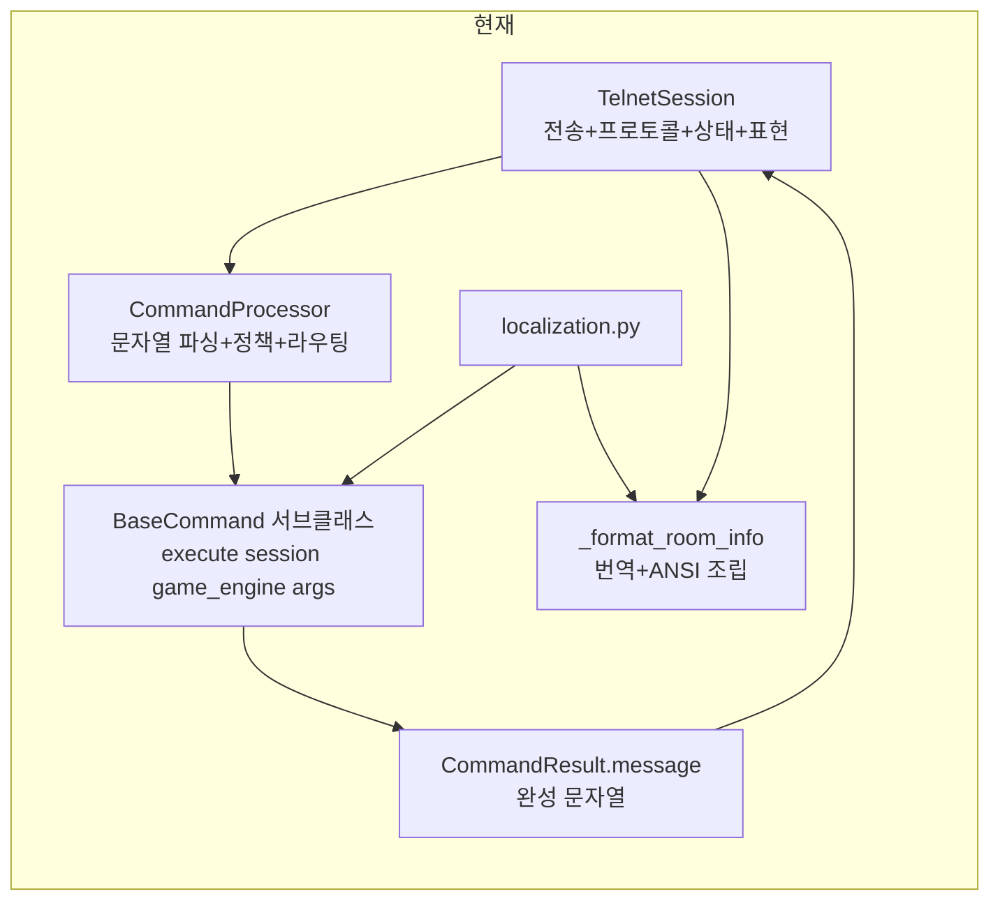
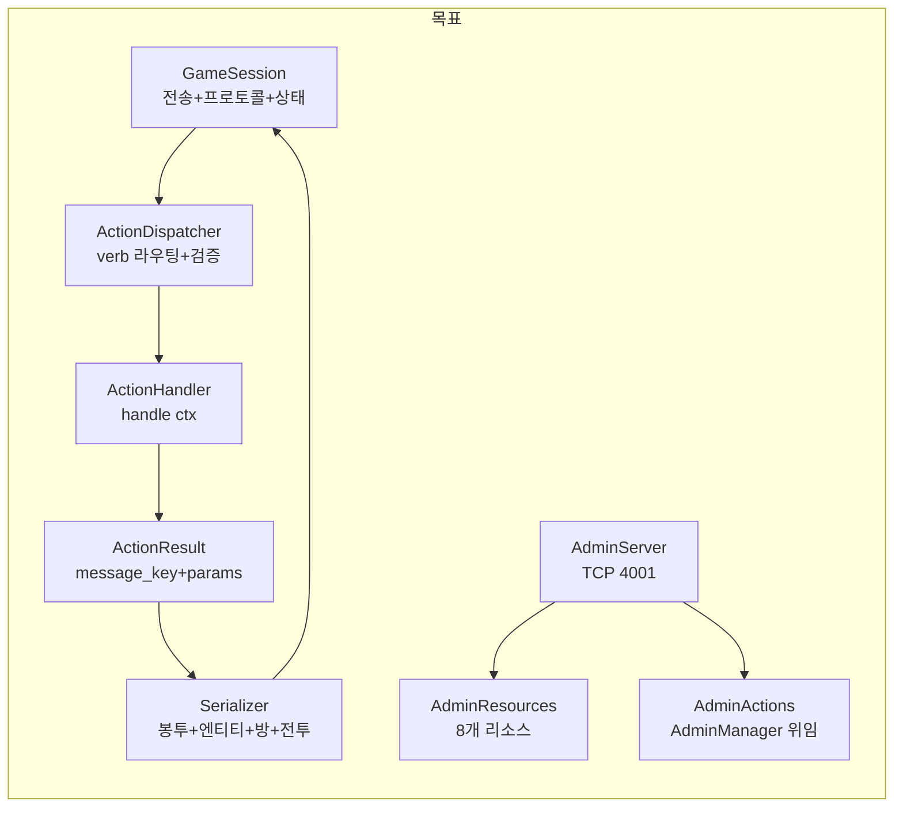
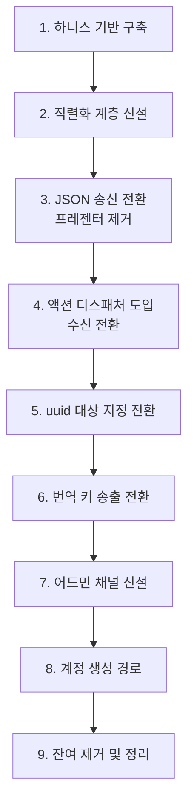

# Design Document

## 개요

서버의 클라이언트 인터페이스를 JSON 라인 프로토콜로 전환한다. 세 가지 축으로 구조를 바꾼다.

- 출력: 텍스트 조립 계층을 직렬화 계층으로 교체한다.
- 입력: 문자열 파싱 라우팅을 verb 디스패치로 교체한다.
- 관리: 외부 프로세스의 DB 직접 조작을 서버 내부 어드민 채널로 흡수한다.

게임 규칙 코드(매니저, 전투, 월드)는 그대로 둔다. 변경은 경계 계층에 집중된다.

## 현재 구조와 목표 구조





## 컴포넌트 설계

### 세션 계층

`server/telnet_session.py`의 클래스명은 유지한다. Telnet IAC 협상을 계속 수행하므로 이름이 여전히 유효하고, 개명은 광범위한 임포트 변경을 유발한다. 향후 협상 제거 시 개명 후보로 기록한다.

책임 변경:

| 현재 | 변경 후 |
|---|---|
| `send_message(dict)` → `_format_message()` → 텍스트 | `send_message(dict)` → JSON 직렬화 → 라인 송신 |
| `_format_room_info()` 320행 | 제거. `RoomSerializer`가 대체 |
| `send_text()` 자유 텍스트 | 제거. 모든 송신이 구조화 메시지 |
| `locale` property | 제거 |
| `room_entity_map`, `inventory_entity_map` | 제거 |
| `_is_friendly_faction`, `_is_neutral_faction` | 제거. `FactionManager`에 위임 |

수신 경로에 라인 버퍼를 둔다. `session/transport.py`의 `read_line`이 이미 라인 단위로 읽지만, JSON 파싱 실패와 부분 수신을 구분해 처리해야 한다.

```
transport.read_line()  →  bytes 누적, 개행 탐색
    ↓ 완성 라인
UTF-8 디코딩
    ↓
json.loads
    ↓ 실패 시 error(MALFORMED_MESSAGE)
메시지 봉투 검증 (type 필수)
    ↓ 알 수 없는 type이면 무시 + 경고 로그
ActionDispatcher 또는 인증 핸들러
```

### 직렬화 계층 (신설)

`server/serialization/` 패키지를 만든다. 파일당 하나의 관심사를 담아 500행 제한을 지킨다.

| 파일 | 책임 |
|---|---|
| `envelope.py` | 봉투 생성, `seq` 부착, JSON 라인 인코딩 |
| `entity.py` | monster / object / player → 엔티티 페이로드 |
| `room.py` | `room_info` 페이로드, `nearby_rooms` 좌표 배열 |
| `combat.py` | `combat_state` 페이로드 |
| `inventory.py` | `inventory`, `container_contents` 페이로드 |
| `player.py` | `player_state` 페이로드 |

`entity.py`가 핵심이다. 모델 인스턴스를 페이로드로 변환하며, 언어를 선택하지 않고 `{"en":..., "ko":...}` dict를 그대로 담는다. 모델에 이미 이 형태가 존재하므로(`gameobject.py:95-107`, `room.py:34`, `monster.py:216-220`) `get_localized_*()` 호출을 제거하고 원본 dict를 읽는다.

파생 boolean은 여기서 계산한다.

```
is_container   ← properties JSON의 컨테이너 표식
is_readable    ← properties JSON의 읽기 가능 표식
is_usable      ← category와 properties
is_merchant    ← properties JSON의 상인 표식
can_talk       ← 대화 스크립트 보유 여부
disposition    ← FactionManager.get_disposition(player_faction, target_faction)
```

`disposition` 계산은 `FactionManager`에 단일 구현을 둔다. 현재 `telnet_session.py`에 하드코딩된 판정(`friendly_factions = {"ash_knights": ["ash_knights"]}`)을 제거하고 `factions`, `faction_relations` 테이블을 조회하는 구현으로 교체한다.

### 액션 디스패처

`commands/processor.py`를 `commands/dispatcher.py`로 교체한다. 기존 파일은 문자열 파싱, 별칭 해석, 숫자 변환, 정책 검사, 라우팅이 뒤섞여 있으므로 재작성이 수정보다 명확하다.

```python
# 구조 스케치
class ActionContext:
    session: GameSession
    game_engine: GameEngine
    verb: str
    target: Optional[str]      # uuid
    params: Dict[str, Any]
    seq: Optional[int]

class ActionDispatcher:
    handlers: Dict[str, ActionHandler]

    async def dispatch(self, ctx: ActionContext) -> ActionResult:
        # 1. 인증 검사
        # 2. verb 조회
        # 3. 상태 게이팅 (전투 중 허용 verb 등)
        # 4. target 해석 (uuid → 엔티티)
        # 5. 핸들러 실행
```

단계별 책임:

1. 인증 검사. 미인증 세션은 `NOT_AUTHENTICATED`로 거절한다.
2. verb 조회. 등록되지 않은 verb는 `NOT_APPLICABLE`로 거절한다.
3. 상태 게이팅. 전투 중에만 허용되는 verb(`flee`, `use_item`, `end_turn`)와 전투 중 금지되는 verb(`move`)를 판정해 `WRONG_STATE`로 거절한다.
4. target 해석. uuid를 현재 컨텍스트(방, 인벤토리, 전투, 컨테이너)에서 찾는다. 없으면 `NOT_FOUND`.
5. 핸들러 실행.

target 해석이 idx 제거의 핵심이다. 현재는 세션에 캐시된 번호 맵을 조회하지만, 전환 후에는 uuid로 다음 순서로 탐색한다.

```
uuid 해석 순서
  1. 전투 중이면 전투 참가자
  2. 현재 방의 몬스터
  3. 현재 방의 오브젝트
  4. 플레이어 인벤토리
  5. 열려 있는 컨테이너 내부
  6. 같은 방의 플레이어
```

세션에 번호 맵을 유지하지 않으므로 매 요청 조회가 발생한다. 방 단위 조회는 이미 매니저가 캐시를 갖고 있어 추가 부하는 크지 않다. 부하가 문제가 되면 세션에 uuid → 엔티티 약한 참조 캐시를 둘 수 있으나 초기 구현에는 포함하지 않는다.

### 액션 핸들러

기존 `BaseCommand` 서브클래스를 액션 핸들러로 전환한다. 클래스 자체는 재사용하고 인터페이스를 바꾼다.

```
현재: async def execute(self, session, game_engine, args: List[str]) -> CommandResult
변경: async def handle(self, ctx: ActionContext) -> ActionResult
```

디렉터리는 verb 카테고리로 재배치한다. 기존 `commands/`는 하위 디렉터리와 평면 파일, 집합 파일이 혼재하고 중복 정의가 있다. verb 목록이 확정됐으므로 그에 맞춰 정리한다.

```
commands/
  dispatcher.py
  context.py          ActionContext, ActionResult
  base.py             ActionHandler 추상 클래스
  actions/
    movement.py       move, enter, look
    inspection.py     examine
    items.py          get, drop, use, equip, unequip, unequip_all, give, read
    containers.py     open, close, put, take_from
    combat.py         attack, flee, use_item, end_turn
    dialogue.py       talk, dialogue_choice, dialogue_end
    shop.py           shop_open, shop_buy, shop_sell
    social.py         follow, unfollow, emote, who, players_here
    state.py          request_state, request_inventory, request_combat_state
    account.py        changename
```

중복 정의 정리 대상: `object_commands.py`와 평면 파일(`get_command.py`, `drop_command.py`, `equip_command.py`, `inventory_command.py`, `use_command.py`)의 중복, `combat/`와 `combat_commands.py`의 중복, 사문화된 `npc_commands.py`와 `npc/`.

### ActionResult

`CommandResult`를 대체한다.

```python
@dataclass
class ActionResult:
    result_type: ActionResultType          # SUCCESS, ERROR, REJECTED
    message_key: Optional[str] = None
    params: Dict[str, Any] = field(default_factory=dict)
    rejection_code: Optional[str] = None
    broadcast: Optional[BroadcastSpec] = None
    data: Dict[str, Any] = field(default_factory=dict)
```

`message: str`이 사라진다. 이것이 페이즈1 Task 4.2가 하려던 작업이며 여기에 흡수된다.

`BroadcastSpec`은 브로드캐스트 대상과 메시지 키를 담는다. 현재 브로드캐스트는 발신자 locale로 만든 문자열을 뿌려 locale 오염이 있는데, 키 전달로 바뀌면 이 문제가 구조적으로 사라진다. 각 수신 클라이언트가 자기 locale로 번역한다.

### 번역 제거

`core/localization.py`와 `data/translations/` 9개 파일을 서버에서 제거한다. 번역 파일은 Godot 클라이언트 저장소로 이동한다.

483곳의 `get_message()` 호출을 키 전달로 바꾼다. 규모가 크므로 카테고리 단위로 나눠 진행한다.

```
1차: 액션 핸들러 (commands/) — 대부분이 여기 있음
2차: 매니저 (game/combat_handler.py 21건, game/combat.py 7건,
      core/managers/player_movement_manager.py 8건, event_handler.py 4건)
3차: 세션 계층 — 프레젠터 제거와 함께 사라짐
4차: 하드코딩 한국어를 키로 대체
```

하드코딩 문자열 중 번역 키가 없는 것은 새 키를 추가한다. 키 이름은 기존 규칙(`도메인.항목`)을 따른다. 추가된 키 목록을 클라이언트 스펙에 전달해야 하므로 별도 파일로 관리한다.

`session.locale`, `state.locale`, `get_user_locale()`을 제거한다. `players.preferred_locale` 컬럼은 남긴다. 계정 생성 시 기록되고 통계 조회에만 쓰인다. 스키마 변경을 피하고, 향후 서버측 알림(이메일 등)에 필요할 수 있다.

### 어드민 채널

`server/admin/` 패키지를 신설한다.

| 파일 | 책임 |
|---|---|
| `admin_server.py` | TCP 4001 리스너. IAC 협상 없음 |
| `admin_session.py` | 어드민 세션 상태, 만료 관리 |
| `auth.py` | 관리자 인증(bcrypt), 서비스 인증(토큰) |
| `resources.py` | 8개 리소스 CRUD 라우팅 |
| `queries.py` | 리소스별 쿼리. 페이지네이션, 필터, 정렬 |
| `actions.py` | `admin_action` 14종. `AdminManager` 위임 |
| `account.py` | 계정 생성 |

`resources.py`와 `queries.py`는 Node `db-client.ts`(1,960행)의 기능을 재현한다. 다만 서버는 이미 리포지토리 계층을 갖고 있으므로 SQL을 새로 쓰지 않고 리포지토리를 재사용한다. 이것이 캐시 불일치를 해소하는 핵심이다.

어드민 변경이 게임 상태에 영향을 주는 경우의 처리:

```
admin_update(rooms, id, values)
    ↓
RoomRepository.update()
    ↓
WorldManager 캐시 무효화
    ↓
해당 방에 있는 플레이어 세션 조회
    ↓
room_info 재전송
```

`map_exporter.py`는 쿼리 부분만 남기고 HTML 생성을 제거한다. 1,000행 이상에서 대폭 축소된다. `get_all_rooms()`와 `get_entities_by_room_and_faction()`이 이미 필요한 데이터를 조회하므로 반환값을 JSON으로 내보내면 된다.

관리자 명령어 15개는 게임 채널에서 제거한다. `commands/admin/` 디렉터리 전체가 사라지고 로직은 `server/admin/actions.py`로 이전한다. `AdminCommand` 기반 클래스와 권한 게이트도 함께 제거된다. 권한 판정이 어드민 채널 인증 단계로 이동하므로 액션 단위 검사가 불필요해진다.

### 계정 생성

`server/admin/account.py`가 담당한다. 어드민 채널의 서비스 인증으로 호출된다.

랜딩 백엔드가 HTTP 대신 TCP JSON을 쓰는 이유는 서버에 HTTP 스택을 추가하지 않기 위해서다. 게이트웨이가 이미 Node `net` 모듈로 TCP 클라이언트를 구현하고 있으므로 랜딩 백엔드도 같은 방식을 쓸 수 있다.

서비스 토큰은 환경변수로 관리한다. 토큰이 설정되지 않으면 서비스 인증 경로를 비활성화한다.

게임 채널의 회원가입 흐름을 제거한다. 현재 접속 시 텍스트 메뉴(1 로그인 / 2 회원가입 / 3 종료)를 주고받는 대화형 인증이 있는데, 이 전체가 `login` 메시지로 대체된다.

### 하니스

`scripts/harness/` 패키지로 만든다. 단일 파일이 아니라 시나리오를 나눈다.

| 파일 | 검증 대상 |
|---|---|
| `client.py` | JSON 라인 클라이언트. 라인 버퍼, 송수신, seq 관리 |
| `scenario_auth.py` | welcome, login 성공/실패, logout |
| `scenario_room.py` | room_info 수신, 이동, entity_enter/leave |
| `scenario_action.py` | 액션 전송, 응답, 거절 코드 |
| `scenario_framing.py` | 분할 수신, 병합 수신, 한국어 왕복 |
| `run_all.py` | 전체 시나리오 실행. 종료 코드 반환 |

`scenario_framing.py`가 중요하다. 의도적으로 바이트를 쪼개 보내고 여러 메시지를 한 번에 보내 라인 복원을 검증한다. 멀티바이트 문자를 경계에서 분할하는 케이스를 포함한다.

기존 `scripts/check_telnet_smoke.py`를 `client.py`의 기반으로 재사용한다. `telnet/telnet_client.py`는 `telnetlib` 의존으로 이미 동작하지 않으므로 폐기한다.

## 제거 대상 정리

| 대상 | 규모 |
|---|---|
| `server/ansi_colors.py` | 전체 |
| `telnet_session.py::_format_message`, `_format_room_info` | 약 320행 |
| `telnet_session.py::_is_friendly_faction`, `_is_neutral_faction` | 약 60행 |
| `core/localization.py` | 152행 |
| `data/translations/*.json` | 9파일 (클라이언트로 이동) |
| `commands/processor.py` | 재작성 |
| `commands/admin/` | 디렉터리 전체 |
| `commands/language_commands.py` | 전체 (동작하지 않는 language + 데드 HelpCommand) |
| `commands/Basic/help.py` | 전체 |
| `core/managers/player_movement_manager.py::_generate_minimap` | 약 50행 |
| `utils/map_exporter.py` HTML 생성부 | 약 900행 |
| `telnet/`, `telnet_test.sh` | 전체 |
| 세션 entity_map 관련 | state.py 2필드, telnet_session.py 4 property, combat.py 3항목 |

## 마이그레이션 순서

동작하는 상태를 유지하며 진행할 수 없는 전환이다. 프로토콜이 바뀌는 순간 기존 클라이언트가 붙을 수 없다. 따라서 하니스를 먼저 만들고, 그 하니스가 각 단계를 검증한다.



3단계와 4단계 사이에 프로토콜이 완전히 교체된다. 이 구간에서는 하니스만이 유일한 검증 수단이다.

5단계를 4단계 뒤에 두는 이유는 액션 메시지가 이미 uuid를 `target`으로 보내기 때문이다. 디스패처가 먼저 있어야 uuid 해석 경로를 한 곳에 구현할 수 있다.

6단계를 뒤로 미루는 이유는 483곳 수정이 다른 작업과 충돌하기 쉬워서다. 3단계에서 프레젠터를 제거할 때 세션 계층의 번역은 함께 사라지고, 나머지는 6단계에서 일괄 처리한다. 그 사이 구간에서는 `ActionResult`에 `message_key`와 과도기 `message`가 공존한다.

## 검증 전략

각 단계는 다음을 통과해야 한다.

| 검사 | 명령 |
|---|---|
| 타입 | `PYTHONPATH=. .venv/Scripts/mypy.exe src/` |
| 린트 | `.venv/Scripts/ruff.exe check src/` |
| 하니스 | `PYTHONPATH=. .venv/Scripts/python.exe scripts/harness/run_all.py` |

ruff는 현재 0.16.2 기본 룰셋으로 1,373건을 보고한다. 이는 툴 버전 차이이며 코드 결함이 아니다. 전환 작업과 린트 정리를 뒤섞으면 diff가 커지므로, `pyproject.toml`에 `lint.select`를 명시해 기준을 고정한 뒤 시작한다.

서버 실행은 `control_bash_process`를 사용한다. `nohup ... &`로 띄우면 콘솔이 분리되어 `kill -2`가 전달되지 않고 graceful 종료가 불가능해진다. 종료는 `kill -2`다.

## 위험과 대응

프로토콜 교체 구간에서 되돌리기가 어렵다. 단계별 독립 커밋을 유지하고, 3단계 이전에 하니스가 동작함을 확인한 뒤 진행한다.

483곳 번역 호출 수정은 누락 가능성이 높다. `get_message` 호출이 남아 있는지 grep으로 확인하는 검증을 6단계 완료 조건에 포함한다.

어드민 이전 중에는 Node 웹어드민과 서버 어드민이 동시에 존재한다. 두 경로가 같은 DB를 조작하면 캐시 불일치가 발생한다. 7단계 완료 후 클라이언트 저장소에서 Node 웹어드민을 즉시 제거해야 하며, 이 순서를 `gateway-landing` 스펙과 맞춘다.

`disposition` 판정을 `FactionManager`로 옮길 때 현재 하드코딩 동작과 결과가 달라질 수 있다. 현재는 같은 종족만 우호로 취급하는데, `faction_relations` 테이블을 조회하면 동맹 관계가 반영된다. 이는 의도된 개선이지만 방 정보의 인물/동물/적 분류가 바뀌므로 데이터 확인이 필요하다. 프로덕션 DB에 `factions` 3건과 `faction_relations`가 존재한다.
