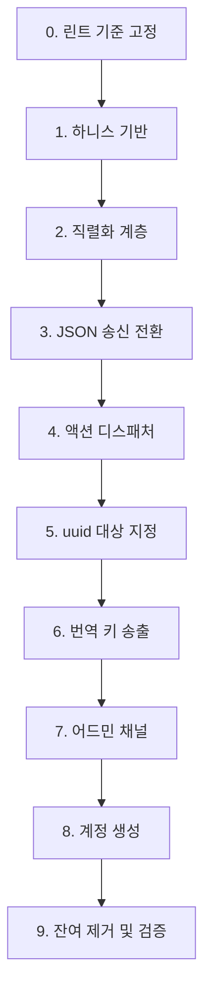

# Implementation Plan

## Overview

각 단계는 독립 커밋으로 진행하고 `mypy src/` + `ruff check src/` + 하니스 검증을 통과해야 한다. 프로토콜이 교체되는 3~4단계 구간에서는 하니스가 유일한 검증 수단이므로 1단계를 먼저 완료한다.

프로토콜 계약은 `docs/protocol/`을 기준으로 하며, 계약과 구현이 어긋나면 계약 문서를 먼저 갱신한다.

## Tasks

- [x] 0. 린트 기준 고정
  - `pyproject.toml`에 `lint.select`를 명시해 ruff 0.16.2 기본 룰셋 확대로 발생한 1,373건을 전환 작업 diff에서 분리한다. 기존 `lint.ignore` 목록은 유지한다.
  - `setup.cfg`의 mypy `python_version`을 실제 환경(3.14)에 맞춘다.
  - _Requirements: 10.1, 10.2_

- [x] 1. 하니스 기반 구축
- [x] 1.1 JSON 라인 클라이언트 작성
  - `scripts/harness/client.py`에 라인 버퍼 기반 송수신 클라이언트를 만든다. 개행까지 누적 후 라인 단위 UTF-8 디코딩, `seq` 발급과 응답 대응, 타임아웃, 명시적 종료 코드를 포함한다. 기존 `scripts/check_telnet_smoke.py`를 기반으로 한다.
  - _Requirements: 9.1, 9.7_
- [x] 1.2 프레이밍 시나리오 작성
  - `scripts/harness/scenario_framing.py`에 분할 수신, 병합 수신, 멀티바이트 경계 분할, 한국어 왕복 검증을 구현한다. 현재 프로토콜(텍스트)에서도 실행 가능한 형태로 작성해 기준선을 확보한다.
  - _Requirements: 9.5, 9.6_
- [x] 1.3 실행 러너 작성
  - `scripts/harness/run_all.py`가 전체 시나리오를 실행하고 종료 코드를 반환한다. 서버 미실행 시 명확한 오류를 낸다.
  - _Requirements: 9.1, 9.7_

- [x] 2. 직렬화 계층 신설
- [x] 2.1 봉투와 엔티티 직렬화
  - `server/serialization/envelope.py`(봉투 생성, seq 부착, JSON 라인 인코딩), `entity.py`(monster/object/player 페이로드, 언어별 dict 유지, 파생 boolean 계산)를 만든다. 기존 송신 경로를 아직 바꾸지 않는다.
  - 모델은 `name`/`description`을 `Dict[str, str]` 단일 필드로 보유한다. `name_en`/`name_ko` 속성은 존재하지 않으므로 `obj.name` dict를 그대로 담는다.
  - 파생 boolean은 다음 판정식을 쓴다. `is_container` = `properties.get('is_container', False)`, `is_readable` = `bool(properties.get('readable', {}))`, `is_usable` = `any(k in properties for k in ['hp_restore','stamina_restore','mana_restore','heal_amount'])`. properties가 문자열로 들어올 수 있으므로 방어 파싱한다.
  - `category`는 `properties.get('category')`에서 읽는다. 모델에 `category` 필드가 없다.
  - 레벨과 상인 여부는 포함하지 않는다. 강함 지표는 `max_hp`, `armor_class`, `attack_power`이며 모두 Monster의 계산 프로퍼티다.
  - `commands/container_commands.py`와 `use_command.py`에 중복 정의된 `_is_container` 3곳을 직렬화 계층의 단일 구현으로 대체할 수 있는지 검토한다.
  - _Requirements: 1.1, 1.2, 2.5, 6.8, 6.10, 6.11, 6.12_
- [x] 2.4 대화 스크립트 존재 확인 메서드 추가
  - `game/lua_script_loader.py`에 스크립트 파일 존재를 확인하는 조회 메서드를 추가해 `can_talk` 산출에 사용한다. 현재는 `load_script()`가 파일을 읽으며 부수효과를 갖고, 존재만 확인하는 경로가 없다.
  - 파일명이 NPC 인스턴스 uuid(`configs/dialogues/{monster.id}.lua`)이므로 리스폰으로 인스턴스 id가 바뀌면 매칭이 깨진다. 이 문제를 기록하고 template_id 기반 조회로 바꿀지 결정한다.
  - `can_talk`이 거짓이어도 서버는 대화를 거절하지 않고 침묵 응답을 준다. 이 동작을 유지한다.
  - _Requirements: 6.8_
- [x] 2.2 disposition 판정을 전용 모듈로 이동
  - `game/faction_rules.py`에 `get_disposition()`을 만들고 `telnet_session.py`의 `_is_friendly_faction`/`_is_neutral_faction` 규칙을 그대로 옮긴다. 같은 종족은 `friendly`, `ash_knights` 기준 `animals`는 `neutral`, 그 밖은 `hostile`이다.
  - `FactionManager`는 존재하지 않는 클래스다. 상태나 DB 접근이 필요하지 않으므로 순수 함수 모듈로 둔다.
  - `faction_relations` 조회 기반 동적 판정은 범위 밖이다. 우호도 기능 개발 시 이 모듈의 내부를 교체한다.
  - 이동 전후로 같은 입력에 같은 결과가 나오는지 확인한다.
  - _Requirements: 2.6, 2.7, 2.8_
- [x] 2.3 방·전투·인벤토리·플레이어 직렬화
  - `serialization/room.py`(room_info, nearby_rooms 좌표 배열), `combat.py`, `inventory.py`, `player.py`를 만든다. 각 페이로드는 `docs/protocol/server-to-client.md` 스키마를 따른다.
  - `room_info`에 `has_passage`를 포함한다. 현재 좌표에 `room_connections` 항목이 있는지 조회한 결과이며, 클라이언트가 진입 버튼 표시 여부를 판단하는 근거다. `commands/Basic/enter.py`가 사용하는 조회를 재사용한다.
  - _Requirements: 2.3, 2.4_

- [x] 3. JSON 송신 전환 및 프레젠터 제거
- [x] 3.1 send_message를 JSON 라인 송신으로 교체
  - `telnet_session.py::send_message()`가 직렬화 계층을 통해 JSON 라인을 내보내도록 바꾼다. `send_text()` 자유 텍스트 경로를 제거한다.
  - _Requirements: 1.1, 1.2, 1.3_
- [x] 3.2 프레젠터 제거
  - `_format_message()`, `_format_room_info()`, `_is_friendly_faction()`, `_is_neutral_faction()`을 제거한다. `server/ansi_colors.py`를 제거하고 참조 임포트를 정리한다.
  - _Requirements: 2.1, 2.2, 2.7_
- [x] 3.3 미니맵 텍스트 조립 제거
  - `player_movement_manager.py::_generate_minimap()`을 제거하고 `room_info`의 `nearby_rooms`로 대체한다.
  - _Requirements: 2.4_
- [x] 3.4 수신 경로에 JSON 파싱 도입
  - 라인 → UTF-8 디코딩 → `json.loads` → 봉투 검증 순서를 구현한다. 파싱 실패 시 `error(MALFORMED_MESSAGE)`, 알 수 없는 `type`은 무시 + 경고 로그로 처리한다.
  - _Requirements: 1.4, 1.5, 1.7_
- [x] 3.5 인증 흐름을 메시지 기반으로 전환
  - 텍스트 메뉴(1 로그인 / 2 회원가입 / 3 종료) 대화형 인증을 제거하고 `login` 메시지로 대체한다. `welcome` 송신을 추가한다. 회원가입 흐름을 제거한다. 로그인 실패 응답에서 사용자명 존재 여부를 구분하지 않는다.
  - _Requirements: 8.6, 8.7_

- [x] 4. 액션 디스패처 도입
- [x] 4.1 ActionContext와 ActionResult 정의
  - `commands/context.py`에 `ActionContext`(session, game_engine, verb, target, params, seq)와 `ActionResult`(result_type, message_key, params, rejection_code, broadcast, data)를 정의한다. 과도기에 `message: str`을 선택적으로 남긴다.
  - _Requirements: 4.1, 5.2_
- [x] 4.2 ActionDispatcher 구현
  - `commands/dispatcher.py`에 인증 검사 → verb 조회 → 상태 게이팅 → target 해석 → 핸들러 실행 순서를 구현한다. `commands/processor.py`를 대체한다.
  - _Requirements: 4.1, 4.2, 6.1, 6.4_
- [x] 4.3 숫자 변환과 별칭 체계 제거
  - `_convert_combat_number_to_command()`, `_convert_dialogue_number_to_command()`를 제거한다. 별칭 등록과 예약 별칭 보호 로직, `command.unknown` 오타 응답을 제거한다. 방향 별칭을 `move` verb의 params로 통합한다.
  - _Requirements: 4.3, 4.4, 4.5, 4.6_
- [x] 4.4 핸들러 인터페이스 전환 및 디렉터리 재배치
  - `BaseCommand.execute(session, game_engine, args)`를 `ActionHandler.handle(ctx)`로 전환한다. `commands/actions/` 아래 카테고리별로 재배치한다(movement, inspection, items, containers, combat, dialogue, shop, social, state, account). 중복 정의(object_commands와 평면 파일, combat과 combat_commands)를 단일화하고 사문화된 `npc_commands.py`, `npc/`를 제거한다.
  - _Requirements: 4.2, 10.6_
- [x] 4.5 채팅 분리
  - `chat` 메시지를 별도 경로로 처리하고 `say`/`whisper` 명령어를 제거한다. `whisper` 대상을 플레이어 uuid로 해석한다. 길이 검증과 제어문자 제거만 수행한다.
  - _Requirements: 4.9, 4.10_
- [x] 4.6 폐기 명령어 제거
  - `help`, `language`를 제거한다. `commands/language_commands.py`(동작하지 않는 language + 데드 HelpCommand)와 `commands/Basic/help.py`를 삭제한다. `quit`을 `logout` 메시지로, `stats`/`inventory`/`combat`을 `request_*` verb로 대체한다.
  - _Requirements: 4.7_

- [x] 5. uuid 대상 지정 전환
- [x] 5.1 target 해석 경로 구현
  - 디스패처의 target 해석을 구현한다. 탐색 순서는 전투 참가자 → 방 몬스터 → 방 오브젝트 → 인벤토리 → 열린 컨테이너 → 같은 방 플레이어다. 미발견 시 `NOT_FOUND`.
  - _Requirements: 3.4, 6.5_
- [x] 5.2 entity_map 생성과 저장 제거
  - `send_room_info_to_player()`의 번호 부여 로직을 제거한다. `session/state.py`의 `room_entity_map`/`inventory_entity_map` 필드와 `telnet_session.py`의 4개 property를 제거한다.
  - _Requirements: 3.1, 3.2_
- [x] 5.3 전투 entity_map 캐시 제거
  - `game/combat.py`의 `_entity_map` 필드와 `get_entity_map`/`set_entity_map`, `get_combat_status_message`의 번호 렌더링, `global_tick_manager.py:124`의 맵 복사, `attack_command.py`의 `set_entity_map` 호출을 제거한다.
  - _Requirements: 3.3_
- [x] 5.4 숫자 해석 경로 전환
  - 조사에서 확인된 8개 파일의 `isdigit()` → `int()` → 맵 조회 패턴을 제거한다. 대상은 attack, talk, look, get, use, container, read, terminate 경로다. `read`의 페이지 번호는 params로 분리한다.
  - 해당 파일들이 Task 4.6에서 삭제되어 함께 사라졌다. `read`의 페이지는 `params.page`로 분리됐다.
  - _Requirements: 3.5_
- [x] 5.5 매니저 시그니처 변경
  - `world_manager.py`의 `take_item_from_container()`와 `put_item_in_container()`가 번호와 entity_map 대신 uuid를 받도록 변경한다. 컨테이너 내부 배열 인덱스 참조(`use_command.py`의 `int(x)-1`)를 uuid로 대체한다.
  - 변경 대신 제거했다. 두 메서드는 호출자가 없었고, 핸들러가 `move_item_to_container()`와 `move_item_from_container()`를 uuid로 직접 호출한다.
  - _Requirements: 3.6, 3.7_
- [x] 5.6 이름 기반 매칭 제거
  - `give_command.py` 등의 `get_localized_name(locale).lower()` 비교 경로를 제거한다. 엔티티 수 제한(9개)이 사라졌음을 확인한다.
  - _Requirements: 3.8, 3.9_
- [x] 5.7 대화 선택지 params 전환
  - 대화 선택지 번호를 `dialogue_choice` 액션의 `params.choice`로 수신한다. 대상 지정과 선택지 번호의 의미 충돌이 해소됐음을 확인한다.
  - _Requirements: 3.10_

- [x] 6. 번역 키 송출 전환
- [x] 6.1 액션 핸들러의 번역 호출 전환
  - `commands/` 아래 `get_message()` 호출을 `message_key` + `params` 전달로 바꾼다. 엔티티 이름은 언어별 dict로 params에 담는다.
  - _Requirements: 5.1, 5.3_
- [x] 6.2 매니저의 번역 호출 전환
  - `game/combat_handler.py`(21건), `game/combat.py`(7건), `core/managers/player_movement_manager.py`(8건), `event_handler.py`(4건) 등의 호출을 전환한다. 브로드캐스트를 키 전달로 바꿔 발신자 locale 오염을 제거한다.
  - _Requirements: 5.1, 5.8_
- [x] 6.3 하드코딩 문자열을 키로 대체
  - `commands/Basic/status.py`(38건), `commands/examine_command.py`, `commands/give_command.py`, `commands/container_commands.py`, `commands/utils.py`의 사용자 노출 한국어를 번역 키로 대체한다. 새로 추가한 키 목록을 별도 파일로 정리해 클라이언트 스펙에 전달한다. 로그 메시지는 변경하지 않는다.
  - _Requirements: 5.9, 5.10_
- [x] 6.4 locale 소유권 제거
  - `session.locale`, `state.locale`, `commands/utils.py::get_user_locale()`을 제거한다. `players.preferred_locale` 컬럼은 유지하고 번역 목적 사용만 제거한다.
  - `get_user_locale()`은 Task 4.6에서 `commands/utils.py`와 함께 사라졌다. `SessionState.locale`과 `TelnetSession.locale` 프로퍼티, `update_locale()`, `get_session_info()`의 `locale` 항목을 제거했다. 대입 지점 3곳(`telnet_session.authenticate`, `telnet_server`, `game_engine`)도 함께 제거했다.
  - `get_room_info()`와 `get_location_summary()`의 `locale` 파라미터는 본문에서 쓰이지 않는 죽은 인자였으므로 시그니처에서 제거했다.
  - Lua 스크립트가 참조하는 `ctx.session.locale` 은 남는다. 대사와 아이템 콜백이 아직 언어별 완성 문장을 반환하므로 `player.preferred_locale` 에서 채운다. Task 10에서 함께 사라진다.
  - _Requirements: 5.6, 5.7_
- [x] 6.5 localization 모듈과 번역 파일 제거
  - `core/localization.py`를 삭제한다. `data/translations/` 9개 파일을 클라이언트 저장소로 이관한 뒤 서버에서 삭제한다. `grep -rn "get_message" src/`로 잔여 호출이 없음을 확인한다.
  - _Requirements: 5.4, 5.5_
- [x] 6.6 ActionResult 과도기 필드 제거
  - `ActionResult.message`를 제거한다. 모든 응답이 `message_key` 경로를 사용함을 확인한다.
  - 필드는 유지하고 용도를 개발자용 사유로 바꿨다. 사용자 노출 경로가 사라졌기 때문이다. REJECTED 는 서버 로그에만 남고, ERROR 는 계약이 허용하는 `error.detail` 로 나간다. SUCCESS 에 남은 유일한 사용처는 Lua 스크립트가 만든 대사이며 Task 10 에서 전환한다.
  - _Requirements: 5.2_
- [x] 6.7 생문장 송신 경로 제거
  - Task 6.4 작업 중 발견한 잔여다. 게임 채널이 아직 완성된 한국어 문장을 그대로 보낸다.
  - `server/telnet_session.py`의 `send_event(text)`/`send_error`/`send_success`/`send_info`가 자유 문자열을 받는다. 시그니처를 `message_key` + `params` 로 바꾼다.
  - 호출처: `telnet_server.py`(서버 종료 알림, 중복 로그인 종료, 서버 오류, 공지 방송), `player_movement_manager.py:55`("존재하지 않는 방입니다."), `command_manager.py:110`(`result.message` 를 그대로 송신 — Task 6.6 결정에 따라 사용자에게 보내지 않아야 한다).
  - `send_event(key, params, category, seq)` 로 바꾸고 `build_event()` 에 위임했다. 계약 밖 필드 `text`·`severity` 가 게임 채널에서 사라졌다. `send_error`·`send_success`·`send_info` 는 삭제했다(`send_info` 는 호출처가 없었다).
  - 서버 종료·중복 로그인은 신규 키 `system.server_shutdown`, `system.duplicate_login` 으로 보낸다. 세션 핸들러의 미처리 예외는 `send_protocol_error("INTERNAL_ERROR", str(e))` 로 바꿨다. `command_manager` 의 ERROR 경로와 같은 처리다.
  - 공지 방송은 기능째 제거했다. `_send_announcements()` 와 `data/announcements.txt` 경로가 사라졌다. 파일이 존재하지 않았고 계약의 어떤 메시지 타입에도 대응되지 않았다.
  - `player_movement_manager` 의 "존재하지 않는 방입니다."는 신규 키 `movement.room_not_found` 다.
  - `command_manager` 의 `result.message` 직송은 제거하고 로그로 대체했다. 유일한 공급처는 Lua `use`/`read` 콜백(`actions/items.py`)이었다. 그 전환은 Task 11 에서 끝냈다. 아이템 사용 결과 문장은 이제 `event`(`category: "item"`)로 나간다.
  - `admin_manager` 14건은 `TelnetSession.send_admin_notice(text, severity)` 로 옮겼다. 어드민 전용임이 이름에 드러나고 Task 7.6 에서 통째로 사라진다.
  - 신규 키 3종을 클라이언트 저장소 `godot/resources/translations/` 에 추가했다(`system.json` 2건, `moving.json` 1건).
  - `game/tutorial_announcer.py`는 제거했다. `preferred_locale` 로 분기해 완성 문장과 이모지를 만들고, 계약에 없는 `tutorial_announcement` 타입으로 보내며, 사라진 텍스트 명령어(`east`, `go east`)를 안내했다. 트리거 조건인 `current_room_id == 'town_square'` 도 방 id가 uuid이므로 성립하지 않았다. 튜토리얼 안내는 Lua 스크립트로 NPC에 주입한다.
  - `core/managers/admin_manager.py`의 14건은 Task 7.6에서 어드민 채널로 옮기며 함께 정리한다.
  - _Requirements: 5.1, 5.9_

- [x] 7. 어드민 채널 신설
- [x] 7.1 어드민 서버와 인증
  - `server/admin/admin_server.py`(TCP 4001, IAC 협상 없음), `admin_session.py`(만료 2시간), `auth.py`(bcrypt 관리자 인증, 서비스 토큰 인증)를 만든다. `is_admin`이 거짓이면 `PERMISSION_DENIED`로 거절한다. 게임 세션 인증 상태가 전이되지 않음을 확인한다.
  - 관리자 인증은 `PlayerManager.authenticate()` 를 재사용한다. bcrypt 검증 경로가 게임 채널과 같아야 계정 체계가 이중화되지 않는다. `is_admin` 이 거짓이면 `PermissionError` 로 구분해 `PERMISSION_DENIED` 를 응답한다. 자격이 틀린 경우는 계정 열거를 막기 위해 사용자명 존재 여부를 구분하지 않는다.
  - 서비스 토큰은 환경변수 `{서비스명 대문자}_SERVICE_TOKEN` 에서 읽고 `hmac.compare_digest` 로 비교한다. 허용 서비스는 `landing` 하나다. 토큰 미설정 시 빈 문자열과 일치하지 않도록 먼저 거절한다.
  - 어드민 세션은 `readuntil(b"\n")` 로 라인을 읽는다. 게임 채널의 바이트 단위 IAC·백스페이스 처리가 없다. `start_server(limit=MAX_LINE_BYTES)` 로 라인 상한을 계약값에 맞췄다.
  - 두 채널을 클라이언트가 즉시 구별하도록 `server/channels.py` 를 두고 양쪽에 적용했다. `welcome` 에 `channel`(`game`/`admin`)을 싣고, 타 채널 전용 메시지는 조용히 무시하지 않고 `NOT_APPLICABLE` 로 거절하며 `detail` 에 기대 채널과 현재 채널을 모두 담는다. `ping` 은 두 채널 공용이다. 어드민 `welcome` 은 `supported_locales` 와 `title` 을 담지 않는다.
  - 세션 만료는 별도 태스크 없이 읽기 타임아웃으로 처리한다. 남은 유효 시간을 `read_message` 의 timeout 으로 넘겨 유휴 상태에서도 만료가 성립한다.
  - `admin_login_result`, `service_login_result`, `admin_rejected` 봉투를 `serialization/admin.py` 에 추가했다. `service_login_result` 는 계약에 응답 형식이 없어 `admin.md` 에 함께 기록했다.
  - 인증 후 메시지는 `AdminServer.register()` 로 붙인다. Task 7.2~7.5 의 확장 지점이며, 미등록 타입은 `NOT_APPLICABLE` 로 거절한다.
  - 진입 안내를 추가했다. 어드민 권한 계정이 게임 채널에 로그인하면 `login_result` 에 `admin_channel`(`available`, `channel`, `requires_reauth`)을 담는다. `available` 은 권한만이 아니라 어드민 서버가 실제로 떠 있는지를 반영하므로, 어드민 채널 없이 띄운 배포에서 클라이언트가 진입 버튼을 노출하지 않는다. `is_admin` 이 거짓이면 필드를 담지 않는다. `main.py` 는 어드민 서버를 먼저 띄우고 `telnet_server.admin_server` 에 배선한다.
  - 검증: `tests/unit/test_admin_auth.py` 19건, `test_admin_channel_info.py` 5건, 하니스 `scenario_admin` 9건(welcome·인증 전 거절·게임 메시지 거절·ping·잘못된 자격·잘못된 토큰·관리자 인증·미등록 거절·게임 세션 비전이). `scenario_auth` 에 `channel` 검증, 어드민 메시지 거절, 어드민 채널 안내 확인을 추가했다.
  - _Requirements: 7.1, 7.2, 7.3, 7.4, 7.5, 7.6_
- [x] 7.2 리소스 CRUD
  - `resources.py`와 `queries.py`에 8개 리소스(players, rooms, room_connections, monsters, objects, item_prices, factions, faction_relations)의 목록·상세·생성·수정·삭제를 구현한다. SQL을 새로 쓰지 않고 기존 리포지토리를 재사용한다. 페이지네이션, 필터, 정렬을 지원한다.
  - 리포지토리 재사용은 절반만 가능했다. 8개 중 4개(players, rooms, monsters, game_objects)만 리포지토리가 있고 나머지는 매니저에 흩어진 SQL로 접근하고 있었다. 또 `BaseRepository` 는 기본키가 `id` 단일 컬럼이라 가정하고 모델 인스턴스를 돌려주는데, 어드민은 계약상 DB 행을 원본 컬럼명으로 그대로 돌려줘야 한다.
  - 대신 `database/table_gateway.py` 를 만들어 SQL 을 한곳에 모았다. 기본키를 인자로 받으므로 8개 리소스가 같은 경로를 쓴다. 리포지토리를 수정하지 않았고 어드민 계층에 SQL 이 흩어지지도 않는다.
  - 컬럼 이름은 SQL 에 직접 들어가므로 `PRAGMA table_info` 결과와 대조한 뒤에만 사용한다. 값은 항상 바인딩 파라미터다. 없는 컬럼이면 `INVALID_PARAMS` 로 거절한다.
  - 기본키는 실제 스키마에서 확인했다. `item_prices` 는 `template_id`, `faction_relations` 는 `(faction_a_id, faction_b_id)` 복합키다. 복합키 리소스는 `id` 대신 `key` 오브젝트를 받으며, 단일키에도 `key` 를 쓸 수 있다. 응답의 `key` 는 항상 오브젝트다.
  - uuid 를 서버가 만드는 리소스는 5개다. `item_prices`, `factions`, `faction_relations` 는 사람이 정하는 식별자라 요청의 `values` 에 담아야 한다.
  - `players.password_hash` 는 응답에서 제거하고 이 경로로 쓸 수 없게 막았다. 비밀번호 변경은 어드민 액션으로 다룬다. 기본키는 생성에서만 쓸 수 있고 수정에서는 `VALIDATION_FAILED` 다.
  - `page_size` 기본 50, 상한 200. 한 라인이 256KB 를 넘지 않게 하기 위한 값이며 초과 요청은 거절하지 않고 상한으로 낮춘다. 정렬을 지정하지 않으면 기본키 오름차순이다.
  - 참조 무결성 검사와 캐시 갱신은 Task 7.3 이다. 그때까지는 참조가 있어도 삭제된다. 감사 로그는 Task 7.7 까지 로그로만 남긴다.
  - `scripts/dump_admin_schema.py` 를 추가했다. 어드민이 컬럼과 기본키를 그대로 노출하므로 문서가 아니라 DB 파일에서 확인해야 한다.
  - 검증: `tests/unit/test_admin_resources.py` 26건, 하니스 `scenario_admin` 에 7건 추가(목록·해시 비노출·복합키 조회·복합키 id 거절·없는 컬럼 거절·쓰기 금지 컬럼 거절·CRUD 왕복). CRUD 왕복은 하니스가 만든 방만 다루고 끝나면 지운다.
  - _Requirements: 7.7_
- [x] 7.3 참조 무결성과 캐시 갱신
  - 삭제 시 참조를 검사해 `REFERENCED`로 거절하고 참조 목록을 반환한다. 변경이 게임 상태에 영향을 주면 매니저 캐시를 무효화하고 영향받는 플레이어에게 갱신 상태를 송신한다.
  - 참조 규칙은 `admin/references.py` 에 선언했다. 실제 DB 에서 확인한 관계이며 선언된 외래키만으로는 부족하다. FK 는 `players.faction_id` 와 `faction_relations` 의 두 컬럼뿐이고, `monsters.faction_id` 와 `game_objects.location_id` 는 FK 없이 운영된다.
  - 확인한 데이터 문제 두 가지를 규칙에 반영했다. `game_objects.location_type` 이 `room`/`ROOM`, `container`/`CONTAINER` 로 섞여 있어 비교를 대소문자 무시로 한다. `rooms` 에 좌표가 같은 행이 1쌍 있어, 좌표 기반 참조(`room_connections`, `monsters`)는 대상 방이 그 좌표로 유일할 때만 참조로 센다.
  - `monsters.faction_id = 'townspeople'` 1건이 이미 `factions` 에 없는 값을 가리킨다. 이번 작업으로 고치지 않았다. 데이터 정리 대상이며 `consistency.md` 에 기록했다.
  - 거절 응답에 `references` 를 추가했다. 참조하는 리소스 이름, 컬럼, 전체 건수, 기본키 표본 최대 5건을 담는다.
  - 캐시 무효화는 대상이 없었다. DB 행을 메모리에 들고 있는 매니저가 없다. `MonsterManager._spawn_points` 와 `_global_spawn_limits` 는 JSON 설정이고 `PriceResolver` 는 요청마다 조회하며 `faction_rules` 는 테이블을 읽지 않는 정적 규칙이다. 따라서 재동기화는 세션 송신만 구현했다.
  - `admin/refresh.py` 가 `rooms`·`monsters`·`objects` 변경 후 해당 방의 세션에 `movement_manager.send_room_info_to_player()` 로 방 정보를 다시 보낸다. `admin_update` 는 변경 전후의 행을 모두 처리하므로 좌표 이동이 떠난 방과 도착한 방을 모두 갱신한다.
  - `TableGateway` 에 대소문자 무시 필터(`ci_filters`)를 추가했다. `location_type` 비교에 필요하다.
  - `scripts/dump_admin_references.py` 를 추가했다. 참조 관계는 문서가 아니라 실제 데이터에서 확인해야 한다.
  - 검증: `tests/unit/test_admin_references.py` 18건, 하니스에 2건 추가(참조 삭제 거절·비참조 삭제 허용). 참조 삭제 거절은 프로덕션 종족을 대상으로 하므로 거절이 성립해야 데이터가 보존된다.
  - _Requirements: 7.8, 7.9_
- [x] 7.4 admin_action 구현
  - `actions.py`에 14종 액션을 구현하고 `AdminManager`에 위임한다. 기존에 노출되지 않았던 `validate_and_repair_world()`를 포함한다. `goto`는 대상 플레이어의 게임 세션이 없으면 `PLAYER_NOT_ONLINE`으로 거절한다.
  - `actions.py`(디스패치, 플레이어·방 레코드 액션)와 `world_actions.py`(세계 콘텐츠 액션)로 나눴다. 한 파일 500행 제한 때문이다.
  - `AdminManager` 는 게임 채널 `TelnetSession` 을 받아 완성 문장을 보내도록 만들어져 있다. `manager_bridge.py` 의 어댑터가 `session_id`·`player`·`send_admin_notice` 를 흉내내고, 매니저가 보내려던 문장을 모아 `data.notices` 로 돌려준다. Task 7.6 에서 매니저를 정리하며 사라진다.
  - `create_exit` 는 계약 그대로 구현할 수 없었다. 이 세계의 방향 이동은 좌표로 결정되고 `rooms` 에 `exits` 컬럼이 없다. 삭제된 `createexit` 명령어는 없는 컬럼을 수정하려 해서 동작하지 않았다. 대신 `blocked_exits` 에서 방향을 빼는 동작으로 구현하고, 인접 좌표의 방과 `to_id` 를 대조해 다르면 거절한다. 방향은 north/south/east/west 넷뿐이다.
  - `spawn_monster` 와 `spawn_item` 은 좌표로 방을 찾은 뒤 템플릿 존재를 먼저 확인한다. 없는 템플릿은 `NOT_FOUND` 다.
  - `terminate` 는 몬스터를 먼저 찾고 없으면 오브젝트를 찾는다. 둘 다 없으면 `NOT_FOUND` 다.
  - `change_display_name` 은 DB 값을 바꾸므로 대상이 접속 중이 아니어도 된다. `goto` 와 `kick` 만 게임 세션을 요구한다.
  - `admin_stats` 는 이 태스크에 없다. 계약의 "통계와 맵" 절에 속하므로 Task 7.5 에서 `admin_map` 과 함께 등록한다.
  - 검증: `tests/unit/test_admin_actions.py` 20건, 하니스에 6건 추가(알 수 없는 액션·파라미터 검증·미접속 goto·템플릿 목록·방 조회·세계 검증). 하니스는 데이터를 바꾸지 않는 액션만 호출한다.
  - _Requirements: 7.10_
- [x] 7.5 맵 데이터 JSON 전환
  - `utils/map_exporter.py`의 HTML 생성을 제거하고 좌표·지형·막힌 출구·방별 종족 분포를 담은 JSON 응답으로 대체한다. `scripts/export_unified_map.py`와 `export_map.sh`, `time_manager`의 자동 생성 스케줄을 정리한다.
  - `map_exporter.py` 를 1026행에서 175행으로 다시 썼다. HTML 렌더링, 종족 색상표, 방 상세 조회, 파일 출력이 모두 사라졌다. 남은 것은 방 목록과 네 개의 집계 쿼리다.
  - `scripts/export_unified_map.py` 와 `export_map.sh` 를 삭제하고 `data/world_map_unified.html` 산출물도 지웠다. `time_manager` 가 15초마다 등록하던 `map_export` 스케줄과 기동 시 즉시 생성도 제거했다. 맵은 요청 시점에 만들며 파일로 남기지 않는다.
  - `admin/insights.py` 에 `admin_stats` 와 `admin_map` 을 등록했다. Task 7.4 에서 미룬 통계가 여기 포함된다.
  - 통계는 `get_admin_stats()` 반환값을 그대로 전달하고 `counts` 만 서버가 채운다. 매니저가 테이블별 행 수를 세지 않기 때문이다.
  - 응답 크기 문제를 발견해 대응했다. 방 520개에 설명을 담으면 248KB 로 한 라인 상한 256KB 의 94.6% 다. 설명을 제외하면 82KB(31.4%)다. 설명을 기본 제외로 바꾸고 `include_descriptions` 로 선택할 수 있게 했다. 상세 설명은 `admin_get` 으로 읽는 것을 권한다.
  - `AdminSession.send_message` 에 라인 길이 가드를 넣었다. 상한을 넘는 응답은 보내지 않고 `INTERNAL_ERROR` 로 알린다. 어드민 응답은 행 수에 비례해 커지므로 조용히 버려지는 것보다 드러나는 편이 낫다.
  - 검증: `tests/unit/test_admin_insights.py` 21건, 하니스에 2건 추가(서버 통계·맵 데이터). 실측으로 기본 82KB, 설명 포함 248KB 를 확인했다.
  - _Requirements: 7.11_
- [x] 7.6 관리자 명령어 제거
  - `commands/admin/` 디렉터리 전체와 `commands/admin_commands.py`, `AdminCommand` 기반 클래스를 제거한다. 게임 채널에서 관리자 명령어가 사라졌음을 확인한다.
  - 명시된 대상은 Task 4.6(커밋 `2bf4973`)에서 이미 사라졌다. 확인 결과 `commands/` 아래에 `admin` 관련 파일과 심볼이 없다. 실제로 남아 있던 잔여를 정리했다.
  - `AdminManager` 를 구조화 결과 방식으로 다시 썼다. 세션을 인자로 받지 않고 결과 dict 를 반환하며 실패는 `AdminOperationError(reason_code, detail)` 로 알린다. 완성된 한국어 문장 14건이 사라졌다. 거절 사유가 코드로 드러나 없는 방 수정은 `NOT_FOUND`, 미접속 추방은 `PLAYER_NOT_ONLINE` 이 된다. 전에는 둘 다 `INTERNAL_ERROR` 였다.
  - `AdminOperationError` 를 `utils/exceptions.py` 에 두고 `world_actions.ActionError` 가 이를 상속하게 했다. 처리기가 매니저 실패와 액션 거절을 한 번에 잡는다. 계층 방향도 맞다.
  - `TelnetSession.send_admin_notice()` 를 삭제했다. 게임 채널에 남아 있던 마지막 생문장 경로다. `admin/manager_bridge.py` 와 `world_actions._NullSession` 도 함께 삭제했다.
  - `game_engine` 의 관리자 위임 래퍼 4개(`create_room_realtime`, `update_room_realtime`, `create_object_realtime`, `validate_and_repair_world`)를 제거했다. 호출처가 없었다. 텍스트 명령어가 거쳐 가던 계층이며 어드민 채널은 매니저를 직접 호출한다.
  - `AdminManager.create_object_realtime()` 을 삭제했다. 유일한 호출처였던 `create_object_command` 가 커밋 `087f4e5` 에서 사라진 뒤 도달 불가였다. 계약 밖 타입 `object_created` 브로드캐스트도 함께 없어졌다.
  - `kick_player` 의 계약 밖 타입은 `kicked` 하나만 남겼다. 추방 통보를 담을 메시지가 계약에 없어 유지한다. 전체 공지였던 `system_message` 브로드캐스트는 제거했다.
  - `get_admin_stats` 의 `players.players` 를 `players.online` 으로, 객체 통계의 `by_type`(항상 `item` 하나였다)을 `by_location_type` 으로 바꿨다.
  - 검증: `tests/unit/test_admin_actions.py` 22건(어댑터 검증을 예외 계열·실행 주체 검증으로 교체), 하니스 26건. 실측으로 `update_room` 없는 방 → `NOT_FOUND`, `kick` 미접속 → `PLAYER_NOT_ONLINE`, 응답에서 `notices` 소멸을 확인했다.
  - _Requirements: 7.12, 4.8_
- [x] 7.7 감사 로그
  - 모든 어드민 변경 작업에 실행 주체, 대상, 변경 내용, 시각을 기록한다. DB 테이블 저장 여부를 결정하고 구현한다.
  - DB 테이블에 저장하지 않고 파일 로그로 결정했다(사용자 지시). 전용 파일 `logs/admin_audit.log` 에 쓰고 자정마다 로테이션하며 90일 보관한다. 일반 서버 로그(30일, 200MB)보다 오래 남긴다.
  - `admin/audit.py` 를 만들었다. 한 건이 한 줄의 JSON 이다. 사람이 읽을 수 있고 `grep`·`jq` 로 걸러낼 수 있으며 포맷이 고정되어 나중에 DB 로 옮기기도 쉽다.
  - 전용 파일에 쓰면서 상위 로거로도 전파한다. 설정을 거치지 않는 실행 경로(테스트, 스크립트)에서 기록이 사라지지 않게 하기 위해서다.
  - 거절된 시도도 남긴다. 무엇을 시도했는지가 감사 대상이다. `queries.py` 에 `_deny()`, `actions.py` 에 `_deny()` 를 두어 변경 처리기의 모든 거절 경로가 한곳을 지난다. 조회는 남기지 않는다.
  - 값을 그대로 쓰지 않는다. 비밀번호·토큰과 리소스의 `hidden_columns` 는 `<redacted>`, 200자 초과는 절단, 중첩 구조는 길이만 남긴다. 컬럼 이름은 가리지 않는다. 쓰기가 막힌 컬럼을 시도한 사실이 기록되어야 한다.
  - `_audit` 정리 과정에서 `queries.py` 의 모듈 로거가 미사용이 되어 제거했다. ruff 가 `F401`·`F841` 을 무시하도록 설정돼 있어 린트로는 드러나지 않는다.
  - 검증: `tests/unit/test_admin_audit.py` 17건, 하니스 실행 후 감사 파일 실측. 13건(성공 7, 거절 6)이 기록되고 `test1234`·bcrypt 해시·서비스 토큰이 파일에 없음을 확인했다. `password_hash` 는 거절 사유의 컬럼명으로만 나타난다.
  - _Requirements: 7.13_

- [x] 8. 계정 생성 경로
  - `server/admin/account.py`에 계정 생성을 구현한다. 사용자명 중복(`USERNAME_TAKEN`), 길이와 허용 문자, 비밀번호 최소 길이, 이메일 형식을 검증한다. `bcrypt` 해시로 저장하고 `is_admin`을 거짓으로 설정한다. 서비스 토큰이 미설정이면 경로를 비활성화한다.
  - 검증 규칙을 정했다. 사용자명 3~20자에 영문·숫자·밑줄만 허용한다. 로그인 식별자이므로 한국어를 배제했다. 키보드 배열이 다른 환경에서 자기 계정에 접속할 수 없는 경우를 막기 위한 제한이며, `Player.is_valid_display_name()`(한국어 허용)과 규칙이 다른 이유다. 표시 이름과 로그인 식별자는 다른 컬럼이다.
  - 비밀번호는 8자 이상, UTF-8 72바이트 이하다. `bcrypt` 가 72바이트를 넘는 입력을 조용히 잘라내므로 상한을 뒀다. 잘린 채 저장되면 뒷부분이 다른 비밀번호로도 인증에 성공한다. 한국어는 한 글자가 3바이트여서 25자면 상한을 넘는다.
  - 이메일은 선택 항목이며 형식과 254자 상한만 확인한다. `preferred_locale` 은 `en`/`ko` 만 허용한다.
  - `AuthService.create_account()` 에 `email`, `preferred_locale` 인자를 추가하고 `is_admin=False` 를 명시했다. DB DEFAULT 에 의존하지 않는다. 계정 생성은 한 번의 INSERT 로 끝난다.
  - 실패 응답은 `account_create_result` 에 `success: false` 와 사유 코드를 담는다. `admin_login_result`·`service_login_result` 와 같은 형태다. 어느 항목이 문제인지는 응답에 담지 않고 로그에만 남긴다.
  - 서비스 토큰이 없으면 처리기를 등록하지 않는다. 미등록 타입은 `NOT_APPLICABLE` 로 거절되므로 경로가 닫힌 사실이 응답으로 드러난다.
  - 요구사항 8.6(게임 채널 회원가입 제거)과 8.7(로그인 실패의 계정 열거 방지)은 이미 충족돼 있음을 확인했다. 게임 채널에 계정 생성 경로가 없고 로그인 실패는 `INVALID_CREDENTIALS` 하나로 응답한다.
  - 검증: `tests/unit/test_admin_account.py` 20건, 하니스에 3건 추가(서비스 권한 범위·검증 3건·중복 거절). 하니스는 계정을 만들지 않고 거절 경로만 본다. 성공 경로는 별도로 실측해 DB 저장 값(bcrypt 해시, `is_admin=0`, email, locale), 만든 계정으로 게임 채널 로그인, 감사 기록, 정리까지 확인했다.
  - _Requirements: 8.1, 8.2, 8.3, 8.4, 8.5, 8.6, 8.7_

- [x] 9. 잔여 제거 및 최종 검증
- [x] 9.1 텔넷 테스트 자산 폐기
  - `telnet/telnet_client.py`(telnetlib 의존으로 이미 동작하지 않음), `telnet/capture_baseline.py`, `telnet_test.sh`를 제거한다. `docs/telnet_test_guide.md`를 하니스 기준으로 갱신하거나 폐기한다.
  - `telnet/` 디렉터리 전체(`telnet_client.py`, `capture_baseline.py`), `telnet_test.sh`, `docs/telnet_test_guide.md` 를 삭제했다. 가이드는 갱신 대신 폐기했다. 대상 프로토콜이 텍스트 명령어에서 JSON 라인으로 바뀌어 내용이 전부 무효였다. 절차는 `.kiro/steering/harness-test.md` 로 옮겼다.
  - _Requirements: 9.8_
- [x] 9.2 스티어링 문서 갱신
  - `.kiro/steering/dev-environment.md`의 가상환경(`mud_engine_env` → `.venv`), Python 버전(3.13 → 3.14), 웹 포트 8080(존재하지 않음) 기술을 정정한다. `telnet-mcp-test.md`를 하니스 절차로 대체한다. `script-execution.md`의 가상환경 경로를 갱신한다.
  - `dev-environment.md` 를 다시 썼다. `.venv`, Python 3.14.6, 게임 4000 / 어드민 4001, 웹 포트 8080 부재, ruff 가 `F401`·`F841` 을 무시한다는 사실, 정상 종료 절차를 담았다.
  - `telnet-mcp-test.md`(756행) 를 `harness-test.md` 로 대체했다. 내용 전부가 폐기된 텍스트 메뉴와 ANSI 색상, 텍스트 명령어 기준이었다.
  - `script-execution.md` 를 다시 썼다. `script_test.sh` 자체가 `mud_engine_env` 를 활성화해 동작하지 않았으므로 스크립트도 함께 고쳤다.
  - `work-best-practice.md` 의 `mud_engine_env`, 8080 브라우저 테스트, `sqlite3` CLI, `black`/`flake8` 기술을 정정했다.
  - _Requirements: 10.1, 10.2, 10.3_
- [x] 9.3 하니스 전체 시나리오 확장
  - 인증, 방 정보, 액션, 거절, 프레이밍 시나리오를 완성한다. 액션 verb 전체와 거절 코드 전체를 커버한다.
  - 커버리지를 grep 으로 추정하지 않고 실행 중에 기록한다. `scripts/harness/coverage.py` 가 클라이언트의 송수신을 받아 적고, 기준 목록은 `build_handlers()` 와 계약 문서에서 읽는다. verb 가 늘어나면 커버리지가 자동으로 낮아진다.
  - 커버리지가 실행마다 달라지던 것이 본질적 문제였다. 적대 몬스터·컨테이너·읽을 수 있는 아이템이 테스트 계정 사거리에 있어야 하고 몬스터는 로밍한다. `scripts/harness/fixture.py` 가 어드민 채널로 전용 방(좌표 -9990)을 만들고 필요한 것을 직접 배치한 뒤 지운다. 방을 지우기 전에 플레이어를 원래 좌표로 빼낸다.
  - 컨테이너와 읽기·사용 아이템은 템플릿으로 만들 수 없었다. `configs/items/` 의 어떤 템플릿도 `is_container` 를 설정하지 않으며 직렬화 계층은 그 키만 본다. `admin_create` 로 properties 를 직접 지정해 만든다. 어드민 CRUD 가 하니스의 도구가 됐다.
  - 결과: 액션 verb 16/31 → 27/31, 건너뜀 4 → 0, 통과 75 → 87. 미검증 항목이 없고 제외 항목마다 이유가 붙는다.
  - `--require-coverage` 를 주면 미검증 항목이 있을 때 실패로 처리한다.
  - 발견한 계약·구현 불일치: `INSUFFICIENT_QUANTITY` 를 서버 어디에서도 발생시키지 않는다. 계약에만 있는 코드이며 부분 수량 요청은 `INVALID_PARAMS` 로 거절한다.
  - 제외로 기록한 것: `give`·`follow`(다른 플레이어 필요), `end_turn`·`use_item`(전투가 한두 턴에 끝난다), `NOT_YOUR_TURN`(같은 이유), `INTERNAL_ERROR`(의도적 재현은 결함 주입이다), `OUT_OF_RANGE`·`INSUFFICIENT_FUNDS`·`SLOT_OCCUPIED`·`COOLDOWN`(해당 규칙이 구현되지 않았다), `SESSION_EXPIRED`(2시간).
  - `unequip_all` 은 장착한 것이 없으면 `WRONG_STATE` 로 거절하는 것이 정상 동작이다. 앞선 장착 왕복 검사가 해제로 끝나므로 이 경로를 지난다.
  - _Requirements: 9.2, 9.3, 9.4_
- [x] 9.4 최종 정합성 검증
  - `docs/protocol/`의 계약과 구현이 일치하는지 확인한다. 서버가 송신하는 모든 메시지 타입이 계약에 정의되어 있고, 계약의 모든 클라이언트 메시지가 처리되는지 점검한다. mypy + ruff + 하니스 전체 통과.
  - `scripts/check_protocol_consistency.py` 를 만들어 계약 문서와 구현을 대조한다. 계약의 타입 표와 JSON 예시에서 타입을 뽑고, 구현의 `build()` 와 `"type"` 리터럴, 처리기 등록을 긁어 세 방향으로 비교한다.
  - 점검 결과 계약 밖 송신 타입이 11종 있었고 전부 전환했다. 핸드오버에 기록된 24종에서 0종이 됐다.
  - 계약이 정의했으나 서버가 보내지 않던 `entity_enter`·`entity_leave` 를 구현했다. 플레이어 이동과 몬스터 로밍 양쪽에 적용했다. 두 문제는 같은 사안의 양면이었다. 서버는 방 인원 변화를 계약 밖 `room_players_update` 로 전체 목록을 매번 다시 보내고 있었다.
  - 제거한 것: `event_handler.py` 의 죽은 채팅 핸들러 3개(호출처 없음, 존재하지 않는 `chat_manager` 참조)와 `_on_player_give`(발행자 없음), `object_update` 중복 브로드캐스트 2곳(액션 핸들러가 이미 보낸다), `update_room_player_list()`, `broadcast_to_room_by_detection_ability()`.
  - 전환한 것: `system_message` 2곳 → `system.server_shutdown`/`system.duplicate_login`, `combat_rejoin` → `combat.rejoined`, `kicked` → `system.kicked`, `follow_stopped` → `follow.stopped_disconnected`.
  - 점검 스크립트의 사각지대를 발견해 고쳤다. 타입 정규식이 `[a-z_]+` 라 공백이 든 `"moving message"` 를 놓쳤다. 실측으로 드러나 `[^"]+` 로 넓혔다.
  - 감지 능력에 따라 몬스터 이동을 알아채지 못하는 규칙은 구현되지 않은 상태였다. 지능·민첩을 로그로만 찍고 모두에게 보냈다. 규칙째 제거했다.
  - 신규 키 3종을 클라이언트 저장소에 추가했다.
  - 검증: 정합성 점검 판정 일치(계약 밖 0종, 미처리 0종, `shop` 만 미구현). 임시 계정으로 두 세션을 붙여 `entity_enter`·`entity_leave` 도달을 실측했고, 20초 관찰로 몬스터 로밍이 `entity_enter` 를 보내며 계약 밖 타입이 하나도 오지 않음을 확인했다.
  - _Requirements: 10.1, 10.2, 10.3, 10.4, 10.5_
- [x] 9.5 시그널 핸들러 재진입 방지
  - `main.py:219`의 시그널 핸들러가 종료 진행 중 재진입을 막지 않아 SIGINT 한 번에 3회 호출되고 종료 시 `KeyboardInterrupt`가 처리되지 않은 채 남는다. 종료 플래그를 두어 중복 처리를 방지한다.
  - `utils/shutdown.py` 의 `ShutdownSignal` 로 분리했다. 예외를 던지지 않고 종료 이벤트를 루프에 넘기며, 두 번째 신호는 무시한다. 기존 구현은 `raise KeyboardInterrupt()` 뒤에 도달 불가 코드가 있었다.
  - Windows 에서 SIGBREAK 도 등록한다. MSYS 의 `kill` 과 `taskkill` 로는 정상 종료를 유도할 수 없어 `scripts/run_server.py` 런처를 추가했다. 서버를 새 프로세스 그룹으로 띄우고 `CTRL_BREAK_EVENT` 를 보낸다.
  - 실측으로 정상 종료를 확인했다. WAL 체크포인트까지 수행하고 0.6초에 종료 코드 0, 핸들러 호출 1회다. 이전에는 강제 종료뿐이어서 WAL 정리와 세션 종료 알림이 빠졌다.
  - 검증: `tests/unit/test_shutdown_signal.py` 8건.
  - _Requirements: 10.6_

- [x] 10. 대화 대사의 번역 키 전환
  - 선행 조건: Task 4.4(대화 핸들러)와 Task 6(번역 키 송출 전환) 완료
- [x] 10.1 대사 번역 키 체계 설계
  - `configs/dialogues/*.lua` 19개 스크립트의 대사와 선택지에 부여할 키 규칙을 정한다. NPC id 가 인스턴스 id 이므로 키를 인스턴스에 묶으면 재생성 시 깨진다. 템플릿 id 기반 키 체계를 검토한다.
  - 파일명(인스턴스 uuid) 대신 NPC 이름에서 만든 슬러그를 접두어로 쓴다. 정적 대사는 위치로 키를 붙였다: `npc.<슬러그>.<분기>.text.<i>`, `npc.<슬러그>.<분기>.choice.<n>`. 분기는 `intro` 와 `c<선택지번호>` 다.
  - 거래 스크립트(밀수업자, 상인 샘플)는 뜻으로 붙였다. 대사가 도우미 함수로 갈라져 위치 기반 키가 성립하지 않고 같은 문장이 여러 자리에 되풀이된다: `npc.smuggler.item_buy`, `npc.town_merchant.no_silver` 형태다.
  - 서버가 붙이는 대화 종료 선택지는 `npc.dialogue.farewell` 하나를 공유한다.
  - _Requirements: 3.1, 3.2_
- [x] 10.2 Lua 스크립트 대사를 키로 교체
  - 각 스크립트가 언어별 완성 문장 대신 번역 키와 파라미터를 반환하도록 바꾼다. `lua_script_loader.py`의 `execute_get_dialogue`, `execute_on_choice` 반환 규약을 함께 갱신한다.
  - 19개 스크립트 전부를 바꿨다. `_lua_table_to_dict` 는 `{key, params}` 를 돌려주고 키가 없으면 경고를 남긴다. `params` 값이 Lua 테이블이면 dict 로 변환해(`_lua_params`, `_lua_value`) 아이템 이름 같은 이중언어 값이 그대로 실린다.
  - 스크립트가 `ctx.session.locale` 로 아이템 이름을 고르던 코드를 없앴다. 언어 선택은 클라이언트 몫이므로 `DialogueContext` 도 `session.locale` 을 더 넘기지 않는다.
  - _Requirements: 3.1_
- [x] 10.3 대사를 클라이언트 번역 파일로 이관
  - 추출한 대사를 Godot 저장소의 번역 파일에 넣는다. Task 6.5의 번역 파일 이관과 같은 경로를 쓴다.
  - 클라이언트 저장소 `godot/resources/translations/dialogue.json` 에 키 277개를 넣었다. `Translator` 가 디렉터리를 훑으므로 별도 등록이 필요하지 않다.
  - 클라이언트 테스트 2건을 더했다. 모든 번역 파일의 키가 두 언어를 갖는지, `{자리표시자}` 집합이 두 언어에서 같은지 확인한다. 기계 이관이라 한쪽 누락이 조용히 지나갈 수 있다.
  - _Requirements: 3.3_
- [x] 10.4 dialogue 페이로드를 키 방식으로 전환
  - `serialization/dialogue.py`의 `lines[]`와 `choices[].text`가 언어별 dict 대신 `{key, params}`를 담도록 바꾼다. 과도기 주석을 제거한다.
  - 종료 선택지 판별을 문장(`"Bye."`)에서 키로 바꿨다. `FAREWELL_KEY` 를 `game/dialogue.py` 에 두고 직렬화 계층이 가져다 쓰므로 두 판정이 갈라지지 않는다.
  - 문장 판별은 거래 메뉴에서 깨졌다. 밀수업자 물건 목록의 종료 번호(104)가 아이템 인덱스와 이어지므로 판별에 실패하면 `handle_buy(4)` 로 흘러가 대화가 끝나지 않는다. 실제 서버로 눌러 `is_active: false` 를 확인했다.
  - 검증: 19개 스크립트를 실행해 키 231개를 얻고 전부 번역 파일에 있음을 확인했다. 실제 서버 대화로 정적 NPC(대사·선택지·종료)와 밀수업자 물건 목록(이름이 언어별 dict 로 실림)을 확인했다.
  - _Requirements: 3.1, 3.2_

- [x] 11. 아이템 Lua 콜백 문장의 번역 키 전환
  - 선행 조건: Task 6.7(생문장 제거)과 Task 10(대사 키 전환) 완료
  - `configs/items/*.lua` 의 `on_use`·`on_read` 가 언어별 완성 문장 대신 번역 키와 파라미터를 돌려준다. 대상은 `health_potion.lua` 와 `forgotten_scripture.lua` 두 건이다.
  - 전달 경로를 정했다. `ActionResult.message` 는 개발자용이므로 사용자 문장은 `event` 로 나간다. `category` 는 계약이 정한 여섯 가지 중 `item` 이다. `ActionResult` 에 `category` 를 두고 기본값을 `system` 으로 뒀다. 이전에는 성공 알림이 항상 `system` 으로 나갔다.
  - Task 10 이 이 경로를 깨뜨린 것을 함께 고쳤다. `LuaScriptLoader._lua_table_to_dict` 를 `{key, params}` 전용으로 바꾸면서 아이템 콜백 결과(`{message, consume}`)가 빈 dict 가 됐고, `consume` 이 사라져 체력 물약이 소모되지 않았다. 아이템 핸들러가 바깥 테이블을 직접 읽고 `message` 만 `message_payload` 로 넘긴다. 그 함수는 대사와 아이템 문장이 함께 쓰므로 공개 이름으로 바꿨다.
  - 스크립트가 `ctx.session.locale` 을 읽지 않으므로 아이템 콜백 컨텍스트에서도 그 필드를 없앴다. 아이템 이름은 언어별 dict 그대로 params 에 실린다.
  - Lua 콜백이 효과를 가로막던 것도 고쳤다. `use`·`read` 는 콜백이 있으면 거기서 끝나 템플릿 속성을 보지 않았다. 체력 물약은 `hp_restore: 10` 을 두고도 체력이 오르지 않았고, 경전은 `readable.content` 를 두고도 본문이 산출되지 않았다. 콜백은 문장과 소모 여부만 정하고 효과와 본문은 템플릿에서 온다. 콜백 문장은 `event` 로 먼저 나가고 수치가 담긴 효과 문장이 액션 결과로 남는다.
  - 검증: `test_item_actions.py` 에 변환 5건, 사용 4건, 읽기 2건 추가(서버 357건). 실제 서버로 체력 5에서 물약을 마셔 15로 오르는 것과 문장 두 줄(`obj.health_potion.use`, `obj.use.hp_restored` 회복량 10)을 확인했다. 아이템은 `after_use` 규칙대로 빈 병이 됐다.
  - 소모 뒤 `inventory` 스냅샷은 밀지 않는다. `get`·`drop` 도 마찬가지이며 클라이언트가 필요할 때 요청한다. 결정: 서버는 그대로 두고 클라이언트가 화면에서만 감춘다. 서버 데이터가 언제나 우선이므로 정확한 동기화가 목적이 아니다. 클라이언트는 소모품에 `use` 를 보낼 때 목록에서 지우고, 거절되면 되돌리며, `inventory` 가 오면 그 값으로 덮는다.
  - _Requirements: 3.1, 5.1_

## Task Dependency Graph



```json
{
  "waves": [
    { "wave": 1, "tasks": ["0"] },
    { "wave": 2, "tasks": ["1.1", "1.2", "1.3"] },
    { "wave": 3, "tasks": ["2.1", "2.2", "2.3"] },
    { "wave": 4, "tasks": ["3.1", "3.2", "3.3", "3.4", "3.5"] },
    { "wave": 5, "tasks": ["4.1", "4.2", "4.3", "4.4", "4.5", "4.6"] },
    { "wave": 6, "tasks": ["5.1", "5.2", "5.3", "5.4", "5.5", "5.6", "5.7"] },
    { "wave": 7, "tasks": ["6.1", "6.2", "6.3", "6.4", "6.5", "6.6"] },
    { "wave": 8, "tasks": ["7.1", "7.2", "7.3", "7.4", "7.5", "7.6", "7.7"] },
    { "wave": 9, "tasks": ["8"] },
    { "wave": 10, "tasks": ["9.1", "9.2", "9.3", "9.4", "9.5"] }
  ]
}
```

의존성 요약:

- 0은 전환 diff와 린트 정리를 분리하기 위한 선행 작업이다.
- 1은 모든 단계의 검증 수단이므로 최우선이다. 3단계 이후에는 하니스 없이 동작 확인이 불가능하다.
- 2는 3의 전제다. 직렬화 구현 없이 송신을 바꿀 수 없다.
- 3과 4 사이에서 프로토콜이 완전히 교체된다. 이 구간은 되돌리기가 어렵다.
- 5는 4에 의존한다. 디스패처가 있어야 uuid 해석을 한 곳에 구현할 수 있다.
- 6은 규모가 커서 다른 작업과 충돌하기 쉬우므로 뒤로 미룬다.
- 7 완료 직후 클라이언트 저장소의 Node 웹어드민을 제거해야 한다. 두 경로가 같은 DB를 조작하는 기간을 최소화한다.

## 저장소 간 조율

| 이 스펙의 단계 | 연동 대상 |
|---|---|
| 3 (JSON 송신) | `gateway-landing` 4.3 라인 프레이밍이 같은 시점에 필요 |
| 6.5 (번역 파일 이관) | `godot-client` 5.2 i18n이 파일을 받아야 함 |
| 7 (어드민 채널) | `gateway-landing` 4.1 웹어드민 삭제의 선행 조건 |
| 8 (계정 생성) | `gateway-landing` 4.5 랜딩 회원가입의 선행 조건 |

## Notes

- 프로토콜 계약(`docs/protocol/`)이 단일 기준이다. 구현이 계약과 어긋나면 계약을 먼저 갱신하고 세 저장소에 반영한다.
- 게임 규칙, 밸런스, DB 스키마는 변경하지 않는다. 어드민과 계정 관련 변경만 예외다.
- 번역 키 문자열은 변경하지 않는다. 클라이언트가 기존 키를 재사용한다.
- `session/protocol.py`의 IAC 협상은 유지한다. 사람이 터미널로 접속하지 않으므로 실질적으로 쓰이지 않으나 게이트웨이 호환을 위해 남기며 향후 제거 후보로 기록한다.
- 서버 실행은 `control_bash_process`를 쓴다. `nohup ... &`는 콘솔 분리로 `kill -2`가 전달되지 않는다. 종료는 `kill -2`다.
