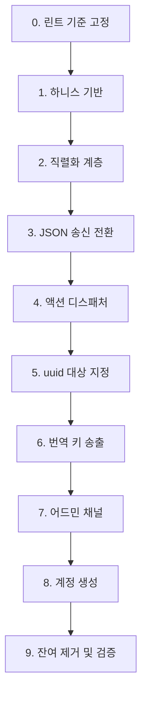

# Implementation Plan

## Overview

각 단계는 독립 커밋으로 진행하고 `mypy src/` + `ruff check src/` + 하니스 검증을 통과해야 한다. 프로토콜이 교체되는 3~4단계 구간에서는 하니스가 유일한 검증 수단이므로 1단계를 먼저 완료한다.

프로토콜 계약은 `docs/protocol/`을 기준으로 하며, 계약과 구현이 어긋나면 계약 문서를 먼저 갱신한다.

## Tasks

- [x] 0. 린트 기준 고정
  - `pyproject.toml`에 `lint.select`를 명시해 ruff 0.16.2 기본 룰셋 확대로 발생한 1,373건을 전환 작업 diff에서 분리한다. 기존 `lint.ignore` 목록은 유지한다.
  - `setup.cfg`의 mypy `python_version`을 실제 환경(3.14)에 맞춘다.
  - _Requirements: 10.1, 10.2_

- [x] 1. 하니스 기반 구축
- [x] 1.1 JSON 라인 클라이언트 작성
  - `scripts/harness/client.py`에 라인 버퍼 기반 송수신 클라이언트를 만든다. 개행까지 누적 후 라인 단위 UTF-8 디코딩, `seq` 발급과 응답 대응, 타임아웃, 명시적 종료 코드를 포함한다. 기존 `scripts/check_telnet_smoke.py`를 기반으로 한다.
  - _Requirements: 9.1, 9.7_
- [x] 1.2 프레이밍 시나리오 작성
  - `scripts/harness/scenario_framing.py`에 분할 수신, 병합 수신, 멀티바이트 경계 분할, 한국어 왕복 검증을 구현한다. 현재 프로토콜(텍스트)에서도 실행 가능한 형태로 작성해 기준선을 확보한다.
  - _Requirements: 9.5, 9.6_
- [x] 1.3 실행 러너 작성
  - `scripts/harness/run_all.py`가 전체 시나리오를 실행하고 종료 코드를 반환한다. 서버 미실행 시 명확한 오류를 낸다.
  - _Requirements: 9.1, 9.7_

- [x] 2. 직렬화 계층 신설
- [x] 2.1 봉투와 엔티티 직렬화
  - `server/serialization/envelope.py`(봉투 생성, seq 부착, JSON 라인 인코딩), `entity.py`(monster/object/player 페이로드, 언어별 dict 유지, 파생 boolean 계산)를 만든다. 기존 송신 경로를 아직 바꾸지 않는다.
  - 모델은 `name`/`description`을 `Dict[str, str]` 단일 필드로 보유한다. `name_en`/`name_ko` 속성은 존재하지 않으므로 `obj.name` dict를 그대로 담는다.
  - 파생 boolean은 다음 판정식을 쓴다. `is_container` = `properties.get('is_container', False)`, `is_readable` = `bool(properties.get('readable', {}))`, `is_usable` = `any(k in properties for k in ['hp_restore','stamina_restore','mana_restore','heal_amount'])`. properties가 문자열로 들어올 수 있으므로 방어 파싱한다.
  - `category`는 `properties.get('category')`에서 읽는다. 모델에 `category` 필드가 없다.
  - 레벨과 상인 여부는 포함하지 않는다. 강함 지표는 `max_hp`, `armor_class`, `attack_power`이며 모두 Monster의 계산 프로퍼티다.
  - `commands/container_commands.py`와 `use_command.py`에 중복 정의된 `_is_container` 3곳을 직렬화 계층의 단일 구현으로 대체할 수 있는지 검토한다.
  - _Requirements: 1.1, 1.2, 2.5, 6.8, 6.10, 6.11, 6.12_
- [x] 2.4 대화 스크립트 존재 확인 메서드 추가
  - `game/lua_script_loader.py`에 스크립트 파일 존재를 확인하는 조회 메서드를 추가해 `can_talk` 산출에 사용한다. 현재는 `load_script()`가 파일을 읽으며 부수효과를 갖고, 존재만 확인하는 경로가 없다.
  - 파일명이 NPC 인스턴스 uuid(`configs/dialogues/{monster.id}.lua`)이므로 리스폰으로 인스턴스 id가 바뀌면 매칭이 깨진다. 이 문제를 기록하고 template_id 기반 조회로 바꿀지 결정한다.
  - `can_talk`이 거짓이어도 서버는 대화를 거절하지 않고 침묵 응답을 준다. 이 동작을 유지한다.
  - _Requirements: 6.8_
- [x] 2.2 disposition 판정을 전용 모듈로 이동
  - `game/faction_rules.py`에 `get_disposition()`을 만들고 `telnet_session.py`의 `_is_friendly_faction`/`_is_neutral_faction` 규칙을 그대로 옮긴다. 같은 종족은 `friendly`, `ash_knights` 기준 `animals`는 `neutral`, 그 밖은 `hostile`이다.
  - `FactionManager`는 존재하지 않는 클래스다. 상태나 DB 접근이 필요하지 않으므로 순수 함수 모듈로 둔다.
  - `faction_relations` 조회 기반 동적 판정은 범위 밖이다. 우호도 기능 개발 시 이 모듈의 내부를 교체한다.
  - 이동 전후로 같은 입력에 같은 결과가 나오는지 확인한다.
  - _Requirements: 2.6, 2.7, 2.8_
- [x] 2.3 방·전투·인벤토리·플레이어 직렬화
  - `serialization/room.py`(room_info, nearby_rooms 좌표 배열), `combat.py`, `inventory.py`, `player.py`를 만든다. 각 페이로드는 `docs/protocol/server-to-client.md` 스키마를 따른다.
  - `room_info`에 `has_passage`를 포함한다. 현재 좌표에 `room_connections` 항목이 있는지 조회한 결과이며, 클라이언트가 진입 버튼 표시 여부를 판단하는 근거다. `commands/Basic/enter.py`가 사용하는 조회를 재사용한다.
  - _Requirements: 2.3, 2.4_

- [x] 3. JSON 송신 전환 및 프레젠터 제거
- [x] 3.1 send_message를 JSON 라인 송신으로 교체
  - `telnet_session.py::send_message()`가 직렬화 계층을 통해 JSON 라인을 내보내도록 바꾼다. `send_text()` 자유 텍스트 경로를 제거한다.
  - _Requirements: 1.1, 1.2, 1.3_
- [x] 3.2 프레젠터 제거
  - `_format_message()`, `_format_room_info()`, `_is_friendly_faction()`, `_is_neutral_faction()`을 제거한다. `server/ansi_colors.py`를 제거하고 참조 임포트를 정리한다.
  - _Requirements: 2.1, 2.2, 2.7_
- [x] 3.3 미니맵 텍스트 조립 제거
  - `player_movement_manager.py::_generate_minimap()`을 제거하고 `room_info`의 `nearby_rooms`로 대체한다.
  - _Requirements: 2.4_
- [x] 3.4 수신 경로에 JSON 파싱 도입
  - 라인 → UTF-8 디코딩 → `json.loads` → 봉투 검증 순서를 구현한다. 파싱 실패 시 `error(MALFORMED_MESSAGE)`, 알 수 없는 `type`은 무시 + 경고 로그로 처리한다.
  - _Requirements: 1.4, 1.5, 1.7_
- [x] 3.5 인증 흐름을 메시지 기반으로 전환
  - 텍스트 메뉴(1 로그인 / 2 회원가입 / 3 종료) 대화형 인증을 제거하고 `login` 메시지로 대체한다. `welcome` 송신을 추가한다. 회원가입 흐름을 제거한다. 로그인 실패 응답에서 사용자명 존재 여부를 구분하지 않는다.
  - _Requirements: 8.6, 8.7_

- [x] 4. 액션 디스패처 도입
- [x] 4.1 ActionContext와 ActionResult 정의
  - `commands/context.py`에 `ActionContext`(session, game_engine, verb, target, params, seq)와 `ActionResult`(result_type, message_key, params, rejection_code, broadcast, data)를 정의한다. 과도기에 `message: str`을 선택적으로 남긴다.
  - _Requirements: 4.1, 5.2_
- [x] 4.2 ActionDispatcher 구현
  - `commands/dispatcher.py`에 인증 검사 → verb 조회 → 상태 게이팅 → target 해석 → 핸들러 실행 순서를 구현한다. `commands/processor.py`를 대체한다.
  - _Requirements: 4.1, 4.2, 6.1, 6.4_
- [x] 4.3 숫자 변환과 별칭 체계 제거
  - `_convert_combat_number_to_command()`, `_convert_dialogue_number_to_command()`를 제거한다. 별칭 등록과 예약 별칭 보호 로직, `command.unknown` 오타 응답을 제거한다. 방향 별칭을 `move` verb의 params로 통합한다.
  - _Requirements: 4.3, 4.4, 4.5, 4.6_
- [x] 4.4 핸들러 인터페이스 전환 및 디렉터리 재배치
  - `BaseCommand.execute(session, game_engine, args)`를 `ActionHandler.handle(ctx)`로 전환한다. `commands/actions/` 아래 카테고리별로 재배치한다(movement, inspection, items, containers, combat, dialogue, shop, social, state, account). 중복 정의(object_commands와 평면 파일, combat과 combat_commands)를 단일화하고 사문화된 `npc_commands.py`, `npc/`를 제거한다.
  - _Requirements: 4.2, 10.6_
- [x] 4.5 채팅 분리
  - `chat` 메시지를 별도 경로로 처리하고 `say`/`whisper` 명령어를 제거한다. `whisper` 대상을 플레이어 uuid로 해석한다. 길이 검증과 제어문자 제거만 수행한다.
  - _Requirements: 4.9, 4.10_
- [x] 4.6 폐기 명령어 제거
  - `help`, `language`를 제거한다. `commands/language_commands.py`(동작하지 않는 language + 데드 HelpCommand)와 `commands/Basic/help.py`를 삭제한다. `quit`을 `logout` 메시지로, `stats`/`inventory`/`combat`을 `request_*` verb로 대체한다.
  - _Requirements: 4.7_

- [x] 5. uuid 대상 지정 전환
- [x] 5.1 target 해석 경로 구현
  - 디스패처의 target 해석을 구현한다. 탐색 순서는 전투 참가자 → 방 몬스터 → 방 오브젝트 → 인벤토리 → 열린 컨테이너 → 같은 방 플레이어다. 미발견 시 `NOT_FOUND`.
  - _Requirements: 3.4, 6.5_
- [x] 5.2 entity_map 생성과 저장 제거
  - `send_room_info_to_player()`의 번호 부여 로직을 제거한다. `session/state.py`의 `room_entity_map`/`inventory_entity_map` 필드와 `telnet_session.py`의 4개 property를 제거한다.
  - _Requirements: 3.1, 3.2_
- [x] 5.3 전투 entity_map 캐시 제거
  - `game/combat.py`의 `_entity_map` 필드와 `get_entity_map`/`set_entity_map`, `get_combat_status_message`의 번호 렌더링, `global_tick_manager.py:124`의 맵 복사, `attack_command.py`의 `set_entity_map` 호출을 제거한다.
  - _Requirements: 3.3_
- [x] 5.4 숫자 해석 경로 전환
  - 조사에서 확인된 8개 파일의 `isdigit()` → `int()` → 맵 조회 패턴을 제거한다. 대상은 attack, talk, look, get, use, container, read, terminate 경로다. `read`의 페이지 번호는 params로 분리한다.
  - 해당 파일들이 Task 4.6에서 삭제되어 함께 사라졌다. `read`의 페이지는 `params.page`로 분리됐다.
  - _Requirements: 3.5_
- [x] 5.5 매니저 시그니처 변경
  - `world_manager.py`의 `take_item_from_container()`와 `put_item_in_container()`가 번호와 entity_map 대신 uuid를 받도록 변경한다. 컨테이너 내부 배열 인덱스 참조(`use_command.py`의 `int(x)-1`)를 uuid로 대체한다.
  - 변경 대신 제거했다. 두 메서드는 호출자가 없었고, 핸들러가 `move_item_to_container()`와 `move_item_from_container()`를 uuid로 직접 호출한다.
  - _Requirements: 3.6, 3.7_
- [x] 5.6 이름 기반 매칭 제거
  - `give_command.py` 등의 `get_localized_name(locale).lower()` 비교 경로를 제거한다. 엔티티 수 제한(9개)이 사라졌음을 확인한다.
  - _Requirements: 3.8, 3.9_
- [x] 5.7 대화 선택지 params 전환
  - 대화 선택지 번호를 `dialogue_choice` 액션의 `params.choice`로 수신한다. 대상 지정과 선택지 번호의 의미 충돌이 해소됐음을 확인한다.
  - _Requirements: 3.10_

- [x] 6. 번역 키 송출 전환
- [x] 6.1 액션 핸들러의 번역 호출 전환
  - `commands/` 아래 `get_message()` 호출을 `message_key` + `params` 전달로 바꾼다. 엔티티 이름은 언어별 dict로 params에 담는다.
  - _Requirements: 5.1, 5.3_
- [x] 6.2 매니저의 번역 호출 전환
  - `game/combat_handler.py`(21건), `game/combat.py`(7건), `core/managers/player_movement_manager.py`(8건), `event_handler.py`(4건) 등의 호출을 전환한다. 브로드캐스트를 키 전달로 바꿔 발신자 locale 오염을 제거한다.
  - _Requirements: 5.1, 5.8_
- [x] 6.3 하드코딩 문자열을 키로 대체
  - `commands/Basic/status.py`(38건), `commands/examine_command.py`, `commands/give_command.py`, `commands/container_commands.py`, `commands/utils.py`의 사용자 노출 한국어를 번역 키로 대체한다. 새로 추가한 키 목록을 별도 파일로 정리해 클라이언트 스펙에 전달한다. 로그 메시지는 변경하지 않는다.
  - _Requirements: 5.9, 5.10_
- [x] 6.4 locale 소유권 제거
  - `session.locale`, `state.locale`, `commands/utils.py::get_user_locale()`을 제거한다. `players.preferred_locale` 컬럼은 유지하고 번역 목적 사용만 제거한다.
  - `get_user_locale()`은 Task 4.6에서 `commands/utils.py`와 함께 사라졌다. `SessionState.locale`과 `TelnetSession.locale` 프로퍼티, `update_locale()`, `get_session_info()`의 `locale` 항목을 제거했다. 대입 지점 3곳(`telnet_session.authenticate`, `telnet_server`, `game_engine`)도 함께 제거했다.
  - `get_room_info()`와 `get_location_summary()`의 `locale` 파라미터는 본문에서 쓰이지 않는 죽은 인자였으므로 시그니처에서 제거했다.
  - Lua 스크립트가 참조하는 `ctx.session.locale` 은 남는다. 대사와 아이템 콜백이 아직 언어별 완성 문장을 반환하므로 `player.preferred_locale` 에서 채운다. Task 10에서 함께 사라진다.
  - _Requirements: 5.6, 5.7_
- [x] 6.5 localization 모듈과 번역 파일 제거
  - `core/localization.py`를 삭제한다. `data/translations/` 9개 파일을 클라이언트 저장소로 이관한 뒤 서버에서 삭제한다. `grep -rn "get_message" src/`로 잔여 호출이 없음을 확인한다.
  - _Requirements: 5.4, 5.5_
- [x] 6.6 ActionResult 과도기 필드 제거
  - `ActionResult.message`를 제거한다. 모든 응답이 `message_key` 경로를 사용함을 확인한다.
  - 필드는 유지하고 용도를 개발자용 사유로 바꿨다. 사용자 노출 경로가 사라졌기 때문이다. REJECTED 는 서버 로그에만 남고, ERROR 는 계약이 허용하는 `error.detail` 로 나간다. SUCCESS 에 남은 유일한 사용처는 Lua 스크립트가 만든 대사이며 Task 10 에서 전환한다.
  - _Requirements: 5.2_
- [ ] 6.7 생문장 송신 경로 제거
  - Task 6.4 작업 중 발견한 잔여다. 게임 채널이 아직 완성된 한국어 문장을 그대로 보낸다.
  - `server/telnet_session.py`의 `send_event(text)`/`send_error`/`send_success`/`send_info`가 자유 문자열을 받는다. 시그니처를 `message_key` + `params` 로 바꾼다.
  - 호출처: `telnet_server.py`(서버 종료 알림, 중복 로그인 종료, 서버 오류, 공지 방송), `player_movement_manager.py:55`("존재하지 않는 방입니다."), `command_manager.py:110`(`result.message` 를 그대로 송신 — Task 6.6 결정에 따라 사용자에게 보내지 않아야 한다).
  - `game/tutorial_announcer.py`는 제거했다. `preferred_locale` 로 분기해 완성 문장과 이모지를 만들고, 계약에 없는 `tutorial_announcement` 타입으로 보내며, 사라진 텍스트 명령어(`east`, `go east`)를 안내했다. 트리거 조건인 `current_room_id == 'town_square'` 도 방 id가 uuid이므로 성립하지 않았다. 튜토리얼 안내는 Lua 스크립트로 NPC에 주입한다.
  - `core/managers/admin_manager.py`의 14건은 Task 7.6에서 어드민 채널로 옮기며 함께 정리한다.
  - _Requirements: 5.1, 5.9_

- [ ] 7. 어드민 채널 신설
- [ ] 7.1 어드민 서버와 인증
  - `server/admin/admin_server.py`(TCP 4001, IAC 협상 없음), `admin_session.py`(만료 2시간), `auth.py`(bcrypt 관리자 인증, 서비스 토큰 인증)를 만든다. `is_admin`이 거짓이면 `PERMISSION_DENIED`로 거절한다. 게임 세션 인증 상태가 전이되지 않음을 확인한다.
  - _Requirements: 7.1, 7.2, 7.3, 7.4, 7.5, 7.6_
- [ ] 7.2 리소스 CRUD
  - `resources.py`와 `queries.py`에 8개 리소스(players, rooms, room_connections, monsters, objects, item_prices, factions, faction_relations)의 목록·상세·생성·수정·삭제를 구현한다. SQL을 새로 쓰지 않고 기존 리포지토리를 재사용한다. 페이지네이션, 필터, 정렬을 지원한다.
  - _Requirements: 7.7_
- [ ] 7.3 참조 무결성과 캐시 갱신
  - 삭제 시 참조를 검사해 `REFERENCED`로 거절하고 참조 목록을 반환한다. 변경이 게임 상태에 영향을 주면 매니저 캐시를 무효화하고 영향받는 플레이어에게 갱신 상태를 송신한다.
  - _Requirements: 7.8, 7.9_
- [ ] 7.4 admin_action 구현
  - `actions.py`에 14종 액션을 구현하고 `AdminManager`에 위임한다. 기존에 노출되지 않았던 `validate_and_repair_world()`를 포함한다. `goto`는 대상 플레이어의 게임 세션이 없으면 `PLAYER_NOT_ONLINE`으로 거절한다.
  - _Requirements: 7.10_
- [ ] 7.5 맵 데이터 JSON 전환
  - `utils/map_exporter.py`의 HTML 생성을 제거하고 좌표·지형·막힌 출구·방별 종족 분포를 담은 JSON 응답으로 대체한다. `scripts/export_unified_map.py`와 `export_map.sh`, `time_manager`의 자동 생성 스케줄을 정리한다.
  - _Requirements: 7.11_
- [ ] 7.6 관리자 명령어 제거
  - `commands/admin/` 디렉터리 전체와 `commands/admin_commands.py`, `AdminCommand` 기반 클래스를 제거한다. 게임 채널에서 관리자 명령어가 사라졌음을 확인한다.
  - _Requirements: 7.12, 4.8_
- [ ] 7.7 감사 로그
  - 모든 어드민 변경 작업에 실행 주체, 대상, 변경 내용, 시각을 기록한다. DB 테이블 저장 여부를 결정하고 구현한다.
  - _Requirements: 7.13_

- [ ] 8. 계정 생성 경로
  - `server/admin/account.py`에 계정 생성을 구현한다. 사용자명 중복(`USERNAME_TAKEN`), 길이와 허용 문자, 비밀번호 최소 길이, 이메일 형식을 검증한다. `bcrypt` 해시로 저장하고 `is_admin`을 거짓으로 설정한다. 서비스 토큰이 미설정이면 경로를 비활성화한다.
  - _Requirements: 8.1, 8.2, 8.3, 8.4, 8.5_

- [ ] 9. 잔여 제거 및 최종 검증
- [ ] 9.1 텔넷 테스트 자산 폐기
  - `telnet/telnet_client.py`(telnetlib 의존으로 이미 동작하지 않음), `telnet/capture_baseline.py`, `telnet_test.sh`를 제거한다. `docs/telnet_test_guide.md`를 하니스 기준으로 갱신하거나 폐기한다.
  - _Requirements: 9.8_
- [ ] 9.2 스티어링 문서 갱신
  - `.kiro/steering/dev-environment.md`의 가상환경(`mud_engine_env` → `.venv`), Python 버전(3.13 → 3.14), 웹 포트 8080(존재하지 않음) 기술을 정정한다. `telnet-mcp-test.md`를 하니스 절차로 대체한다. `script-execution.md`의 가상환경 경로를 갱신한다.
  - _Requirements: 10.1, 10.2, 10.3_
- [ ] 9.3 하니스 전체 시나리오 확장
  - 인증, 방 정보, 액션, 거절, 프레이밍 시나리오를 완성한다. 액션 verb 전체와 거절 코드 전체를 커버한다.
  - _Requirements: 9.2, 9.3, 9.4_
- [ ] 9.4 최종 정합성 검증
  - `docs/protocol/`의 계약과 구현이 일치하는지 확인한다. 서버가 송신하는 모든 메시지 타입이 계약에 정의되어 있고, 계약의 모든 클라이언트 메시지가 처리되는지 점검한다. mypy + ruff + 하니스 전체 통과.
  - _Requirements: 10.1, 10.2, 10.3, 10.4, 10.5_
- [ ] 9.5 시그널 핸들러 재진입 방지
  - `main.py:219`의 시그널 핸들러가 종료 진행 중 재진입을 막지 않아 SIGINT 한 번에 3회 호출되고 종료 시 `KeyboardInterrupt`가 처리되지 않은 채 남는다. 종료 플래그를 두어 중복 처리를 방지한다.
  - _Requirements: 10.6_

- [ ] 10. 대화 대사의 번역 키 전환
  - 선행 조건: Task 4.4(대화 핸들러)와 Task 6(번역 키 송출 전환) 완료
- [ ] 10.1 대사 번역 키 체계 설계
  - `configs/dialogues/*.lua` 19개 스크립트의 대사와 선택지에 부여할 키 규칙을 정한다. NPC id 가 인스턴스 id 이므로 키를 인스턴스에 묶으면 재생성 시 깨진다. 템플릿 id 기반 키 체계를 검토한다.
  - _Requirements: 3.1, 3.2_
- [ ] 10.2 Lua 스크립트 대사를 키로 교체
  - 각 스크립트가 언어별 완성 문장 대신 번역 키와 파라미터를 반환하도록 바꾼다. `lua_script_loader.py`의 `execute_get_dialogue`, `execute_on_choice` 반환 규약을 함께 갱신한다.
  - _Requirements: 3.1_
- [ ] 10.3 대사를 클라이언트 번역 파일로 이관
  - 추출한 대사를 Godot 저장소의 번역 파일에 넣는다. Task 6.5의 번역 파일 이관과 같은 경로를 쓴다.
  - _Requirements: 3.3_
- [ ] 10.4 dialogue 페이로드를 키 방식으로 전환
  - `serialization/dialogue.py`의 `lines[]`와 `choices[].text`가 언어별 dict 대신 `{key, params}`를 담도록 바꾼다. 과도기 주석을 제거한다.
  - _Requirements: 3.1, 3.2_

## Task Dependency Graph



```json
{
  "waves": [
    { "wave": 1, "tasks": ["0"] },
    { "wave": 2, "tasks": ["1.1", "1.2", "1.3"] },
    { "wave": 3, "tasks": ["2.1", "2.2", "2.3"] },
    { "wave": 4, "tasks": ["3.1", "3.2", "3.3", "3.4", "3.5"] },
    { "wave": 5, "tasks": ["4.1", "4.2", "4.3", "4.4", "4.5", "4.6"] },
    { "wave": 6, "tasks": ["5.1", "5.2", "5.3", "5.4", "5.5", "5.6", "5.7"] },
    { "wave": 7, "tasks": ["6.1", "6.2", "6.3", "6.4", "6.5", "6.6"] },
    { "wave": 8, "tasks": ["7.1", "7.2", "7.3", "7.4", "7.5", "7.6", "7.7"] },
    { "wave": 9, "tasks": ["8"] },
    { "wave": 10, "tasks": ["9.1", "9.2", "9.3", "9.4", "9.5"] }
  ]
}
```

의존성 요약:

- 0은 전환 diff와 린트 정리를 분리하기 위한 선행 작업이다.
- 1은 모든 단계의 검증 수단이므로 최우선이다. 3단계 이후에는 하니스 없이 동작 확인이 불가능하다.
- 2는 3의 전제다. 직렬화 구현 없이 송신을 바꿀 수 없다.
- 3과 4 사이에서 프로토콜이 완전히 교체된다. 이 구간은 되돌리기가 어렵다.
- 5는 4에 의존한다. 디스패처가 있어야 uuid 해석을 한 곳에 구현할 수 있다.
- 6은 규모가 커서 다른 작업과 충돌하기 쉬우므로 뒤로 미룬다.
- 7 완료 직후 클라이언트 저장소의 Node 웹어드민을 제거해야 한다. 두 경로가 같은 DB를 조작하는 기간을 최소화한다.

## 저장소 간 조율

| 이 스펙의 단계 | 연동 대상 |
|---|---|
| 3 (JSON 송신) | `gateway-landing` 4.3 라인 프레이밍이 같은 시점에 필요 |
| 6.5 (번역 파일 이관) | `godot-client` 5.2 i18n이 파일을 받아야 함 |
| 7 (어드민 채널) | `gateway-landing` 4.1 웹어드민 삭제의 선행 조건 |
| 8 (계정 생성) | `gateway-landing` 4.5 랜딩 회원가입의 선행 조건 |

## Notes

- 프로토콜 계약(`docs/protocol/`)이 단일 기준이다. 구현이 계약과 어긋나면 계약을 먼저 갱신하고 세 저장소에 반영한다.
- 게임 규칙, 밸런스, DB 스키마는 변경하지 않는다. 어드민과 계정 관련 변경만 예외다.
- 번역 키 문자열은 변경하지 않는다. 클라이언트가 기존 키를 재사용한다.
- `session/protocol.py`의 IAC 협상은 유지한다. 사람이 터미널로 접속하지 않으므로 실질적으로 쓰이지 않으나 게이트웨이 호환을 위해 남기며 향후 제거 후보로 기록한다.
- 서버 실행은 `control_bash_process`를 쓴다. `nohup ... &`는 콘솔 분리로 `kill -2`가 전달되지 않는다. 종료는 `kill -2`다.
