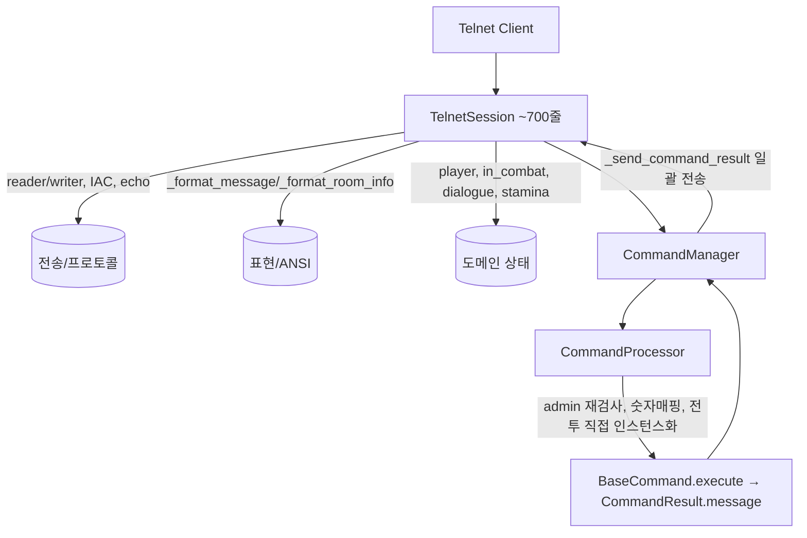
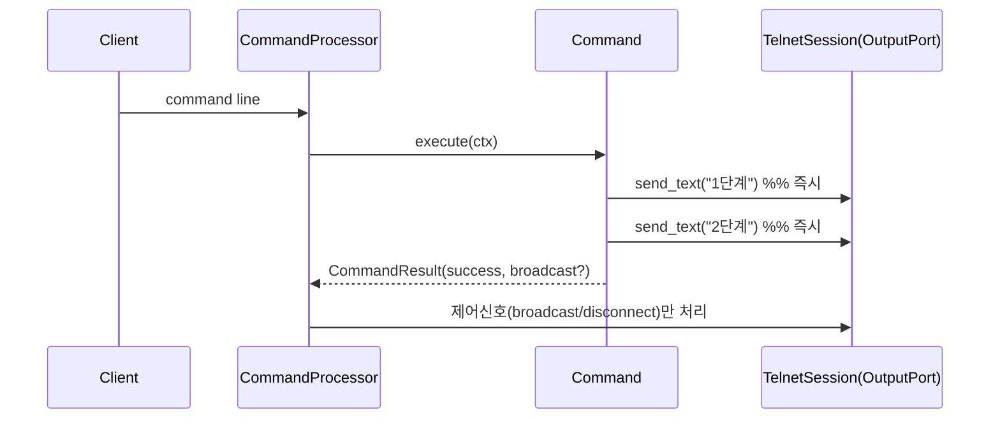

# Design Document

## Overview

이 설계는 `requirements.md`(R1~R11)를 충족하기 위한 세션 계층과 명령어 시스템의 동작 보존 리팩토링 구조를 정의한다. 두 가지 목적을 축으로 한다.

- 1차 목적(유지보수성): god object인 `TelnetSession`을 책임별 구성요소로 분해하고, 명령어를 "한 명령어 = 한 파일"로 분리하며, 등록·실행 인터페이스를 일원화한다.
- 2차 목적(즉시 메시지 전달): 명령어가 출력을 `CommandResult.message`에 누적해 종료 후 일괄 전송하던 모델을, 실행 도중 `Output_Port`로 즉시 전송하는 모델로 전환한다.

설계의 최상위 제약은 점진적 동작 보존이다. 모든 단계는 독립적으로 적용 가능하고, 각 단계 후 정적 검사(mypy + ruff)와 telnet-mcp 회귀가 통과해야 한다(R1, R10).

## Architecture

### 현재 구조 (As-Is)



문제점: `TelnetSession`이 4책임 혼재, 표현 로직·팩션 판정 하드코딩, 명령어 출력이 종료 후 일괄 전송, 디렉토리/등록/실행 패턴 불일치, processor 정책 과다.

### 목표 구조 (To-Be)

```mermaid
flowchart TD
    Client[Telnet Client] --> TS[TelnetSession 조립자]
    TS --> TR[TelnetTransport]
    TS --> PR[TelnetProtocol]
    TS --> ST[SessionState]
    TS -.implements.-> OP[[OutputPort]]
    TS --> VIEW[Presenters: RoomPresenter/MessagePresenter]
    VIEW --> FM[FactionManager 위임]

    TS --> CM[CommandManager]
    CM --> CP[CommandProcessor 라우팅 전담]
    CP --> REG[CommandRegistry 자동 발견]
    CP --> CTX[CommandContext: session, output, game_engine, args, locale]
    CTX --> CMD[Command.execute(ctx) → CommandResult 제어흐름]
    CMD -->|즉시| OP
    CP --> NIM[NumericInputMap 데이터]
```

핵심 변화:
- `TelnetSession`은 구성요소를 조립하고 `OutputPort`를 구현하는 얇은 파사드가 된다.
- 명령어는 `CommandContext`를 받아 `OutputPort`로 즉시 출력하고, `CommandResult`는 제어 흐름만 반환한다.
- 등록은 `CommandRegistry`의 자동 발견으로 일원화한다.

## Components and Interfaces

### 1. 세션 계층 분해 (R2, R4)

`server/session/` 패키지로 분리한다. `TelnetSession`은 제거하지 않고 구성요소를 조립하는 파사드로 유지하여 외부 호출부(예: `session.send_message`, `session.player`, `session.current_room_id`)의 인터페이스를 보존한다.

- `TelnetTransport` (`server/session/transport.py`): `reader`/`writer` 보유. `send_text`, `send_prompt`, `read_line`, `enable_echo`/`disable_echo`, `is_closing`, `close`. 바이트 입출력과 줄바꿈 정규화만 담당.
- `TelnetProtocol` (`server/session/protocol.py`): IAC 협상(`initialize_telnet`), `_filter_telnet_commands`, `read_line` 내 IAC 시퀀스 스킵 로직. Transport와 협력하되 프로토콜 규칙만 보유.
- `SessionState` (`server/session/state.py`): `player`, `is_authenticated`, `current_room_id`, `current_room_type`, `locale`, `following_player`, 전투(`in_combat`, `combat_id`, `original_room_id`), 대화(`in_dialogue`, `dialogue_id`), `stamina`/`max_stamina`, `last_command`, `created_at`/`last_activity`. 순수 상태 컨테이너 + `update_activity`/`is_active`.
- Presenters (`server/session/presenters/`): `MessagePresenter`(기존 `_format_message`), `RoomPresenter`(기존 `_format_room_info`). 입력은 메시지 dict + `SessionState`(locale, player faction) + `entity_map`, 출력은 문자열. 팩션 우호/중립/적대 판정은 `FactionManager`에 위임(하드코딩 `_is_*_faction` 제거).
- `TelnetSession` (파사드): 위 구성요소를 보유하고 기존 공개 메서드(`send_message`, `send_text`, `send_success`, `send_error`, `send_info`, `authenticate`, `get_session_info` 등)를 위임으로 재구현. `player`, `current_room_id` 등은 `SessionState`로 프록시.

분리 전략(점진적): ① 내부 헬퍼를 새 클래스로 추출하되 `TelnetSession`이 위임 호출 → ② 호출부는 그대로 → ③ 각 추출 후 회귀 확인. 외부 코드 변경 없이 내부만 이동(R2.5 중간 상태 동작 보존).

`short_session_id`는 `server/session/util.py`의 단일 함수로 통합(R4.1). Presenter 내 `get_localization_manager` 인라인 임포트는 모듈 상단 단일 임포트로(R4.2). `send_message`의 매 호출 INFO 로깅은 제거 또는 DEBUG 강등(R4.3).

### 2. 세션 타입 정리 (R3)

- `core/types.py`: `SessionType`을 `TelnetSession` 단일 참조로 변경하고, 존재하지 않는 `..server.session` 임포트를 제거. 순환 임포트 회피를 위해 `TYPE_CHECKING` 하에 `from ..server.telnet_session import TelnetSession`만 유지하거나, `Protocol` 기반 `ClientSession` 인터페이스로 정의.
- `Legacy_Session` 제거: `grep -rn "models.session\|import Session\b"` + mypy 미사용 보고로 런타임 미참조 확인 → `game/models/session.py` 삭제, `game/__init__.py`·`game/models/__init__.py` export 제거. 이를 참조하던 테스트 임포트는 유효 타입으로 갱신(R3.5). 각 중간 단계 정적검사 통과(R3.6).

권장: `SessionType`을 `Protocol`(`ClientSession`)로 정의하면 명령어가 구체 클래스가 아닌 출력 계약에 의존하게 되어 R7/R11과 자연스럽게 결합한다.

### 3. 즉시 메시지 전달 모델 (R11, R7, R1.3)

`OutputPort` 프로토콜을 도입한다.

```python
class OutputPort(Protocol):
    async def send_message(self, message: dict) -> bool: ...
    async def send_text(self, text: str, newline: bool = True) -> bool: ...
    async def send_success(self, message: str) -> bool: ...
    async def send_error(self, message: str) -> bool: ...
    async def send_info(self, message: str) -> bool: ...
```

`TelnetSession`이 `OutputPort`를 구현한다(기존 send 메서드가 이미 시그니처를 충족). 명령어는 실행 중 `ctx.output`(= 세션)으로 직접 즉시 전송한다.

- `CommandResult`(R11.4)는 출력 텍스트 누적 책임을 제거하고 제어 흐름만 보유: `result_type`(SUCCESS/ERROR/INFO/WARNING), `broadcast`/`broadcast_message`/`room_only`, `data`(disconnect 등). `message` 필드는 과도기 동안 선택적으로 유지하되, 신규 명령어는 사용하지 않는다.
- 전환 경로: `CommandManager._send_command_result`는 더 이상 `result.message`를 일괄 전송하지 않는다. 명령어가 이미 즉시 전송했으므로, 매니저는 broadcast/disconnect 등 제어 신호만 처리(R9.3 보존). 과도기 호환을 위해 `result.message`가 존재하면 전송하는 폴백을 두되, 명령어를 순차 이관하며 폴백 의존을 제거.
- 메시지 내용·상대 순서·ANSI는 보존하고, 전달 타이밍만 즉시로 변경(R1.3, R11.5). 오류 중단 시 이미 전송된 메시지는 회수하지 않음(R11.6).



### 4. 명령어 실행 계약 및 컨텍스트 (R7)

단일 계약으로 통일한다.

```python
@dataclass
class CommandContext:
    session: "ClientSession"      # OutputPort 겸 상태 접근
    output: OutputPort            # = session (명시적 의존)
    game_engine: "GameEngine"
    args: list[str]
    locale: str

class BaseCommand(ABC):
    name: str
    aliases: list[str]
    admin_only: bool
    @abstractmethod
    async def execute(self, ctx: CommandContext) -> CommandResult: ...
```

- 의존성 주입 일원화: 전투 명령어가 생성자에서 받던 `combat_handler`, talk이 받던 `dialogue_manager`, who의 `session_manager` 등은 `ctx.game_engine`을 통해 접근하거나, 등록 시 레지스트리가 주입한다. processor의 `_execute_combat_command` 직접 인스턴스화 제거(R7.3) → flee/item/endturn도 정식 등록.
- 기존 `execute(session, args)` 시그니처에서 `execute(ctx)`로 이행. 과도기에는 어댑터로 양쪽을 흡수할 수 있으나, 명령어 분리 작업과 함께 일괄 이관 권장.

### 5. 명령어 디렉토리 표준화 (R5, R6)

목표 구조: 한 명령어 = 한 파일, 카테고리 소문자 하위 디렉토리.

```
commands/
├── base.py            # BaseCommand, CommandResult, CommandContext
├── registry.py        # CommandRegistry (자동 발견)
├── processor.py       # 라우팅 전담
├── numeric_input.py   # NumericInputMap 데이터
├── basic/             # say, whisper, who, look, help, quit, stats, move, enter, emote, follow, players, language, changename, ...
├── object/            # get, drop, inventory, use, equip, unequip
├── container/         # open, put
├── equipment/         # unequipall
├── combat/            # attack, flee, item, endturn, combat_status
├── dialogue/          # talk
└── admin/             # create_room, edit_room, create_exit, admin_list, goto, room_info, spawn_monster, list_monster_templates, spawn_item, list_item_templates, terminate, scheduler, changename(admin)
```

집합 파일 분해 매핑:
- `object_commands.py` → `object/{get,drop,inventory,use,equip,unequip}.py`
- `combat_commands.py` → `combat/{attack,flee,item,combat_status}.py` (기존 `combat/` 디렉토리와 병합, 중복 제거 R6.1)
- `container_commands.py` → `container/{open,put}.py`
- `equipment_commands.py` → `equipment/unequipall.py`
- `interaction_commands.py` → `basic/{emote,follow,players}.py` + `object/give.py`
- `name_commands.py` → `basic/{changename}.py`, `admin/admin_changename.py`
- `language_commands.py` → `basic/language.py`
- `Basic/`(대문자) → `basic/`로 정규화(R5.3)
- 사문화 `npc_commands.py`(매니저에서 주석 처리, dialogue/talk으로 대체) 및 `npc/`와의 중복 정리 → 미등록 확인 후 제거(R6.2)

각 카테고리 `__init__.py`에서 명령어를 export, 루트 `commands/__init__.py`는 공개 심볼만 정리. 디렉토리 표준화 후 등록되는 명령어 집합·별칭은 동일해야 함(R5.4, R6.3).

### 6. 등록 일원화 및 자동 발견 (R7)

`CommandRegistry`가 카테고리 디렉토리를 스캔하여 `BaseCommand` 서브클래스를 발견·인스턴스화한다.

- 발견: `commands/<category>/` 모듈을 import하여 `BaseCommand` 구상 클래스를 수집. 또는 데코레이터 `@command`로 명시 등록(추천: 암묵적 스캔의 부작용을 줄임).
- 커스터마이징 재현(R7.5): `MoveCommand`처럼 한 클래스가 4개 방향 인스턴스(north/south/east/west, 별칭 n/s/e/w)를 만드는 경우는 팩토리/등록 스펙으로 표현. `n/s/e/w` 예약 별칭 보호 로직은 레지스트리로 이동.
- 의존성 주입: 발견된 명령어가 `game_engine`을 요구하면 실행 시 `ctx`로 공급되므로 생성자 주입 불필요. 부득이한 경우 레지스트리가 `game_engine`을 주입.

### 7. 숫자 입력 매핑 데이터화 (R8)

`commands/numeric_input.py`:

```python
COMBAT_NUMERIC_MAP = {"1": "attack", "3": "flee", "4": "item", "9": "endturn"}
# 대화: 숫자 입력은 "talk <n>"으로 변환
```

`CommandProcessor`는 이 데이터를 참조해 변환하며, 처리 로직에 리터럴을 분산하지 않는다(R8.3). 변환 결과는 기존과 동일(R8.4).

### 8. Processor 정책 정리 (R9)

`CommandProcessor.process_command`의 책임을 라우팅으로 좁힌다.

- 인증 확인, "." 반복, 모드(전투/대화) 숫자 변환, 전투 전용 게이팅, 이벤트 발행, `last_command` 저장은 명확한 단계(헬퍼)로 분리.
- 관리자 권한 검사는 `AdminCommand`(또는 `admin_only` 게이트) 한 곳에서만 수행하고 processor의 중복 검사를 제거(R9.1). 비관리자 거부 응답 메시지는 기존과 동일(R9.2) — 단일 출처를 `admin.permission_denied`로 통일.

## Data Models

- `CommandResult`: `result_type: CommandResultType`, `data: dict`, `broadcast: bool`, `broadcast_message: str|None`, `room_only: bool`. (출력 텍스트 누적 제거; `message`는 과도기 선택적)
- `CommandContext`: §4 정의.
- `NumericInputMap`: §7 상수 데이터.
- `SessionState`: §1 필드.

## Migration Strategy (점진적, 동작 보존)

각 단계는 독립 커밋, 단계 후 mypy+ruff+telnet 회귀 통과(R1, R10).

1. 세션 타입 정리(R3): 깨진 임포트 제거 + `SessionType` 단일화(+ Legacy_Session 미사용 확인·제거). 가장 저위험, 선행.
2. 세션 분해(R2, R4): Transport/Protocol/State/Presenters 추출, `TelnetSession` 파사드화, 보일러플레이트·로깅 정리, 팩션 판정 위임.
3. OutputPort + CommandContext 도입(R7, R11): 계약 정의 + 매니저 일괄 전송 폴백 유지.
4. 명령어 이관(R5, R6, R11): 카테고리별로 한 파일씩 분해하며 즉시 전송으로 전환. 각 카테고리 이관 후 회귀.
5. 등록 자동 발견(R7) + 전투 명령어 정식 등록 + 숫자 매핑 데이터화(R8).
6. processor 정책 정리(R9) + 일괄 전송 폴백 제거.

## Error Handling

- 명령어 실행 예외는 processor가 포착해 즉시 에러 메시지를 `OutputPort`로 전송(기존 동일 문구 유지). 이미 즉시 전송된 메시지는 회수하지 않음(R11.6).
- Transport 전송 실패(연결 종료)는 기존과 동일하게 False 반환·경고 로깅.

## Correctness Properties

리팩토링의 정합성을 판정하는 불변식이다. 각 단계 후 이 속성들이 유지되어야 한다.

### Property 1: 출력 동등성

동일 입력 시퀀스에 대해 리팩토링 전후의 (메시지 내용, 메시지 간 상대 순서, ANSI 색상) 집합이 동일하다. 전달 타이밍(일괄 vs 즉시)만 예외다.

**Validates: Requirements 1.1, 1.2, 11.5**

### Property 2: 명령어 집합 보존

등록되는 (명령어 이름, 별칭) 집합이 리팩토링 전후 동일하다.

**Validates: Requirements 5.4, 6.3, 7.5**

### Property 3: 단일 권한 판정

관리자 권한 거부는 정확히 한 경로에서 발생하며, 동일 입력에 대해 한 번만 거부 응답을 낸다.

**Validates: Requirements 9.1, 9.2**

### Property 4: 숫자 변환 동등성

전투/대화 숫자 입력의 변환 결과가 데이터화 전후 동일하다.

**Validates: Requirements 8.4**

### Property 5: 정적 정합성

모든 중간 상태에서 mypy + ruff가 오류 없이 통과한다.

**Validates: Requirements 3.6, 10.2**

### Property 6: 제어 신호 보존

broadcast(room_only 포함)와 disconnect 등 제어 흐름의 효과가 보존된다.

**Validates: Requirements 9.3**

## Testing Strategy

- 정적 검사: 각 단계 `mypy src/`, `ruff check src/` 통과.
- 회귀: telnet-mcp로 look, 방 정보(엔티티 번호/팩션 분류), 전투(attack/flee/item/endturn, 숫자 입력), 대화(숫자 입력), 관리자 권한 거부, 미인증 접근, 알 수 없는 명령어 시나리오 실행 → 리팩토링 이전 기준선과 메시지 내용·상대 순서·ANSI 동일 확인.
- 분해 단위 테스트: Presenter(room_info 포맷), NumericInputMap, Registry(발견·별칭·커스터마이징 재현)에 단위 테스트 추가 가능(선택).

## Requirements Traceability

| 요구사항 | 설계 반영 |
|---|---|
| R1 동작 보존 | Migration 각 단계 회귀, 전달 타이밍만 변경(§3) |
| R2 세션 책임 분리 | §1 Transport/Protocol/View/State |
| R3 세션 타입 정리 | §2 |
| R4 보일러플레이트/로깅 | §1 util/단일 임포트/로깅 강등 |
| R5 디렉토리 표준화 | §5 |
| R6 중복/사문화 제거 | §5 매핑·npc 제거 |
| R7 단일 인터페이스/등록 | §4, §6 |
| R8 숫자 매핑 데이터화 | §7 |
| R9 processor 정책 | §8 |
| R10 검증 가능성 | Testing Strategy |
| R11 즉시 전달 | §3 OutputPort/CommandResult |
