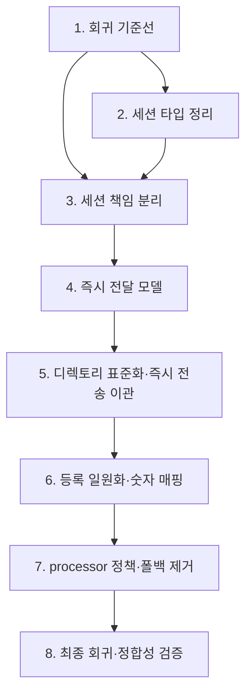

# Implementation Plan

## Overview

각 작업은 동작 보존을 전제로 하며, 완료 시 mypy + ruff 통과와 telnet-mcp 회귀(해당 시나리오)를 확인한다. 작업은 설계의 6단계 마이그레이션 순서를 따른다.

## Tasks

- [x] 1. 회귀 기준선 및 검증 절차 확보
  - telnet-mcp로 look, 방 정보(엔티티 번호/팩션 분류), 전투(attack/flee/item/endturn, 숫자 입력), 대화(숫자 입력), 관리자 권한 거부, 미인증 접근, 알 수 없는 명령어 시나리오의 현재 출력을 캡처해 기준선으로 저장한다.
  - `mypy src/`와 `ruff check src/`의 현재 상태를 기록한다.
  - _Requirements: 1.1, 1.2, 10.1, 10.3, 10.4_

- [x] 2. 세션 타입 단일화 및 깨진 임포트 정리
- [x] 2.1 `core/types.py`의 깨진 `..server.session` 임포트 제거 및 `SessionType` 단일화
  - `SessionType`을 `TelnetSession` 단일 참조(또는 `ClientSession` Protocol)로 정의하고 `TYPE_CHECKING` 가드로 순환 임포트를 방지한다.
  - _Requirements: 3.1, 3.2, 3.6_
- [x] 2.2 Legacy_Session 미사용 확인 및 제거
  - grep 전체 검색 + mypy 미사용 보고로 런타임 미참조를 확인한 뒤 `game/models/session.py`와 `game/__init__.py`·`game/models/__init__.py`의 export를 제거한다.
  - Legacy_Session을 참조하던 테스트 임포트를 유효 세션 타입으로 갱신한다.
  - _Requirements: 3.3, 3.4, 3.5, 3.6_

- [ ] 3. 세션 계층 책임 분리 (파사드 유지)
- [x] 3.1 `server/session/` 패키지 및 `short_session_id` 유틸 통합
  - `server/session/util.py`에 짧은 세션 식별자 산출을 단일 정의로 만들고 기존 6곳을 대체한다.
  - _Requirements: 4.1, 2.5_
- [x] 3.2 `TelnetTransport` 추출
  - reader/writer, send_text, send_prompt, read_line, enable/disable_echo, is_closing, close를 `transport.py`로 이동하고 `TelnetSession`이 위임한다.
  - _Requirements: 2.1, 2.5_
- [x] 3.3 `TelnetProtocol` 추출
  - IAC 협상(initialize_telnet), `_filter_telnet_commands`, read_line 내 IAC 스킵을 `protocol.py`로 이동한다.
  - _Requirements: 2.2, 2.5_
- [x] 3.4 `SessionState` 추출
  - player/room/locale/전투/대화/stamina/following/last_command/타임스탬프 상태를 `state.py`로 이동하고 `TelnetSession`이 프록시한다. 외부 호출부(`session.player`, `session.current_room_id` 등) 인터페이스 보존.
  - _Requirements: 2.4, 2.5_
- [ ] 3.5 Presenter 분리 및 팩션 판정 위임, 로깅/임포트 정리
  - `_format_message`→`MessagePresenter`, `_format_room_info`→`RoomPresenter`로 이동. 하드코딩 `_is_friendly_faction`/`_is_neutral_faction` 제거하고 `FactionManager`에 위임. localization 인라인 반복 임포트를 모듈 상단 단일 임포트로, `send_message` 매 호출 INFO 로깅 제거/DEBUG 강등.
  - _Requirements: 2.3, 2.6, 4.2, 4.3, 2.5_

- [ ] 4. 즉시 메시지 전달 모델 도입
- [ ] 4.1 `OutputPort` 프로토콜 및 `CommandContext` 정의
  - `OutputPort`(send_message/send_text/send_success/send_error/send_info)와 `CommandContext`(session, output, game_engine, args, locale)를 `commands/base.py`에 정의한다. `TelnetSession`이 `OutputPort`를 충족함을 확인한다.
  - _Requirements: 7.1, 7.2, 11.1_
- [ ] 4.2 `CommandResult`에서 출력 누적 책임 제거
  - `CommandResult`를 제어 흐름(result_type, broadcast/broadcast_message/room_only, data) 중심으로 정리한다. `message`는 과도기 선택적 유지.
  - _Requirements: 11.3, 11.4_
- [ ] 4.3 `CommandManager._send_command_result` 일괄 전송 폐지(폴백 유지)
  - 매니저가 `result.message`를 일괄 전송하지 않고 broadcast/disconnect 제어 신호만 처리하도록 변경한다. 미이관 명령어 호환을 위해 `message` 존재 시 전송하는 임시 폴백을 둔다.
  - _Requirements: 11.1, 11.3, 9.3_

- [ ] 5. 명령어 디렉토리 표준화 및 즉시 전송 이관
  - 카테고리별로 한 파일씩 분해하며 `execute(ctx)` + 즉시 전송으로 전환한다. 각 카테고리 이관 후 회귀 확인.
- [ ] 5.1 `basic/` 정규화 (`Basic/`→`basic/`)
  - say, whisper, who, look, help, quit, stats, move, enter를 `basic/`으로 이동(소문자 디렉토리). 별칭(n/s/e/w 포함) 보존.
  - _Requirements: 5.1, 5.2, 5.3, 5.4, 11.1, 11.2_
- [ ] 5.2 `object/` 분해 및 중복 제거
  - get/drop/inventory/use/equip/unequip를 `object/`로 단일화. `object_commands.py`와 평면 파일(get_command.py, drop_command.py, equip_command.py, inventory_command.py, use_command.py 등)의 중복 정의를 단일 정의로 정리. give는 `object/give.py`로.
  - _Requirements: 5.1, 6.1, 11.1_
- [ ] 5.3 `container/`, `equipment/` 분해
  - open/put → `container/`, unequipall → `equipment/`.
  - _Requirements: 5.1, 5.2_
- [ ] 5.4 `basic/` 상호작용·기타 이관
  - emote/follow/players → `basic/`, changename → `basic/`, language → `basic/`, read → `basic/`(또는 object). examine 정리.
  - _Requirements: 5.1, 6.1_
- [ ] 5.5 `admin/` 정리 및 admin_changename 이동
  - admin 명령어를 `admin/`에 한 파일씩 유지, name_commands.py의 AdminChangeNameCommand를 `admin/admin_changename.py`로 이동. AdminCommand 권한 판정을 단일 경로로.
  - _Requirements: 5.1, 9.1_
- [ ] 5.6 `combat/` 통합 및 `dialogue/` 정리, 사문화 제거
  - combat_commands.py를 `combat/`로 병합(attack/flee/item/endturn/combat_status), `combat/`↔`combat_commands.py` 중복 제거. 사문화된 `npc_commands.py`·`npc/`의 미등록 모듈 제거.
  - _Requirements: 6.1, 6.2, 6.3, 6.4_

- [ ] 6. 등록 일원화 및 숫자 매핑 데이터화
- [ ] 6.1 `CommandRegistry` 자동 발견 구현
  - 카테고리 디렉토리 스캔 또는 `@command` 데코레이터로 `BaseCommand` 구상 클래스를 발견·등록한다. 예약 별칭(n/s/e/w) 보호 로직을 레지스트리로 이동. `MoveCommand` 4방향 인스턴스 등 커스터마이징 재현.
  - _Requirements: 7.3, 7.4, 7.5_
- [ ] 6.2 전투 명령어 정식 등록 및 processor 직접 인스턴스화 제거
  - flee/item/endturn을 레지스트리에 등록하고 `_execute_combat_command`의 직접 인스턴스화를 제거한다. 의존성은 `ctx.game_engine`으로 공급.
  - _Requirements: 7.2, 7.3, 11.1_
- [ ] 6.3 숫자 입력 매핑 데이터화
  - `commands/numeric_input.py`에 전투(1/3/4/9→attack/flee/item/endturn)·대화 매핑을 데이터로 정의하고 processor가 이를 참조한다.
  - _Requirements: 8.1, 8.2, 8.3, 8.4_

- [ ] 7. Processor 정책 정리 및 폴백 제거
- [ ] 7.1 관리자 권한 이중 검사 제거
  - processor의 admin_only 재검사를 제거하고 AdminCommand(또는 단일 게이트) 한 곳에서만 판정한다. 거부 응답 문구는 기존과 동일.
  - _Requirements: 9.1, 9.2_
- [ ] 7.2 라우팅 외 정책 단계 정리 및 일괄 전송 폴백 제거
  - 인증/"." 반복/모드 변환/전투 게이팅/이벤트 발행/last_command를 명확한 헬퍼로 분리. 모든 명령어 이관 완료 후 4.3의 임시 폴백을 제거한다.
  - _Requirements: 9.3, 11.3_

- [ ] 8. 최종 회귀 및 정합성 검증
  - 전체 회귀 시나리오를 기준선과 비교(메시지 내용·상대 순서·ANSI 동일, 전달은 즉시). 등록 명령어/별칭 집합 동일성 확인. mypy + ruff 최종 통과.
  - _Requirements: 1.1, 1.2, 5.4, 6.3, 7.5, 10.2, 10.4, 11.5_

## Task Dependency Graph



```json
{
  "waves": [
    { "wave": 1, "tasks": ["1"] },
    { "wave": 2, "tasks": ["2"] },
    { "wave": 3, "tasks": ["3.1", "3.2", "3.3", "3.4", "3.5"] },
    { "wave": 4, "tasks": ["4.1", "4.2", "4.3"] },
    { "wave": 5, "tasks": ["5.1", "5.2", "5.3", "5.4", "5.5", "5.6"] },
    { "wave": 6, "tasks": ["6.1", "6.2", "6.3"] },
    { "wave": 7, "tasks": ["7.1", "7.2"] },
    { "wave": 8, "tasks": ["8"] }
  ]
}
```

의존성 요약:
- 1은 모든 작업의 선행(기준선 없이는 동작 보존 판정 불가).
- 2·3은 독립적이나 3이 2의 단일 타입을 활용하므로 2를 먼저 권장.
- 4(OutputPort/CommandContext)는 5의 명령어 이관 전제.
- 6은 5(분해 완료)에 의존, 7은 5·6 이관 완료 후 폴백 제거 가능.

## Notes

- 모든 단계는 독립 커밋으로 진행하고, 단계 후 `mypy src/` + `ruff check src/` + 해당 회귀 시나리오를 통과해야 한다.
- 동작 보존 예외는 메시지 전달 타이밍(일괄→즉시)뿐이며, 메시지 내용·상대 순서·ANSI는 보존한다.
- 명령어 이관(5)은 카테고리 단위로 잘게 나누어 각 단위 후 회귀를 수행한다. 한 번에 전체를 바꾸지 않는다.
- 4.3의 일괄 전송 폴백은 모든 명령어 이관이 끝난 7.2에서만 제거한다.
- 게임 규칙/밸런스/데이터 스키마/번역 키 변경, 신규 기능, WebSocket 재도입은 범위 밖이다.
