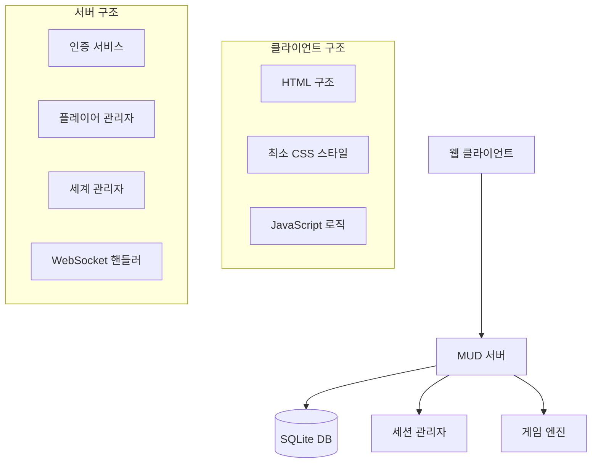
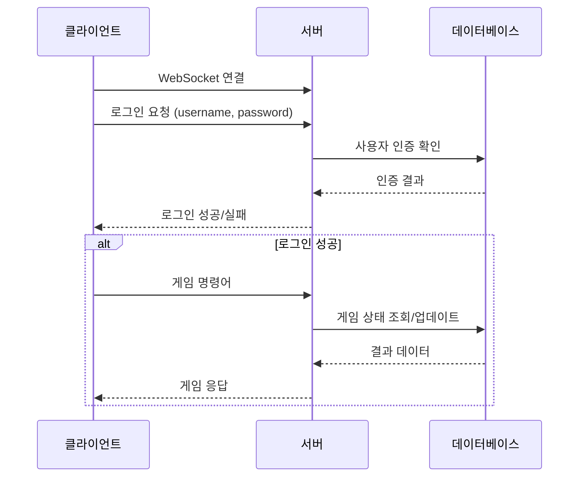

# 웹 클라이언트 기본 UI 설계 문서

## 개요

기존의 복잡한 Pico.css 기반 인터페이스를 완전히 새롭게 구현하여, 심플하고 깔끔한 웹 클라이언트 UI를 제공합니다. 실제 서버와 데이터베이스 연동을 통한 완전한 로그인 시스템과 게임 화면을 구현합니다.

## 아키텍처

### 전체 시스템 구조



### 클라이언트-서버 통신



## 컴포넌트 및 인터페이스

### 1. HTML 구조

#### 로그인 화면
```html
<!DOCTYPE html>
<html lang="ko">
<head>
    <meta charset="UTF-8">
    <meta name="viewport" content="width=device-width, initial-scale=1.0">
    <title>Echoes of the Fallen Age</title>
    <link rel="stylesheet" href="/static/css/simple.css">
</head>
<body>
    <div id="loginScreen" class="screen active">
        <div class="container">
            <h1>Echoes of the Fallen Age</h1>
            <form id="loginForm" class="form">
                <div class="field">
                    <label for="username">사용자명</label>
                    <input type="text" id="username" name="username" required>
                </div>
                <div class="field">
                    <label for="password">비밀번호</label>
                    <input type="password" id="password" name="password" required>
                </div>
                <div class="actions">
                    <button type="submit" class="btn primary">로그인</button>
                    <button type="button" id="registerBtn" class="btn secondary">회원가입</button>
                </div>
            </form>
            <div id="loginMessage" class="message hidden"></div>
        </div>
    </div>

    <div id="registerScreen" class="screen">
        <!-- 회원가입 폼 -->
    </div>

    <div id="gameScreen" class="screen">
        <!-- 게임 화면 -->
    </div>

    <script src="/static/js/client.js"></script>
</body>
</html>
```

#### 게임 화면
```html
<div id="gameScreen" class="screen">
    <div class="game-container">
        <div class="game-output" id="gameOutput">
            <!-- 게임 메시지들이 여기에 표시됨 -->
        </div>

        <div class="game-input-area">
            <div class="quick-commands">
                <button class="cmd-btn" data-cmd="look">둘러보기</button>
                <button class="cmd-btn" data-cmd="inventory">인벤토리</button>
                <button class="cmd-btn" data-cmd="help">도움말</button>
                <button class="cmd-btn" data-cmd="who">접속자</button>
            </div>

            <div class="input-container">
                <input type="text" id="commandInput" placeholder="명령어를 입력하세요..." autocomplete="off">
                <button id="sendBtn" class="btn primary">전송</button>
            </div>
        </div>

        <div class="status-bar">
            <span id="connectionStatus" class="status">연결됨</span>
            <span id="playerInfo" class="player-info"></span>
            <button id="logoutBtn" class="btn secondary small">로그아웃</button>
        </div>
    </div>
</div>
```

### 2. CSS 스타일 (최소화)

```css
/* 기본 리셋 및 변수 */
* {
    margin: 0;
    padding: 0;
    box-sizing: border-box;
}

:root {
    --primary-color: #2563eb;
    --secondary-color: #64748b;
    --success-color: #16a34a;
    --error-color: #dc2626;
    --warning-color: #d97706;
    --bg-color: #ffffff;
    --text-color: #1f2937;
    --border-color: #e5e7eb;
    --input-bg: #f9fafb;
}

body {
    font-family: -apple-system, BlinkMacSystemFont, 'Segoe UI', Roboto, sans-serif;
    line-height: 1.6;
    color: var(--text-color);
    background-color: var(--bg-color);
}

/* 화면 전환 */
.screen {
    display: none;
    min-height: 100vh;
}

.screen.active {
    display: block;
}

/* 컨테이너 */
.container {
    max-width: 400px;
    margin: 0 auto;
    padding: 2rem;
    display: flex;
    flex-direction: column;
    justify-content: center;
    min-height: 100vh;
}

/* 폼 스타일 */
.form {
    background: white;
    padding: 2rem;
    border-radius: 8px;
    box-shadow: 0 1px 3px rgba(0, 0, 0, 0.1);
    border: 1px solid var(--border-color);
}

.field {
    margin-bottom: 1rem;
}

.field label {
    display: block;
    margin-bottom: 0.5rem;
    font-weight: 500;
}

.field input {
    width: 100%;
    padding: 0.75rem;
    border: 1px solid var(--border-color);
    border-radius: 4px;
    background-color: var(--input-bg);
    font-size: 1rem;
}

.field input:focus {
    outline: none;
    border-color: var(--primary-color);
    box-shadow: 0 0 0 3px rgba(37, 99, 235, 0.1);
}

/* 버튼 스타일 */
.btn {
    padding: 0.75rem 1.5rem;
    border: none;
    border-radius: 4px;
    font-size: 1rem;
    cursor: pointer;
    transition: all 0.2s;
}

.btn.primary {
    background-color: var(--primary-color);
    color: white;
}

.btn.primary:hover {
    background-color: #1d4ed8;
}

.btn.secondary {
    background-color: var(--secondary-color);
    color: white;
}

.btn.secondary:hover {
    background-color: #475569;
}

.btn.small {
    padding: 0.5rem 1rem;
    font-size: 0.875rem;
}

/* 게임 화면 */
.game-container {
    display: flex;
    flex-direction: column;
    height: 100vh;
}

.game-output {
    flex: 1;
    padding: 1rem;
    overflow-y: auto;
    background-color: #1f2937;
    color: #f9fafb;
    font-family: 'Courier New', monospace;
    font-size: 0.875rem;
    line-height: 1.5;
}

.game-input-area {
    padding: 1rem;
    background-color: var(--input-bg);
    border-top: 1px solid var(--border-color);
}

.quick-commands {
    display: flex;
    gap: 0.5rem;
    margin-bottom: 1rem;
    flex-wrap: wrap;
}

.cmd-btn {
    padding: 0.5rem 1rem;
    background-color: white;
    border: 1px solid var(--border-color);
    border-radius: 4px;
    cursor: pointer;
    font-size: 0.875rem;
}

.cmd-btn:hover {
    background-color: var(--primary-color);
    color: white;
}

.input-container {
    display: flex;
    gap: 0.5rem;
}

.input-container input {
    flex: 1;
    padding: 0.75rem;
    border: 1px solid var(--border-color);
    border-radius: 4px;
    font-size: 1rem;
}

.status-bar {
    display: flex;
    justify-content: space-between;
    align-items: center;
    padding: 0.5rem 1rem;
    background-color: var(--input-bg);
    border-top: 1px solid var(--border-color);
    font-size: 0.875rem;
}

/* 메시지 스타일 */
.message {
    margin-top: 1rem;
    padding: 0.75rem;
    border-radius: 4px;
    font-size: 0.875rem;
}

.message.success {
    background-color: #dcfce7;
    color: var(--success-color);
    border: 1px solid #bbf7d0;
}

.message.error {
    background-color: #fef2f2;
    color: var(--error-color);
    border: 1px solid #fecaca;
}

.message.hidden {
    display: none;
}

/* 게임 메시지 타입 */
.game-message {
    margin-bottom: 0.5rem;
}

.game-message.system {
    color: #60a5fa;
}

.game-message.error {
    color: #f87171;
}

.game-message.success {
    color: #4ade80;
}

.game-message.chat {
    color: #fbbf24;
}

/* 반응형 */
@media (max-width: 768px) {
    .container {
        padding: 1rem;
    }

    .quick-commands {
        justify-content: center;
    }

    .status-bar {
        flex-direction: column;
        gap: 0.5rem;
    }
}
```

### 3. JavaScript 클라이언트 로직

```javascript
class MudClient {
    constructor() {
        this.ws = null;
        this.isConnected = false;
        this.commandHistory = [];
        this.historyIndex = -1;
        this.currentScreen = 'login';

        this.init();
    }

    init() {
        this.setupEventListeners();
        this.showScreen('login');
    }

    setupEventListeners() {
        // 로그인 폼
        document.getElementById('loginForm').addEventListener('submit', (e) => {
            e.preventDefault();
            this.handleLogin();
        });

        // 회원가입 버튼
        document.getElementById('registerBtn').addEventListener('click', () => {
            this.showScreen('register');
        });

        // 게임 명령어 입력
        const commandInput = document.getElementById('commandInput');
        if (commandInput) {
            commandInput.addEventListener('keydown', (e) => {
                if (e.key === 'Enter') {
                    this.sendCommand();
                } else if (e.key === 'ArrowUp') {
                    e.preventDefault();
                    this.showPreviousCommand();
                } else if (e.key === 'ArrowDown') {
                    e.preventDefault();
                    this.showNextCommand();
                }
            });
        }

        // 빠른 명령어 버튼들
        document.querySelectorAll('.cmd-btn').forEach(btn => {
            btn.addEventListener('click', () => {
                const cmd = btn.dataset.cmd;
                this.sendCommand(cmd);
            });
        });

        // 로그아웃 버튼
        const logoutBtn = document.getElementById('logoutBtn');
        if (logoutBtn) {
            logoutBtn.addEventListener('click', () => {
                this.logout();
            });
        }
    }

    showScreen(screenName) {
        document.querySelectorAll('.screen').forEach(screen => {
            screen.classList.remove('active');
        });

        document.getElementById(screenName + 'Screen').classList.add('active');
        this.currentScreen = screenName;
    }

    async connectWebSocket() {
        return new Promise((resolve, reject) => {
            const protocol = window.location.protocol === 'https:' ? 'wss:' : 'ws:';
            const wsUrl = `${protocol}//${window.location.host}/ws`;

            this.ws = new WebSocket(wsUrl);

            this.ws.onopen = () => {
                this.isConnected = true;
                this.updateConnectionStatus('연결됨', true);
                resolve();
            };

            this.ws.onmessage = (event) => {
                this.handleMessage(JSON.parse(event.data));
            };

            this.ws.onclose = () => {
                this.isConnected = false;
                this.updateConnectionStatus('연결 끊김', false);
                // 재연결 시도
                setTimeout(() => this.connectWebSocket(), 3000);
            };

            this.ws.onerror = (error) => {
                console.error('WebSocket 오류:', error);
                reject(error);
            };
        });
    }

    async handleLogin() {
        const username = document.getElementById('username').value.trim();
        const password = document.getElementById('password').value;

        if (!username || !password) {
            this.showMessage('사용자명과 비밀번호를 입력해주세요.', 'error');
            return;
        }

        try {
            if (!this.isConnected) {
                await this.connectWebSocket();
            }

            this.sendMessage({
                command: 'login',
                username: username,
                password: password
            });

        } catch (error) {
            this.showMessage('서버 연결에 실패했습니다.', 'error');
        }
    }

    handleMessage(data) {
        if (data.error) {
            this.showMessage(data.error, 'error');
            return;
        }

        if (data.status === 'success' && data.action === 'login_success') {
            this.showScreen('game');
            this.updatePlayerInfo(data.username);
            this.addGameMessage(`${data.username}님, 환영합니다!`, 'success');

            // 초기 명령어 실행
            setTimeout(() => {
                this.sendCommand('look');
            }, 500);

        } else if (data.response) {
            this.addGameMessage(data.response, data.message_type || 'system');
        }
    }

    sendMessage(data) {
        if (this.ws && this.isConnected) {
            this.ws.send(JSON.stringify(data));
        }
    }

    sendCommand(command = null) {
        const input = document.getElementById('commandInput');
        const cmd = command || input.value.trim();

        if (!cmd) return;

        // 명령어 히스토리에 추가
        if (this.commandHistory[this.commandHistory.length - 1] !== cmd) {
            this.commandHistory.push(cmd);
            if (this.commandHistory.length > 50) {
                this.commandHistory.shift();
            }
        }
        this.historyIndex = this.commandHistory.length;

        // 입력 필드 클리어
        if (!command) {
            input.value = '';
        }

        // 서버로 전송
        this.sendMessage({
            command: cmd
        });

        // 게임 출력에 명령어 표시
        this.addGameMessage(`> ${cmd}`, 'command');
    }

    addGameMessage(message, type = 'system') {
        const output = document.getElementById('gameOutput');
        const messageDiv = document.createElement('div');
        messageDiv.className = `game-message ${type}`;

        // 타임스탬프 추가
        const timestamp = new Date().toLocaleTimeString();
        messageDiv.innerHTML = `<span class="timestamp">[${timestamp}]</span> ${message}`;

        output.appendChild(messageDiv);
        output.scrollTop = output.scrollHeight;
    }

    showPreviousCommand() {
        if (this.historyIndex > 0) {
            this.historyIndex--;
            document.getElementById('commandInput').value = this.commandHistory[this.historyIndex];
        }
    }

    showNextCommand() {
        if (this.historyIndex < this.commandHistory.length - 1) {
            this.historyIndex++;
            document.getElementById('commandInput').value = this.commandHistory[this.historyIndex];
        } else {
            this.historyIndex = this.commandHistory.length;
            document.getElementById('commandInput').value = '';
        }
    }

    updateConnectionStatus(status, isConnected) {
        const statusElement = document.getElementById('connectionStatus');
        if (statusElement) {
            statusElement.textContent = status;
            statusElement.className = `status ${isConnected ? 'connected' : 'disconnected'}`;
        }
    }

    updatePlayerInfo(username) {
        const playerInfo = document.getElementById('playerInfo');
        if (playerInfo) {
            playerInfo.textContent = `플레이어: ${username}`;
        }
    }

    showMessage(message, type) {
        const messageElement = document.getElementById('loginMessage');
        if (messageElement) {
            messageElement.textContent = message;
            messageElement.className = `message ${type}`;
            messageElement.classList.remove('hidden');

            setTimeout(() => {
                messageElement.classList.add('hidden');
            }, 5000);
        }
    }

    logout() {
        if (this.ws) {
            this.sendCommand('quit');
            this.ws.close();
        }

        this.showScreen('login');
        document.getElementById('loginForm').reset();
        document.getElementById('gameOutput').innerHTML = '';
        this.commandHistory = [];
        this.historyIndex = -1;
    }
}

// 클라이언트 초기화
document.addEventListener('DOMContentLoaded', () => {
    new MudClient();
});
```

## 데이터 모델

### 클라이언트 상태 관리

```javascript
class ClientState {
    constructor() {
        this.player = null;
        this.currentRoom = null;
        this.inventory = [];
        this.connectionStatus = 'disconnected';
        this.messageHistory = [];
    }

    updatePlayer(playerData) {
        this.player = playerData;
    }

    updateRoom(roomData) {
        this.currentRoom = roomData;
    }

    addMessage(message, type) {
        this.messageHistory.push({
            message,
            type,
            timestamp: new Date()
        });

        // 메시지 히스토리 제한
        if (this.messageHistory.length > 1000) {
            this.messageHistory.shift();
        }
    }
}
```

### 서버 메시지 프로토콜

```typescript
// 클라이언트 -> 서버
interface ClientMessage {
    command: string;
    username?: string;
    password?: string;
    data?: any;
}

// 서버 -> 클라이언트
interface ServerMessage {
    status?: 'success' | 'error';
    message?: string;
    response?: string;
    action?: string;
    data?: any;
    error?: string;
    error_code?: string;
    timestamp?: string;
}
```

## 오류 처리

### 클라이언트 오류 처리

1. **네트워크 연결 오류**
   - WebSocket 연결 실패 시 재연결 시도
   - 연결 상태를 사용자에게 시각적으로 표시
   - 오프라인 상태에서 명령어 큐잉

2. **인증 오류**
   - 로그인 실패 시 명확한 오류 메시지 표시
   - 세션 만료 시 자동 로그인 화면으로 이동

3. **입력 유효성 검사**
   - 클라이언트 측에서 기본적인 입력 검증
   - 빈 명령어 전송 방지

### 서버 오류 처리

1. **인증 오류**
   - 잘못된 사용자명/비밀번호
   - 중복 로그인 처리
   - 세션 만료 처리

2. **게임 로직 오류**
   - 잘못된 명령어 처리
   - 데이터베이스 오류 처리
   - 게임 상태 불일치 처리

## 테스트 전략

### 단위 테스트

1. **클라이언트 로직 테스트**
   - 메시지 파싱 테스트
   - 명령어 히스토리 테스트
   - 상태 관리 테스트

2. **서버 로직 테스트**
   - 인증 서비스 테스트
   - WebSocket 핸들러 테스트
   - 데이터베이스 연동 테스트

### 통합 테스트

1. **클라이언트-서버 통신 테스트**
   - 로그인 플로우 테스트
   - 게임 명령어 처리 테스트
   - 연결 끊김/재연결 테스트

2. **데이터베이스 연동 테스트**
   - 사용자 생성/인증 테스트
   - 게임 상태 저장/로드 테스트

### 사용자 테스트

1. **사용성 테스트**
   - 로그인 프로세스 테스트
   - 게임 명령어 입력 테스트
   - 반응형 디자인 테스트

2. **성능 테스트**
   - 다중 사용자 연결 테스트
   - 메시지 처리 성능 테스트
   - 메모리 사용량 테스트