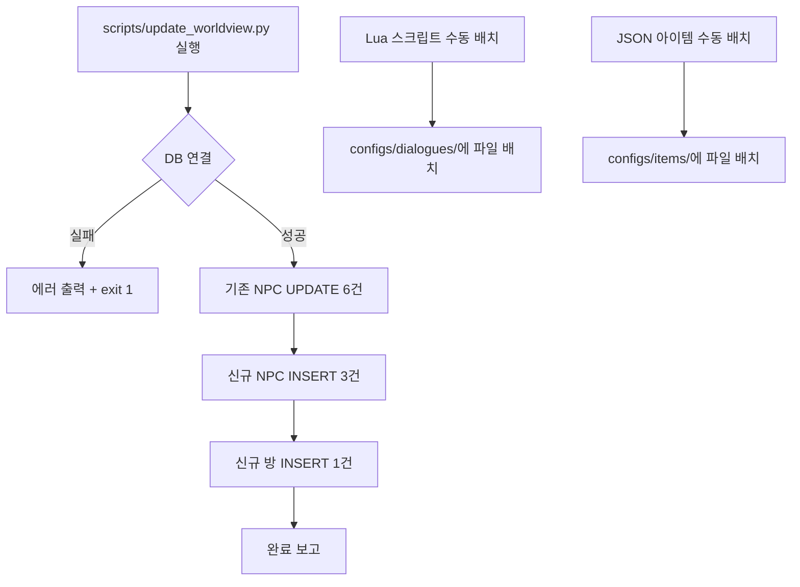

# 설계 문서: 세계관 업데이트 반영 (worldview-update)

## 개요

수정된 WorldView.md에 맞춰 기존 NPC/아이템의 대화 및 설명을 수정하고, 신규 NPC/아이템/방을 추가한다. 핵심 변경 사항은 다음과 같다:

1. "잊혀진 신" → "알바(Alva) 태양신" 종교 구체화
2. 네크로폴리스 수도승 침묵화 (비언어적 소통)
3. 성 서쪽 마을/쓰레기장/돌 제단 관련 콘텐츠 추가
4. 소문 체계 확장 (왕 사망설, 알바신=밝은 빛, 대마법사 미래인설 등)

모든 작업은 코드 변경 없이 데이터만 수정/추가하는 방식으로 진행한다:
- 정적 DB INSERT/UPDATE (UUID 고정)
- Lua 대화 스크립트 수정/생성
- JSON 아이템 템플릿 수정/생성

## 아키텍처

### 변경 범위

이 업데이트는 기존 게임 엔진 코드를 전혀 수정하지 않는다. 변경 대상은 데이터 레이어에 한정된다:

```
┌─────────────────────────────────────────────────────┐
│                  변경 없음 (코드)                      │
│  GameEngine, WorldManager, DialogueManager,          │
│  MonsterManager, LuaScriptLoader 등                  │
└─────────────────────────────────────────────────────┘
         │                │                │
         ▼                ▼                ▼
┌──────────────┐ ┌────────────────┐ ┌──────────────────┐
│  DB (SQLite)  │ │ Lua 스크립트    │ │ JSON 아이템 템플릿 │
│  monsters     │ │ configs/       │ │ configs/items/    │
│  rooms        │ │ dialogues/     │ │                   │
│  (UPDATE/     │ │ {npc_id}.lua   │ │ {template_id}.json│
│   INSERT)     │ │                │ │                   │
└──────────────┘ └────────────────┘ └──────────────────┘
```

### 실행 흐름



## 컴포넌트 및 인터페이스

### 1. Init_Script: scripts/update_worldview.py

단일 Python 스크립트로 모든 DB 변경을 처리한다.

기능:
- 기존 NPC 6건 UPDATE (Priest, Crypt Guard Monk, Brother Marcus, Wandering Bard, Drunken Refugee, Royal Adviser)
- 신규 NPC 3건 INSERT (마을 술집 주인, 자경단원, 쓰레기장 떠돌이)
- 신규 방 1건 INSERT (돌 제단)
- 멱등성 보장: 2회 연속 실행 시 동일한 DB 상태 유지
- 개별 작업 실패 시 에러 로그 출력 후 다음 작업 진행

구조:
```python
async def main():
    db_manager = await get_database_manager()

    # Phase 1: 기존 NPC UPDATE
    await update_existing_npcs(db_manager)

    # Phase 2: 신규 NPC INSERT (멱등)
    await insert_new_npcs(db_manager)

    # Phase 3: 신규 방 INSERT (멱등)
    await insert_new_rooms(db_manager)
```

### 2. Lua 대화 스크립트

수정 대상 (기존 파일 덮어쓰기):
| NPC | 파일 | 변경 내용 |
|-----|------|-----------|
| Priest | `a1e5c6f7-...lua` | "잊혀진 신" → "알바 태양신" 전면 교체 |
| Crypt Guard Monk | `b2f6d7a8-...lua` | 대화 → 침묵/제스처 서술형 텍스트 |
| Wandering Bard | `f0d4b5e6-...lua` | 기존 유지 + 소문 선택지 추가 |
| Drunken Refugee | `e9c3a4d5-...lua` | 기존 유지 + 소문 선택지 추가 |
| Royal Adviser | `a7e1c2f3-...lua` | 기존 유지 + 왕 사망 암시 선택지 추가 |

생성 대상 (신규 파일):
| NPC | 파일 | 내용 |
|-----|------|------|
| Brother Marcus | `church_monk.lua` | 예배당 수도승 대화 (알바 신앙, 예배당 역사) |
| 마을 술집 주인 | `{uuid}.lua` | 이주 명령 불만, 마을 상황 |
| 자경단원 | `{uuid}.lua` | 마을 방어, 괴물 경계 |
| 쓰레기장 떠돌이 | `{uuid}.lua` | 쓰레기장 정보, 북쪽 바위 틈 힌트 |

Lua 스크립트 인터페이스 (기존 패턴 준수):
```lua
function get_dialogue(ctx)
    -- ctx.player.display_name 사용
    -- return { text = { {en=..., ko=...} }, choices = { [n] = {en=..., ko=...} } }
end

function on_choice(choice_number, ctx)
    -- return { text = { {en=..., ko=...} }, choices = { ... } } 또는 nil
end
```

### 3. JSON 아이템 템플릿

수정 대상:
| 아이템 | 파일 | 변경 내용 |
|--------|------|-----------|
| forgotten_scripture | `forgotten_scripture.json` | "이름 없는 신" → "알바 태양신" |

생성 대상:
| 아이템 | 파일 | 내용 |
|--------|------|------|
| relocation_order | `relocation_order.json` | 이주 명령 공고문 (readable note) |
| rumour_note | `rumour_note.json` | 소문 쪽지 (readable note) |

JSON 아이템 구조 (기존 패턴 준수):
```json
{
  "template_id": "...",
  "name_en": "...",
  "name_ko": "...",
  "description_en": "...",
  "description_ko": "...",
  "object_type": "item",
  "category": "readable",
  "weight": 0.1,
  "max_stack": 1,
  "properties": {
    "readable": {
      "type": "note",
      "content": { "en": "...", "ko": "..." }
    }
  }
}
```

## 데이터 모델

### DB UPDATE 대상 (monsters 테이블)

#### Priest (a1e5c6f7-8b9d-0e1f-2a3b-4c5d6e7f8a9b)
- Lua 스크립트만 수정 (DB 변경 없음)
- description은 기존 유지 (Lua에서 대화 내용만 변경)

#### Crypt Guard Monk (b2f6d7a8-9c0e-1f2a-3b4c-5d6e7f8a9b0c)
UPDATE 필드:
- `name_en`: "Crypt Guard Monk" → "Necropolis Monk"
- `name_ko`: "교회 지하 입구 경비 수도사" → "네크로폴리스 수도승"
- `description_en`: 침묵하는 수도승 + 부활 인도자 역할 묘사
- `description_ko`: 한국어 동일 내용

#### Brother Marcus (church_monk)
- Lua 스크립트 생성 (DB 변경 없음, 기존 NPC 레코드 활용)
- 예배당 수도승 역할에 맞는 대화 스크립트

#### Wandering Bard (f0d4b5e6-7a8c-9d0e-1f2a-3b4c5d6e7f8a)
- Lua 스크립트만 수정 (DB 변경 없음)

#### Drunken Refugee (e9c3a4d5-6f7b-8c9d-0e1f-2a3b4c5d6e7f)
- Lua 스크립트만 수정 (DB 변경 없음)

#### Royal Adviser (a7e1c2f3-4b5d-6e7f-8a9b-0c1d2e3f4a5b)
- Lua 스크립트만 수정 (DB 변경 없음)

### DB INSERT 대상

#### 신규 NPC (monsters 테이블)

| 필드 | 마을 술집 주인 | 자경단원 | 쓰레기장 떠돌이 |
|------|---------------|---------|----------------|
| id | 고정 UUID | 고정 UUID | 고정 UUID |
| name_en | Village Tavern Keeper | Village Militia | Junkyard Drifter |
| name_ko | 마을 술집 주인 | 자경단원 | 쓰레기장 떠돌이 |
| monster_type | neutral | neutral | neutral |
| behavior | stationary | stationary | stationary |
| faction_id | ash_knights | ash_knights | ash_knights |
| x | -16 (성 서쪽 마을) | -16 (성 서쪽 마을) | -12 (쓰레기장) |
| y | 0 | 0 | 1 |

좌표 결정 근거:
- 성 서쪽 마을: 기존 NPC 배치에서 Disgruntled Farmer(-14, 0), Former Merchant(-18, 0) 사이인 (-16, 0)이 적절
- 쓰레기장: 요구사항에 명시된 (-12, 1)

#### 신규 방 (rooms 테이블)

| 필드 | 돌 제단 |
|------|---------|
| id | 고정 UUID |
| x | -20 (평야 좌표) |
| y | 0 |
| description_en | 평야 위 돌 제단 묘사 (30cm 돌바닥 + 작은 상) |
| description_ko | 한국어 동일 내용 |

좌표 결정 근거:
- WorldView.md에 따르면 돌 제단은 "평야 같은 곳 마른 땅"에 위치
- 성 서쪽 마을(-16~-18) 너머 평야 지역인 (-20, 0)이 적절

### UUID 상수 (고정값)

```python
# 신규 NPC UUID
TAVERN_KEEPER_ID = "1a2b3c4d-5e6f-7a8b-9c0d-1e2f3a4b5c6d"
VILLAGE_MILITIA_ID = "2b3c4d5e-6f7a-8b9c-0d1e-2f3a4b5c6d7e"
JUNKYARD_DRIFTER_ID = "3c4d5e6f-7a8b-9c0d-1e2f-3a4b5c6d7e8f"

# 신규 방 UUID
STONE_ALTAR_ROOM_ID = "4d5e6f7a-8b9c-0d1e-2f3a-4b5c6d7e8f9a"
```

## 에러 처리

### Init_Script 에러 처리 전략

1. DB 연결 실패: 에러 메시지 출력 + exit code 1로 즉시 종료
2. 개별 UPDATE/INSERT 실패: 에러 로그 출력 + 다음 작업으로 진행 (부분 실패 허용)
3. 멱등성 보장:
   - UPDATE: 동일 값으로 재실행해도 결과 동일
   - INSERT: `SELECT` 존재 여부 확인 후 INSERT (이미 존재하면 SKIP)
   - 방 INSERT: 동일 좌표 존재 여부 확인 후 INSERT

### Lua 스크립트 에러 처리

- Lua 스크립트는 LuaScriptLoader가 로드 시 구문 검증
- `get_dialogue(ctx)` / `on_choice(choice_number, ctx)` 인터페이스 준수 필수
- 잘못된 선택지 번호 입력 시 `on_choice`가 `nil` 반환 → DialogueManager가 기본 처리

### JSON 아이템 에러 처리

- JSON 파싱 실패 시 게임 엔진이 기본값 사용
- `template_id` 중복 시 기존 템플릿 덮어쓰기 (의도된 동작: forgotten_scripture 수정)

## 테스트 전략

### PBT 적용 여부

이 기능은 Property-Based Testing에 적합하지 않다. 이유:
- 코드 변경이 없고 데이터(DB 레코드, Lua 스크립트, JSON 파일)만 수정/추가
- 순수 함수나 입출력 변환 로직이 없음
- 테스트 대상이 정적 데이터의 정확성이므로 example-based 검증이 적절

### 검증 방법

1. Init_Script 멱등성 검증:
   - `./script_test.sh update_worldview` 2회 연속 실행
   - 2회차에서 모든 항목이 SKIP 처리되는지 확인
   - DB 상태가 동일한지 확인

2. DB 데이터 검증 스크립트:
   - Crypt Guard Monk의 name_en/name_ko가 변경되었는지 확인
   - 신규 NPC 3건이 올바른 좌표에 존재하는지 확인
   - 신규 방 1건이 올바른 좌표에 존재하는지 확인

3. Lua 스크립트 검증:
   - 서버 실행 후 Telnet 접속하여 각 NPC와 대화 테스트
   - `get_dialogue` 반환값에 en/ko 텍스트가 모두 포함되는지 확인
   - `on_choice` 각 선택지가 올바른 응답을 반환하는지 확인

4. JSON 아이템 검증:
   - forgotten_scripture.json의 내용이 알바 태양신으로 변경되었는지 확인
   - relocation_order.json, rumour_note.json이 올바른 구조인지 확인

5. E2E 테스트 (Telnet MCP):
   - 관리자 계정으로 로그인
   - `goto` 명령으로 각 NPC 위치로 이동
   - `talk` 명령으로 대화 시작 및 선택지 테스트
   - 신규 방(돌 제단) 이동 및 description 확인
