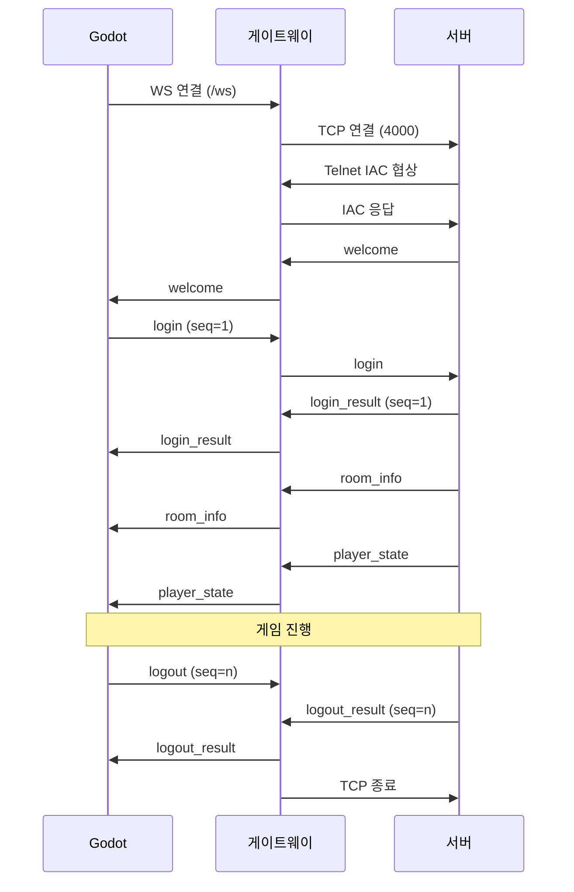

# 카르나스 연대기 클라이언트 프로토콜 계약

페이즈2 아키텍처에서 MUD 서버, 게이트웨이, Godot 클라이언트가 공유하는 메시지 계약을 정의한다. 세 저장소의 구현이 이 문서를 단일 기준으로 삼는다.

## 문서 구성

| 문서 | 내용 |
|---|---|
| README.md | 전송 계층, 프레이밍, 공통 봉투, 연결 수명주기 |
| [client-to-server.md](client-to-server.md) | 클라이언트가 보내는 메시지와 verb 목록 |
| [server-to-client.md](server-to-client.md) | 서버가 보내는 메시지 |
| [entities.md](entities.md) | 엔티티 페이로드 스키마, 번역 키 형식, 거절 사유 코드 |
| [admin.md](admin.md) | 어드민 채널 |

## 구간 구조

```
Godot 클라이언트
  │  WebSocket (ws://host:3000)
  ▼
게이트웨이 (Node/TS)
  │  TCP (host:4000)
  ▼
MUD 서버 (Python)
```

게이트웨이는 두 구간의 프레임 변환만 담당한다. 메시지 내용을 해석하거나 변형하지 않으며, 번역과 프레젠테이션에도 관여하지 않는다.

## 전송 계층

### TCP 구간 (게이트웨이 ↔ 서버, 포트 4000)

연결 직후 Telnet IAC 협상이 발생한다. 이 협상은 기존 동작을 유지하며, 협상이 끝난 뒤부터는 페이로드에 IAC 시퀀스가 나타나지 않는다. 게이트웨이는 협상 구간의 IAC 바이트를 걸러내고 이후 데이터를 JSON 라인으로 취급한다.

협상 이후 페이로드 규약:

- 인코딩은 UTF-8이다.
- 메시지 하나는 JSON 오브젝트 하나이며 개행 문자 `\n`으로 끝난다.
- 메시지 내부에는 개행이 들어가지 않는다. 문자열 값에 개행이 필요하면 `\n`으로 이스케이프한다.
- ANSI 이스케이프 시퀀스를 보내지 않는다. 색상과 강조는 클라이언트가 결정한다.
- 라인 하나의 최대 길이는 256KB로 제한한다. 초과하는 페이로드는 분할 전송 대상이며 현재 계약에는 그런 메시지가 없다.

TCP는 스트림이므로 하나의 읽기 단위가 라인 경계와 일치하지 않는다. 양쪽 구현은 개행이 나타날 때까지 바이트를 누적하고, 완성된 라인만 파싱해야 한다. UTF-8 디코딩은 라인 단위로 수행한다. 멀티바이트 문자가 청크 경계에서 쪼개진 상태로 디코딩하면 한국어 텍스트가 손상된다.

### WebSocket 구간 (클라이언트 ↔ 게이트웨이, 포트 3000)

- 텍스트 프레임을 사용한다. 바이너리 프레임은 쓰지 않는다.
- 프레임 하나가 JSON 오브젝트 하나에 대응한다. 프레임에는 개행을 붙이지 않는다.
- 게이트웨이는 TCP에서 받은 완성 라인의 개행을 제거해 프레임으로 보내고, 프레임을 TCP로 보낼 때 개행을 붙인다.
- WebSocket 업그레이드 경로는 `/ws`로 제한한다. 어드민은 `/admin`을 쓴다.

## 공통 봉투

모든 메시지는 다음 형태를 갖는다.

```json
{
  "type": "<message_type>",
  "seq": 12
}
```

| 필드 | 타입 | 필수 | 설명 |
|---|---|---|---|
| `type` | string | 필수 | 메시지 종류. 소문자와 밑줄만 사용 |
| `seq` | integer | 조건부 | 요청-응답 대응 번호 |

`seq` 규약:

- 클라이언트가 요청 메시지에 1부터 증가하는 정수를 넣는다.
- 서버는 그 요청에 대한 응답과 거절에 같은 값을 되돌려준다.
- 서버가 자발적으로 보내는 알림(다른 플레이어의 이동, 전투 틱 결과 등)에는 `seq`가 없다.
- 클라이언트는 `seq`로 어느 액션이 거절됐는지 판별한다. 이 값이 없으면 버튼 상태를 되돌릴 수 없다.

알 수 없는 `type`을 받은 쪽은 그 메시지를 무시하고 경고를 로그에 남긴다. 연결을 끊지 않는다. 이 규칙이 프로토콜 확장 시 하위 호환을 보장한다.

## 연결 수명주기



단계별 규약:

1. 클라이언트가 WS를 연결하면 게이트웨이가 서버로 TCP 연결을 맺는다. TCP 연결에 실패하면 게이트웨이는 WS를 코드 1011로 닫는다. 풀 용량을 초과하면 1008로 닫는다.
2. 서버는 IAC 협상을 마친 뒤 `welcome`을 보낸다. 클라이언트는 `welcome`을 받기 전에 어떤 메시지도 보내지 않는다.
3. 인증되지 않은 상태에서 허용되는 클라이언트 메시지는 `login`과 `ping`뿐이다. 그 외는 `action_rejected`에 `NOT_AUTHENTICATED`로 응답한다.
4. `login_result`가 성공이면 서버는 이어서 `room_info`, `player_state`, `inventory`를 보낸다. 클라이언트는 이 세 메시지를 받은 뒤 게임 화면을 표시한다.
5. `logout`은 세션을 인증 해제하고 연결은 유지한다. 클라이언트가 로그인 화면으로 돌아가 다른 계정으로 접속할 수 있다.

## 유휴 처리

서버는 세션 유휴 타임아웃을 유지한다. 클라이언트는 60초 이상 보낼 메시지가 없으면 `ping`을 보낸다. 서버는 `pong`으로 답한다. WebSocket 자체의 ping/pong 프레임은 게이트웨이와 클라이언트 사이 구간만 확인하므로 서버 세션 유지에는 쓰이지 않는다.

## 회원가입

회원가입은 게임 채널의 `register` 로 한다. 인증 전에 보낼 수 있고, 성공해도 로그인되지 않으므로 클라이언트가 이어서 `login` 을 보낸다. 어드민 채널에도 `account_create` 가 있지만 그쪽은 관리자가 계정을 만드는 경로다.

## 타이핑이 허용되는 지점

UI는 버튼 기반이며 자유 문자 입력은 다음에만 허용된다.

- 채팅 메시지
- 로그인의 username과 password
- `changename` 액션의 새 이름
- 어드민 패널의 CRUD 폼 값

그 밖의 모든 상호작용은 버튼과 목록 선택으로 이뤄진다. 따라서 서버는 명령어 문자열을 파싱하지 않으며 별칭 체계와 오타 교정 응답을 제공하지 않는다.

## 유지되는 숫자 체계

대상 지정은 uuid 전용이다. 순서 번호(idx) 체계는 폐기한다. 다만 대상 지정과 무관한 다음 숫자는 유지한다.

| 대상 | 성격 |
|---|---|
| 대화 선택지 번호 | 대화 인스턴스 안에서만 유효한 로컬 인덱스. `dialogue_choice` 액션의 params로 전달 |
| 전투 액션 단축키 | 클라이언트 UI의 키보드 단축키. 프로토콜에는 나타나지 않고 verb로 변환되어 전송 |

## 버전 협상

`welcome`에 `protocol_version`이 담긴다. 현재 값은 `1`이다. 클라이언트가 지원하지 않는 버전을 받으면 사용자에게 클라이언트 업데이트를 안내하고 연결을 종료한다. 서버는 하위 버전 클라이언트를 거부하지 않으며, 알 수 없는 메시지 무시 규칙에 의존한다.
