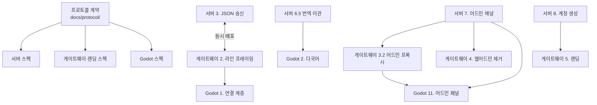

# 스펙 간 정합성 매핑

프로토콜 계약에 정의된 모든 메시지와 verb가 세 스펙에 반영되었는지 점검한 결과다. 계약이 변경되면 이 표를 갱신한다.

관련 스펙:

- 서버: `Echoes-of-the-Fallen-Age/.kiro/specs/server-json-protocol/`
- 게이트웨이와 랜딩: `KarnasChronicles-DividedDominio-client/.kiro/specs/gateway-landing/`
- Godot 클라이언트: `KarnasChronicles-DividedDominio-client/.kiro/specs/godot-client/`

## 클라이언트 → 서버 메시지

| 메시지 | 서버 처리 | 클라이언트 송신 |
|---|---|---|
| `login` | Task 3.5 | Task 3 |
| `logout` | Task 3.5 | Task 3 |
| `action` | Task 4.2 | Task 1.5 |
| `chat` | Task 4.5 | Task 5.7 |
| `ping` | Task 3.4 | Task 1.3 |
| `client_info` | Task 3.4 | Task 1.9 |

## 서버 → 클라이언트 메시지

| 메시지 | 서버 송신 | 클라이언트 처리 |
|---|---|---|
| `welcome` | Task 3.5 | Task 1.2, 1.6 |
| `login_result` | Task 3.5 | Task 3 |
| `logout_result` | Task 3.5 | Task 3 |
| `pong` | Task 3.4 | Task 1.3 |
| `room_info` | Task 2.3, 3.1 | Task 5.1, 5.3 |
| `entity_enter` | Task 2.1 | Task 5.6 |
| `entity_leave` | Task 2.1 | Task 5.6 |
| `entity_update` | Task 2.1 | Task 5.6 |
| `player_state` | Task 2.3 | Task 5.1, 10 |
| `inventory` | Task 2.3 | Task 7.1 |
| `container_contents` | Task 2.3 | Task 7.4 |
| `combat_state` | Task 2.3 | Task 8 |
| `dialogue` | Task 4.4 | Task 9.1 |
| `shop` | Task 4.4 | Task 9.2 |
| `who_result` | Task 4.4 | Task 5.8 |
| `chat` | Task 4.5 | Task 5.7 |
| `event` | Task 6.1, 6.2 | Task 5.9 |
| `action_rejected` | Task 4.2, 6.1 | Task 4.2 |
| `error` | Task 3.4 | Task 1.4 |

## verb 매핑

| verb | 서버 핸들러 | 클라이언트 버튼 |
|---|---|---|
| `move` | actions/movement.py | Task 5.2 출구 버튼 |
| `enter` | actions/movement.py | Task 5.2 진입 버튼 |
| `look` | actions/movement.py | Task 5.6 재동기화 |
| `examine` | actions/inspection.py | Task 6 대상 동사 |
| `get` | actions/items.py | Task 6 대상 동사 |
| `drop` | actions/items.py | Task 7.3 |
| `use` | actions/items.py | Task 7.1 |
| `equip` | actions/items.py | Task 7.2 |
| `unequip` | actions/items.py | Task 7.2 |
| `unequip_all` | actions/items.py | Task 7.2 |
| `give` | actions/items.py | Task 6 대상 동사 |
| `read` | actions/items.py | Task 6 대상 동사 |
| `open` | actions/containers.py | Task 7.4 |
| `put` | actions/containers.py | Task 7.4 |
| `take_from` | actions/containers.py | Task 7.4 |
| `attack` | actions/combat.py | Task 8 |
| `flee` | actions/combat.py | Task 8 |
| `use_item` | actions/combat.py | Task 8 |
| `end_turn` | actions/combat.py | Task 8 |
| `talk` | actions/dialogue.py | Task 6 대상 동사 |
| `dialogue_choice` | actions/dialogue.py | Task 9.1 |
| `dialogue_end` | actions/dialogue.py | Task 9.1 |
| `shop_open` | actions/shop.py | Task 6 대상 동사 |
| `shop_buy` | actions/shop.py | Task 9.2 |
| `shop_sell` | actions/shop.py | Task 9.2 |
| `follow` | actions/social.py | Task 6 대상 동사 |
| `unfollow` | actions/social.py | Task 5.10 |
| `emote` | actions/social.py | Task 5.10 |
| `who` | actions/social.py | Task 5.8 |
| `players_here` | actions/social.py | Task 5.8 |
| `request_state` | actions/state.py | Task 1.7 |
| `request_inventory` | actions/state.py | Task 7.1 |
| `request_combat_state` | actions/state.py | Task 8 |
| `changename` | actions/account.py | Task 10 |

서버측 파일 배치는 `server-json-protocol` design.md의 `commands/actions/` 구조를 따르며 Task 4.4에서 구현한다.

## 거절 코드 매핑

| 코드 | 서버 발생 | 클라이언트 처리 |
|---|---|---|
| `NOT_AUTHENTICATED` | Task 4.2 디스패처 1단계 | Task 4.2 로그인 전환 |
| `NOT_FOUND` | Task 5.1 target 해석 | Task 4.2 `look` 재동기화 |
| `NOT_APPLICABLE` | Task 6(액션 검증) | Task 4.2 버튼 제거 |
| `PERMISSION_DENIED` | Task 7.1 어드민 인증 | Task 4.2, 11.1 안내 |
| `WRONG_STATE` | Task 4.2 상태 게이팅 | Task 4.2 안내 |
| `NOT_YOUR_TURN` | actions/combat.py | Task 8 턴 대기 표시 |
| `OUT_OF_RANGE` | 각 액션 핸들러 | Task 4.2 안내 |
| `INSUFFICIENT_FUNDS` | actions/shop.py | Task 9.2 부족액 표시 |
| `INSUFFICIENT_QUANTITY` | actions/items.py | Task 4.2 상한 조정 |
| `INVENTORY_FULL` | actions/items.py | Task 4.2 안내 |
| `SLOT_OCCUPIED` | actions/items.py | Task 4.2 교체 확인 |
| `COOLDOWN` | actions/account.py | Task 10 잔여 시간 |
| `TARGET_REQUIRED` | Task 4.2 디스패처 | Task 4.2 로그 기록 |
| `INVALID_PARAMS` | Task 4.2 디스패처 | Task 4.2 로그 기록 |
| `INTERNAL_ERROR` | 전역 예외 처리 | Task 4.2 재시도 안내 |

어드민 전용 코드는 `admin.md`에 정의되며 클라이언트 Task 11.1이 처리한다. 어드민 채널의 거절에는 번역 키가 없고 `detail`에 영문 설명이 온다.

## 어드민 메시지 매핑

| 메시지 | 서버 | 클라이언트 |
|---|---|---|
| `admin_login` / `admin_login_result` | Task 7.1 | Task 11.1 |
| `service_login` | Task 7.1 | 게이트웨이 Task 5.3 |
| `account_create` | Task 8 | 게이트웨이 Task 5.4 |
| `admin_list` / `admin_get` | Task 7.2 | Task 11.3 |
| `admin_create` / `admin_update` / `admin_delete` | Task 7.2, 7.3 | Task 11.4 |
| `admin_stats` | Task 7.4 | Task 11.5 |
| `admin_map` | Task 7.5 | Task 11.2 |
| `admin_action` | Task 7.4 | Task 11.5 |
| `admin_rejected` | Task 7 전체 | Task 11.1 |

## 전송 계층 매핑

| 항목 | 서버 | 게이트웨이 | 클라이언트 |
|---|---|---|---|
| JSON 라인 프레이밍 | Task 3.1, 3.4 | Task 2.1~2.4 | Task 1.2 |
| Telnet IAC 협상 | 유지 (Req 10.7) | Task 2.3 필터 유지 | 해당 없음 |
| 게임 채널 | TCP 4000 | `/ws` → 4000 | `ws://host/ws` |
| 어드민 채널 | TCP 4001 (Task 7.1) | `/admin` → 4001 (Task 3.2) | `ws://host/admin` (Task 11.1) |
| 계정 생성 | TCP 4001 (Task 8) | `POST /api/register` (Task 5.4) | 해당 없음 (랜딩) |
| ANSI 제거 | Task 3.2 | sanitizer 제거 (Task 3.3) | 해당 없음 |

## 저장소 간 의존 그래프



## 착수 순서

```
1단계  프로토콜 계약 확정 (완료)
       └ docs/protocol/ 5개 문서

2단계  병렬 착수
       ├ 서버:      Task 0 → 1(하니스) → 2(직렬화)
       ├ 게이트웨이: Task 1(터미널 제거) → 2.1~2.2(LineFramer 단위 구현)
       └ Godot:     Task 1(기반과 연결)

3단계  프로토콜 교체 (동시 배포 필요)
       ├ 서버:      Task 3(JSON 송신) → 4(디스패처) → 5(uuid)
       └ 게이트웨이: Task 2.3~2.5(프레이밍 통합)

4단계  번역 이관
       ├ 서버:      Task 6
       └ Godot:     Task 2

5단계  게임 화면
       └ Godot:     Task 3~10

6단계  어드민 이전
       ├ 서버:      Task 7
       ├ 게이트웨이: Task 3.2 → 4(웹어드민 제거)
       └ Godot:     Task 11

7단계  계정 생성과 랜딩
       ├ 서버:      Task 8
       └ 게이트웨이: Task 5

8단계  정리와 검증
       ├ 서버:      Task 9
       ├ 게이트웨이: Task 6~7
       └ Godot:     Task 12
```

3단계가 가장 위험하다. 서버와 게이트웨이를 동시에 배포해야 하며 어긋나면 통신이 성립하지 않는다. 서버는 하니스로, 게이트웨이는 `LineFramer` 단위 테스트로 각각 독립 검증한 뒤 통합한다.

6단계에서 Node 웹어드민과 서버 어드민이 공존하는 기간이 발생한다. 같은 데이터베이스를 조작하면 서버 캐시와 불일치가 생기므로 이 기간을 최소화한다.

## 점검에서 발견해 보완한 항목

계약과 스펙을 대조하며 클라이언트 스펙에 누락된 항목을 찾아 보완했다.

| 누락 항목 | 보완 |
|---|---|
| `client_info` 송신 | Godot Requirement 1.12, Task 1.9 추가 |
| `chat` 송수신 UI | Godot Requirement 5.12~5.14, Task 5.7 추가 |
| `who` / `players_here` verb와 `who_result` | Godot Requirement 5.15, Task 5.8 추가 |
| `event` 로그 표시 | Godot Requirement 5.16, Task 5.9 추가 |
| `unfollow`, `emote` verb | Godot Requirement 5.17, Task 5.10 추가 |
| `unequip_all` verb | Godot 인벤토리 화면 버튼(Task 7.2)으로 반영. 대상이 없는 액션이므로 규칙 테이블 대상이 아니다 |

## 점검에서 정정한 계약 오류

코드를 확인해 계약의 사실 오류를 정정했다.

| 오류 | 확인 내용 | 정정 |
|---|---|---|
| `enter`의 `target`을 uuid로 정의 | `commands/Basic/enter.py`는 현재 방 좌표로 `room_connections`를 조회해 이동한다. 대상 엔티티가 없다 | `enter`를 target 없는 verb로 변경. `room_info`에 `has_passage` 필드를 추가해 클라이언트가 진입 버튼 표시 여부를 판단하게 함 |
| `close` verb 정의 | `commands/container_commands.py`에는 `OpenCommand`와 `PutCommand`만 있다. 열림 상태를 추적하는 필드가 없어 `open`은 내용 조회 동작이다 | `close` verb 제거 |
| monster와 combatant에 `level` 정의 | level은 코드에서 의도적으로 제거된 개념이다. `MonsterStats.from_dict`이 `pop('level')`, `PlayerStats.from_dict`이 `pop("level")`, `Player.from_dict`의 deprecated 목록에 `stat_level`. DB 컬럼도 없다 | `level` 제거. 대신 능력치에서 계산되는 `armor_class`, `attack_power`를 제공 |
| monster에 `is_merchant` 정의 | `Monster.is_merchant()`는 없다. 유일한 판정식은 deprecated·미등록 `shop_command.py`에 있고, `ExchangeManager.buy_from_npc`는 상인 여부를 검사하지 않는다 | `is_merchant` 제거. 모든 캐릭터와 거래 가능하므로 구분이 불필요하다 |
| object의 `category` 출처 | DB에 `category` 컬럼이 있으나 `GameObject.from_dict`이 명시적으로 버리고 실제로는 `properties['category']`를 쓴다 | 출처를 `properties.category`로 명시 |
| `can_talk` 판정 근거 | `talk_command.py`는 `type == 'monster'`만 확인하고 스크립트 존재를 보지 않는다. 조회용 API가 없다 | `LuaScriptLoader`에 스크립트 존재 확인 메서드를 추가해 산출한다. 거짓이어도 서버는 침묵 응답을 주므로 버튼 우선순위 판단용으로 정의 |

## 미해결 사항

다음은 구현 단계에서 결정해야 한다.

| 항목 | 결정 시점 |
|---|---|
| 감사 로그를 DB 테이블로 저장할지 | 서버 Task 7.7 |
| `resize` 메시지 타입 존속 여부 | 게이트웨이 Task 3.4 |
| `sanitizer.ts` 제거 또는 연결 | 게이트웨이 Task 3.3 |
| 랜딩 정적 서빙 주체(게이트웨이 vs nginx) | 게이트웨이 Task 5.2 |
| 랜딩 한국어 병기 여부 | 게이트웨이 Task 5.1 |
| GDScript 테스트 프레임워크 선택 | Godot Task 12.3 |
| 대상 선택 UI 방식(팝오버 vs 고정 패널) | Godot Task 6 |
| faction_relations 기반 동적 disposition 판정 | 범위 외. 우호도 기능 개발 시. 현재는 하드코딩 규칙 보존 |
| 역할 기반 어드민 권한 | 범위 외. 향후 확장 |
| 한국어 조사 자동 선택 | 범위 외. 향후 개선 |
| Telnet IAC 협상 제거 | 범위 외. 향후 후보 |
