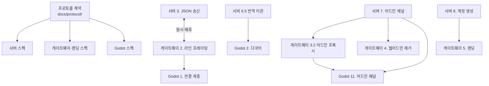

# 스펙 간 정합성 매핑

프로토콜 계약에 정의된 모든 메시지와 verb가 세 스펙에 반영되었는지 점검한 결과다. 계약이 변경되면 이 표를 갱신한다.

관련 스펙:

- 서버: `Echoes-of-the-Fallen-Age/.kiro/specs/server-json-protocol/`
- 게이트웨이와 랜딩: `KarnasChronicles-DividedDominio-client/.kiro/specs/gateway-landing/`
- Godot 클라이언트: `KarnasChronicles-DividedDominio-client/.kiro/specs/godot-client/`

## 클라이언트 → 서버 메시지

| 메시지 | 서버 처리 | 클라이언트 송신 |
|---|---|---|
| `login` | Task 3.5 | Task 3 |
| `logout` | Task 3.5 | Task 3 |
| `action` | Task 4.2 | Task 1.5 |
| `chat` | Task 4.5 | Task 5.7 |
| `ping` | Task 3.4 | Task 1.3 |
| `client_info` | Task 3.4 | Task 1.9 |

## 서버 → 클라이언트 메시지

| 메시지 | 서버 송신 | 클라이언트 처리 |
|---|---|---|
| `welcome` | Task 3.5 | Task 1.2, 1.6 |
| `login_result` | Task 3.5 | Task 3 |
| `logout_result` | Task 3.5 | Task 3 |
| `pong` | Task 3.4 | Task 1.3 |
| `room_info` | Task 2.3, 3.1 | Task 5.1, 5.3 |
| `entity_enter` | Task 2.1 | Task 5.6 |
| `entity_leave` | Task 2.1 | Task 5.6 |
| `entity_update` | Task 2.1 | Task 5.6 |
| `player_state` | Task 2.3 | Task 5.1, 10 |
| `inventory` | Task 2.3 | Task 7.1 |
| `container_contents` | Task 2.3 | Task 7.4 |
| `readable_content` | 서버 Task 11 이후 신설 | 읽기 화면 |
| `combat_state` | Task 2.3 | Task 8 |
| `dialogue` | Task 4.4 | Task 9.1 |
| `who_result` | Task 4.4 | Task 5.8 |
| `chat` | Task 4.5 | Task 5.7 |
| `event` | Task 6.1, 6.2 | Task 5.9 |
| `action_rejected` | Task 4.2, 6.1 | Task 4.2 |
| `error` | Task 3.4 | Task 1.4 |

## verb 매핑

| verb | 서버 핸들러 | 클라이언트 버튼 |
|---|---|---|
| `move` | actions/movement.py | Task 5.2 출구 버튼 |
| `enter` | actions/movement.py | Task 5.2 진입 버튼 |
| `look` | actions/movement.py | Task 5.6 재동기화 |
| `examine` | actions/inspection.py | Task 6 대상 동사 |
| `get` | actions/items.py | Task 6 대상 동사 |
| `drop` | actions/items.py | Task 7.3 |
| `use` | actions/items.py | Task 7.1 |
| `equip` | actions/items.py | Task 7.2 |
| `unequip` | actions/items.py | Task 7.2 |
| `unequip_all` | actions/items.py | Task 7.2 |
| `give` | actions/items.py | Task 6 대상 동사 |
| `read` | actions/items.py | Task 6 대상 동사 |
| `open` | actions/containers.py | Task 7.4 |
| `put` | actions/containers.py | Task 7.4 |
| `take_from` | actions/containers.py | Task 7.4 |
| `attack` | actions/combat.py | Task 8 |
| `flee` | actions/combat.py | Task 8 |
| `use_item` | actions/combat.py | Task 8 |
| `end_turn` | actions/combat.py | Task 8 |
| `talk` | actions/dialogue.py | Task 6 대상 동사 |
| `dialogue_choice` | actions/dialogue.py | Task 9.1 |
| `dialogue_end` | actions/dialogue.py | Task 9.1 |
| `follow` | actions/social.py | Task 6 대상 동사 |
| `unfollow` | actions/social.py | Task 5.10 |
| `emote` | actions/social.py | Task 5.10 |
| `who` | actions/social.py | Task 5.8 |
| `players_here` | actions/social.py | Task 5.8 |
| `request_state` | actions/state.py | Task 1.7 |
| `request_inventory` | actions/state.py | Task 7.1 |
| `request_combat_state` | actions/state.py | Task 8 |
| `changename` | actions/account.py | Task 10 |

서버측 파일 배치는 `server-json-protocol` design.md의 `commands/actions/` 구조를 따르며 Task 4.4에서 구현한다.

## 거절 코드 매핑

| 코드 | 서버 발생 | 클라이언트 처리 |
|---|---|---|
| `NOT_AUTHENTICATED` | Task 4.2 디스패처 1단계 | Task 4.2 로그인 전환 |
| `NOT_FOUND` | Task 5.1 target 해석 | Task 4.2 `look` 재동기화 |
| `NOT_APPLICABLE` | Task 6(액션 검증) | Task 4.2 버튼 제거 |
| `PERMISSION_DENIED` | Task 7.1 어드민 인증 | Task 4.2, 11.1 안내 |
| `WRONG_STATE` | Task 4.2 상태 게이팅 | Task 4.2 안내 |
| `NOT_YOUR_TURN` | actions/combat.py | Task 8 턴 대기 표시 |
| `OUT_OF_RANGE` | 각 액션 핸들러 | Task 4.2 안내 |
| `INSUFFICIENT_FUNDS` | Lua exchange API | 대화 화면 안내 |
| `INSUFFICIENT_QUANTITY` | actions/items.py | Task 4.2 상한 조정 |
| `INVENTORY_FULL` | actions/items.py | Task 4.2 안내 |
| `SLOT_OCCUPIED` | actions/items.py | Task 4.2 교체 확인 |
| `COOLDOWN` | actions/account.py | Task 10 잔여 시간 |
| `TARGET_REQUIRED` | Task 4.2 디스패처 | Task 4.2 로그 기록 |
| `INVALID_PARAMS` | Task 4.2 디스패처 | Task 4.2 로그 기록 |
| `INTERNAL_ERROR` | 전역 예외 처리 | Task 4.2 재시도 안내 |

어드민 전용 코드는 `admin.md`에 정의되며 클라이언트 Task 11.1이 처리한다. 어드민 채널의 거절에는 번역 키가 없고 `detail`에 영문 설명이 온다.

## 어드민 메시지 매핑

| 메시지 | 서버 | 클라이언트 |
|---|---|---|
| `admin_login` / `admin_login_result` | Task 7.1 | Task 11.1 |
| `service_login` | Task 7.1 | 게이트웨이 Task 5.3 |
| `account_create` | Task 8 | 게이트웨이 Task 5.4 |
| `admin_list` / `admin_get` | Task 7.2 | Task 11.3 |
| `admin_create` / `admin_update` / `admin_delete` | Task 7.2, 7.3 | Task 11.4 |
| `admin_stats` | Task 7.4 | Task 11.5 |
| `admin_map` | Task 7.5 | Task 11.2 |
| `admin_action` | Task 7.4 | Task 11.5 |
| `admin_rejected` | Task 7 전체 | Task 11.1 |

## 전송 계층 매핑

| 항목 | 서버 | 게이트웨이 | 클라이언트 |
|---|---|---|---|
| JSON 라인 프레이밍 | Task 3.1, 3.4 | Task 2.1~2.4 | Task 1.2 |
| Telnet IAC 협상 | 유지 (Req 10.7) | Task 2.3 필터 유지 | 해당 없음 |
| 게임 채널 | TCP 4000 | `/ws` → 4000 | `ws://host/ws` |
| 어드민 채널 | TCP 4001 (Task 7.1) | `/admin` → 4001 (Task 3.2) | `ws://host/admin` (Task 11.1) |
| 계정 생성 | TCP 4001 (Task 8) | `POST /api/register` (Task 5.4) | 해당 없음 (랜딩) |
| ANSI 제거 | Task 3.2 | sanitizer 제거 (Task 3.3) | 해당 없음 |

## 저장소 간 의존 그래프



## 착수 순서

```
1단계  프로토콜 계약 확정 (완료)
       └ docs/protocol/ 5개 문서

2단계  병렬 착수
       ├ 서버:      Task 0 → 1(하니스) → 2(직렬화)
       ├ 게이트웨이: Task 1(터미널 제거) → 2.1~2.2(LineFramer 단위 구현)
       └ Godot:     Task 1(기반과 연결)

3단계  프로토콜 교체 (동시 배포 필요)
       ├ 서버:      Task 3(JSON 송신) → 4(디스패처) → 5(uuid)
       └ 게이트웨이: Task 2.3~2.5(프레이밍 통합)

4단계  번역 이관
       ├ 서버:      Task 6
       └ Godot:     Task 2

5단계  게임 화면
       └ Godot:     Task 3~10

6단계  어드민 이전
       ├ 서버:      Task 7
       ├ 게이트웨이: Task 3.2 → 4(웹어드민 제거)
       └ Godot:     Task 11

7단계  계정 생성과 랜딩
       ├ 서버:      Task 8
       └ 게이트웨이: Task 5

8단계  정리와 검증
       ├ 서버:      Task 9
       ├ 게이트웨이: Task 6~7
       └ Godot:     Task 12
```

3단계가 가장 위험하다. 서버와 게이트웨이를 동시에 배포해야 하며 어긋나면 통신이 성립하지 않는다. 서버는 하니스로, 게이트웨이는 `LineFramer` 단위 테스트로 각각 독립 검증한 뒤 통합한다.

6단계에서 Node 웹어드민과 서버 어드민이 공존하는 기간이 발생한다. 같은 데이터베이스를 조작하면 서버 캐시와 불일치가 생기므로 이 기간을 최소화한다.

## 점검에서 발견해 보완한 항목

계약과 스펙을 대조하며 클라이언트 스펙에 누락된 항목을 찾아 보완했다.

| 누락 항목 | 보완 |
|---|---|
| `client_info` 송신 | Godot Requirement 1.12, Task 1.9 추가 |
| `chat` 송수신 UI | Godot Requirement 5.12~5.14, Task 5.7 추가 |
| `who` / `players_here` verb와 `who_result` | Godot Requirement 5.15, Task 5.8 추가 |
| `event` 로그 표시 | Godot Requirement 5.16, Task 5.9 추가 |
| `unfollow`, `emote` verb | Godot Requirement 5.17, Task 5.10 추가 |
| `unequip_all` verb | Godot 인벤토리 화면 버튼(Task 7.2)으로 반영. 대상이 없는 액션이므로 규칙 테이블 대상이 아니다 |

## 점검에서 정정한 계약 오류

코드를 확인해 계약의 사실 오류를 정정했다.

| 오류 | 확인 내용 | 정정 |
|---|---|---|
| `enter`의 `target`을 uuid로 정의 | `commands/Basic/enter.py`는 현재 방 좌표로 `room_connections`를 조회해 이동한다. 대상 엔티티가 없다 | `enter`를 target 없는 verb로 변경. `room_info`에 `has_passage` 필드를 추가해 클라이언트가 진입 버튼 표시 여부를 판단하게 함 |
| `close` verb 정의 | `commands/container_commands.py`에는 `OpenCommand`와 `PutCommand`만 있다. 열림 상태를 추적하는 필드가 없어 `open`은 내용 조회 동작이다 | `close` verb 제거 |
| monster와 combatant에 `level` 정의 | level은 코드에서 의도적으로 제거된 개념이다. `MonsterStats.from_dict`이 `pop('level')`, `PlayerStats.from_dict`이 `pop("level")`, `Player.from_dict`의 deprecated 목록에 `stat_level`. DB 컬럼도 없다 | `level` 제거. 대신 능력치에서 계산되는 `armor_class`, `attack_power`를 제공 |
| monster에 `is_merchant` 정의 | `Monster.is_merchant()`는 없다. 유일한 판정식은 deprecated·미등록 `shop_command.py`에 있고, `ExchangeManager.buy_from_npc`는 상인 여부를 검사하지 않는다 | `is_merchant` 제거. 모든 캐릭터와 거래 가능하므로 구분이 불필요하다 |
| object의 `category` 출처 | DB에 `category` 컬럼이 있으나 `GameObject.from_dict`이 명시적으로 버리고 실제로는 `properties['category']`를 쓴다 | 출처를 `properties.category`로 명시 |
| `can_talk` 판정 근거 | `talk_command.py`는 `type == 'monster'`만 확인하고 스크립트 존재를 보지 않는다. 조회용 API가 없다 | `LuaScriptLoader`에 스크립트 존재 확인 메서드를 추가해 산출한다. 거짓이어도 서버는 침묵 응답을 주므로 버튼 우선순위 판단용으로 정의 |
| `max_stack` 제공과 스택 그룹 전제 | DB에 값이 있으나 서버가 그에 따라 동작하지 않는다. 스택 병합은 `CurrencyManager`에만 있고 `_group_stackable_objects`는 `return []`로 무력화됐다. 프로덕션 데이터에서 `properties.quantity`를 가진 25건은 전부 화폐이며 모두 `max_stack=9999`, `max_stack>1`인 나머지 22건은 `quantity`가 없다. 두 필드가 함께 쓰이는 사례가 없다 | `max_stack` 제거. `stack_count`는 `properties.quantity`에서 산출하며 화폐만 1을 초과한다. 같은 종류 아이템은 개별 엔티티로 송신하고 묶음 표시는 클라이언트 책임으로 정의 |

## 미해결 사항

다음은 구현 단계에서 결정해야 한다.

| 항목 | 결정 시점 |
|---|---|
| 감사 로그를 DB 테이블로 저장할지 | 서버 Task 7.7 |
| `resize` 메시지 타입 존속 여부 | 게이트웨이 Task 3.4 |
| `sanitizer.ts` 제거 또는 연결 | 게이트웨이 Task 3.3 |
| 랜딩 정적 서빙 주체(게이트웨이 vs nginx) | 게이트웨이 Task 5.2 |
| 랜딩 한국어 병기 여부 | 게이트웨이 Task 5.1 |
| GDScript 테스트 프레임워크 선택 | Godot Task 12.3 |
| 대상 선택 UI 방식(팝오버 vs 고정 패널) | Godot Task 6 |
| faction_relations 기반 동적 disposition 판정 | 범위 외. 우호도 기능 개발 시. 현재는 하드코딩 규칙 보존 |
| 일반 아이템 스택 병합 구현 | 범위 외. 아이템 시스템 전반(get/drop/put/give, 무게 계산)에 영향이 크다. 페이즈2 이후 별도 작업 |
| max_stack 데이터 정리 | 범위 외. 부피 있는 물건에 스택이 붙어 있다(건초 더미 5kg=3, 밧줄 1.5kg=5, 횃불 0.5kg=10, 빈 병 5, 말굽 5). 체력 물약은 5와 20으로 불일치하고 무게도 0.30/0.60으로 갈린다. 어드민 기능 준비 후 정리 |
| category 분류 정리 | 범위 외. 101건 중 97건이 `misc`이며 `consumable` 1건, `currency` 2건, `readable` 1건뿐이다. 클라이언트 카테고리 필터가 실질적으로 동작하려면 분류가 필요하다 |
| room_connections 조회를 매니저로 이전 | 차후 개발. 현재 `commands/Basic/enter.py::_get_room_connection()`이 매니저를 거치지 않고 `SELECT to_x, to_y FROM room_connections`를 직접 실행한다. `has_passage` 산출에도 같은 조회가 필요해 중복이 생긴다. `RoomManager`에 조회 메서드를 만들어 양쪽이 공유하는 것이 구조상 맞으며, 명령어를 액션 핸들러로 옮기는 Task 4 시점에 함께 정리한다. 그때까지는 호출부가 조회해 직렬화 계층에 인자로 전달한다 |
| 계약 밖 메시지 타입 정리 | 서버 Task 9.4 완료. 계약에 없는 `type` 이 0종이다. `scripts/check_protocol_consistency.py` 로 확인한다. 계약이 정의했으나 서버가 보내지 않던 `entity_enter`·`entity_leave` 도 함께 구현했다. 두 문제는 같은 사안의 양면이었다. 서버는 방 인원 변화를 계약 밖 `room_players_update` 로 전체 목록을 매번 다시 보내고 있었다. 미구현으로 남은 계약 타입은 없다. `shop` 은 계약에서 제거했다 |
| 감지 능력 기반 이동 알림 | 제거. `broadcast_to_room_by_detection_ability()` 가 계약 밖 타입 `"moving message"`(공백 포함)로 완성된 영어 문장을 보냈다. 플레이어가 센스가 떨어지면 몬스터 이동을 알아채지 못한다는 규칙은 지능·민첩을 로그로만 찍고 실제로는 모두에게 보냈으므로 구현되지 않은 상태였다. 몬스터 로밍은 `entity_enter`·`entity_leave` 로 알린다. 감지 판정을 도입하려면 규칙을 새로 설계해야 한다 |
| `event` 과도기 필드 제거 | 서버 Task 6.7 완료. `TelnetSession.send_event()`는 `key`/`params`/`category`/`seq`를 받아 `build_event()`에 위임한다. 계약 밖 필드 `text`·`severity`는 게임 채널에서 사라졌다. `send_error`·`send_success`·`send_info`는 삭제했다. 남은 사용처는 어드민 전용 `send_admin_notice()` 하나이며 `category: "admin"`으로 나가고 Task 7.6에서 어드민 채널로 옮기며 사라진다 |
| 어드민 생문장 경로 제거 | 서버 Task 7.6 완료. `AdminManager` 가 세션에 완성 문장을 보내던 14건을 없애고 결과 dict 반환과 `AdminOperationError` 로 바꿨다. `TelnetSession.send_admin_notice()`, `manager_bridge.py`, `game_engine` 의 관리자 위임 래퍼 4개, 도달 불가였던 `create_object_realtime()` 을 삭제했다. 계약 밖 타입 `object_created` 와 추방 시 `system_message` 브로드캐스트가 사라졌고 `kicked` 만 남았다. 추방 통보를 담을 메시지가 계약에 없기 때문이다 |
| Lua 아이템 콜백 문장 미전달 | 서버 Task 11 완료. `configs/items/health_potion.lua` 와 `forgotten_scripture.lua` 가 번역 키와 파라미터를 돌려주고 문장은 클라이언트의 `item.json` 으로 옮겼다. 전달은 `event` 이며 `category` 는 `item` 이다. `ActionResult` 에 `category` 를 두고 기본값을 `system` 으로 뒀다. 이전에는 성공 알림이 항상 `system` 으로 나갔다. Task 10 이 이 경로를 함께 깨뜨렸던 것도 고쳤다. `_lua_table_to_dict` 를 `{key, params}` 전용으로 바꾸면서 아이템 콜백 결과가 빈 dict 가 됐고 `consume` 이 사라져 체력 물약이 소모되지 않았다 |
| 읽기 본문을 담을 메시지가 없다 | 해결. 계약에 `readable_content` 를 추가했다. `open` → `container_contents` 와 같은 규약이며 요청 `seq` 를 되돌려준다. 본문은 번역 키가 아니라 언어별 dict 다. 책과 두루마리의 본문은 DB 의 이중언어 컬럼에 담긴 콘텐츠이므로 클라이언트 번역 파일로 옮기지 않는다. 엔티티 이름·설명과 같은 성질이다. Lua `on_read` 콜백이 있으면 분위기 문장이 `event` 로 먼저 가고 본문이 이 메시지로 간다 |
| 계약 예시와 구현 불일치 | 정정 완료. 클라이언트를 예시대로 구현하다 드러난 것들이다. ① `event`·`entities.md` 의 `combat.damage_dealt` 는 존재하지 않는 키였다. 같은 params 를 쓰는 실제 키는 `combat.hit` 다. ② `inventory` 예시에 `gold` 가 빠져 있었다. `build_inventory` 가 항상 담는다. ③ `equipped` 예시가 `HEAD`·`BODY`·`WEAPON` 같은 대문자 슬롯을 쓰고 빈 슬롯을 `null` 로 담았다. 실제 값은 `right_hand` 같은 소문자이고 채워진 슬롯만 담는다. ④ `dialogue` 예시의 `npc.merchant.*` 는 지어낸 키였다. Task 10 이 정한 실제 규칙(`npc.<slug>.<분기>.text.<i>`)을 쓰는 예시로 바꿨다. ⑤ `action_rejected` 예시가 없는 키 `action.cannot_talk_to_target` 을 담고 있었다. `message` 는 선택 항목이며 서버가 그 자리에 키를 담는 경우는 `account.name_change_cooldown` 하나뿐이라 그것으로 바꿨다. `scripts/check_doc_keys.py` 가 문서 예시의 키가 실재하는지 확인한다 |
| 화폐 정리 | 완료(2026-08-15). 화폐는 실버 하나다. 골드는 화폐가 아니라 아이템이며 1골드는 10실버의 값을 갖는다. 두 동전의 무게는 같다(0.003). 대화와 거래는 이미 실버로만 말하고 있었고(`dialogue.json` 26곳, Lua 의 `insufficient_silver`), `CurrencyManager` 도 `silver_coin` 스택만 집계했다. 어긋난 것은 계약 필드명뿐이라 `player_state.gold`·`inventory.gold` 를 `silver` 로 바꿨다. 함께 한 데이터 반영: `gold_coin.json` 의 무게를 0.005 → 0.003, `properties` 를 `category: misc`·`base_value: 10` 으로, `item_prices` 에 `gold_coin` 행(매수·매도 10) 추가, 세계의 gold_coin 인스턴스 23개 무게 정정(0.005 와 1.0 이 섞여 있었다) |
| `combat_state.is_over` 기준 | 기존 동작 유지로 결정. `build_combat_state`는 `not combat.is_active`를 보내며, 이는 `combat.is_combat_over()`(한쪽 전멸 판정)와 다른 개념이다. 한쪽이 전멸했으나 `end_combat()`이 아직 호출되지 않은 짧은 구간에서는 `is_over: false`가 나간다. 클라이언트는 전투 종료를 `is_over` 대신 `combat_state` 수신 중단과 `room_info` 재수신으로도 판별할 수 있으므로 현재 동작을 바꾸지 않는다. 전투 종료 처리를 정리할 때 재검토한다 |
| 대화 대사의 번역 키 전환 | 서버 Task 10 완료. `configs/dialogues/*.lua` 19개 스크립트의 언어별 완성 문장을 번역 키로 바꿨고 문장은 클라이언트 저장소의 `godot/resources/translations/dialogue.json`(키 277개)으로 옮겼다. `lines[]`와 `choices[].text`가 계약대로 `{key, params}`를 담는다. 정적 대사는 위치로 키를 붙였고(`npc.<slug>.<분기>.text.<i>`), 거래 스크립트는 도우미 함수로 갈라져 위치 기반 키가 성립하지 않아 뜻으로 붙였다(`npc.smuggler.item_buy`). 스크립트가 `ctx.session.locale`을 읽어 아이템 이름을 고르던 코드는 없앴다. 이름은 언어별 dict를 그대로 `params`에 실어 클라이언트가 고른다. 종료 선택지 판별도 문장(`"Bye."`)에서 키(`npc.dialogue.farewell`)로 바꿨다. 문장 판별은 거래 메뉴에서 종료 번호가 아이템 인덱스와 겹쳐 매수 시도로 흘러갔다 |
| 상점을 계약에서 제거 | 결정 완료(2026-08-15). `shop` 메시지와 `shop_open`/`shop_buy`/`shop_sell` verb 를 계약에서 뺐다. 누구와도 대화로 거래할 수 있으므로 상점을 특별한 개념으로 둘 이유가 없다. 계약의 상점 모델은 데이터와도 어긋나 있었다. `item_prices` 는 `template_id`·`buy_price`·`sell_price` 세 컬럼뿐이라 `stock` 에 대응하는 데이터가 없고, 상인의 `exchange_config` 는 `initial_silver` 와 `buy_margin` 만 담아 판매 목록이라는 개념이 없다. 실제 재고는 NPC 인벤토리의 실물이며 대화 안 Lua exchange API 가 그것을 그대로 다룬다. 상점을 따로 두면 같은 재고를 두 경로가 보게 되고 진실의 출처가 갈라진다 |
| `monsters.faction_id` 끊어진 참조 | 정리 완료(2026-08-15). 세계관에서 상인과 마을 사람은 모두 잿빛 기사단 소속이라는 결정에 따라 Town Merchant 의 종족을 `ash_knights` 로 바꿨다. 템플릿 `town_merchant.json` 과 `harbor_guide.json` 도 함께 고쳤다. 끊어진 참조가 0건이다. `monsters.faction_id` 에 외래키가 없는 것은 그대로다 |
| `game_objects.location_type` 대소문자 혼재 | 정리 완료(2026-08-15). 저장 값을 소문자로 통일했다. 원인은 코드였다. `move_item_from_container` 가 `.upper()` 로 저장하고 `move_object_to_room` 이 `'ROOM'` 을 쓰는 등 쓰기 경로가 대문자를 섞었고, 조회는 두 벌로 던져 이를 덮고 있었다. 쓰기를 소문자로 통일하고 조회를 한 벌로 줄였으며(방·인벤토리·컨테이너 각 1회) 모델 검증도 소문자만 받는다. 데이터 16건을 정정했다 |
| `rooms` 좌표 중복 | 정리 완료(2026-08-15). 좌표 (-20,-1) 의 두 방 중 나중에 만든 것을 지웠다. 설명과 지형이 같고 어느 쪽도 오브젝트·통로·몬스터가 가리키지 않았다. 방 519개, 중복 좌표 0개다. 어드민 삭제의 참조 검사가 좌표 유일성을 전제로 우회하던 것은 그대로 두었다. 좌표가 겹치면 실제로 대상이 갈라진다. 하니스가 전용 좌표에 방을 남긴 채 다시 돌 때 `goto` 와 오브젝트 생성이 서로 다른 방을 골라 `NOT_FOUND` 가 났다 |
| `town_merchant.json` 중복 키 | 정리 완료(2026-08-15). `exchange_config` 가 두 번 있던 것을 하나로 줄였다. 값이 같아 동작에는 영향이 없었다 |
| 어드민 명령어 재작성 | 서버 Task 7. Task 4.6에서 `commands/admin/` 15개 파일을 삭제했다. 텍스트 프로토콜과 번호 기반 대상 지정에 묶여 있어 어드민 채널에서 재사용할 수 없었고, 삭제 시점에 이미 도달 불가 상태였다. `core/managers/admin_manager.py`는 남겼으며 어드민 채널이 그것을 호출한다. 그때까지 `admin_manager`의 메서드는 호출자가 없다. 필요하면 커밋 91790e3에서 삭제된 파일을 참고할 수 있다 |
| NPC 침묵 폴백 문구 | 서버 Task 10. Lua 스크립트가 없는 NPC 와 대화하면 `lines` 에 `"..."` 가 담긴다. 기존에는 `npc.talk.silent_stare` 키로 "아무 말 없이 바라봅니다"를 렌더링했으나, 대화 대사가 언어별 dict 인 과도기에는 키를 실을 자리가 없다. 대화 대사가 키 방식으로 전환되면 이 센티널을 해당 키로 바꾼다 |
| 이관된 번역 파일의 사용처 없는 키 | Godot Task 5.2. 서버에서 이관한 9개 파일에는 명령어 도움말, 어드민 명령어 안내처럼 페이즈2 에서 사라진 기능의 키가 남아 있다. 클라이언트가 i18n 계층을 만들 때 실제 사용 키만 남기고 정리한다 |
| `SessionState.last_command` 제거 | 서버 Task 9. 텍스트 프로토콜의 `.` 반복 입력에 쓰였고 참조하는 코드가 사라졌다. 필드만 남아 있으며 잔여 정리 단계에서 제거한다 |
| 전투 알림의 번역 키 전환 | 서버 Task 6. `combat_handler`의 공격·명중·사망·시체 생성 알림이 아직 완성 문장을 `combat_message` 타입으로 보낸다. 전투 상태표와 턴 안내, 행동 메뉴는 Task 5에서 `combat_state` 브로드캐스트로 대체해 제거했다 |
| 역할 기반 어드민 권한 | 범위 외. 향후 확장 |
| 한국어 조사 자동 선택 | 범위 외. 향후 개선 |
| Telnet IAC 협상 제거 | 범위 외. 향후 후보 |
